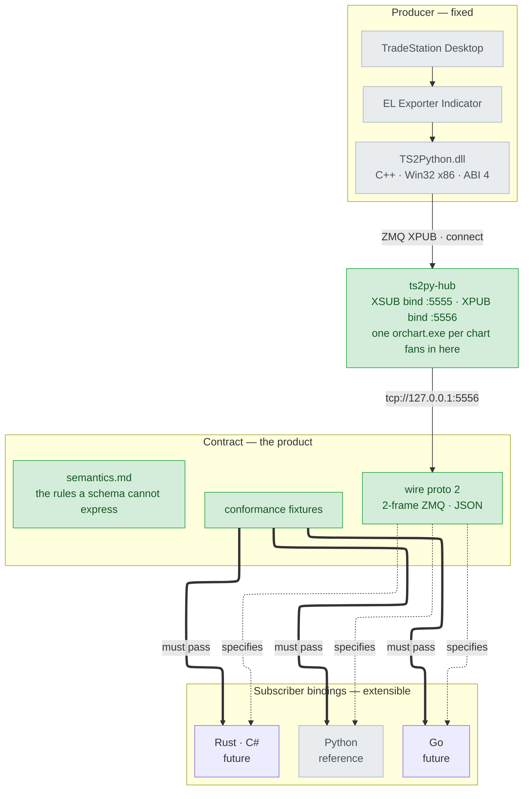

# tradestation-data-provider

[](https://github.com/millerlai/tradestation-data-provider/actions/workflows/ci.yml)
[](LICENSE)

> 📖 [繁體中文版 README](README.zh-TW.md)

Market data out of **TradeStation**, for subscribers in any language.

A TradeStation EasyLanguage indicator hands ticks and whole OHLC bars to a C++
bridge DLL, which publishes them over ZeroMQ. Anything that speaks the protocol
can consume the feed.

**Nothing on the way is computed.** The bars are the ones TradeStation drew, at
the interval its chart runs; the quantity fields are EasyLanguage's reserved
words forwarded verbatim. What you subscribe to is what the terminal saw.



## The product is the wire contract

What this repo promises is **the protocol on the wire**, not any one client
library. [`contract/`](contract/) is the source of truth; the Python package is
the reference binding, and the template for the next one.

Any parsing rule that lives only inside a binding is a bug — it will be missed
by the next implementation. This repo has already seen that happen: the former
spec had drifted to describing fields the DLL no longer emitted, and nobody
noticed, because nothing checked.

## Layout

| Path | What it is |
| --- | --- |
| [`contract/`](contract/) | **Wire spec, semantics, and conformance fixtures.** Start here to write a binding |
| [`EL/`](EL/) | EasyLanguage exporter indicator — the upstream origin of the feed |
| [`cpp/`](cpp/) | C++ bridge DLL (Win32 x86) and its standalone test harness |
| [`bindings/python/`](bindings/python/) | Reference Python binding — ingestion runtime, pluggable sinks, Parquet store |
| [`docs/`](docs/) | Architecture notes and working plans |

## Quick start

**Running `ts2py-hub`, first and always.** Every TradeStation chart runs in its own
`orchart.exe` with its own copy of the DLL, and `bind()` is exclusive — so the DLL
**connects** (to `:5555`) and so does every consumer (to `:5556`). Something has to bind,
and that is the hub. Nothing publishes while it is down.

```powershell
tradestation-data-hub          # XSUB :5555 for charts, XPUB :5556 for consumers
```

**Set it to start at logon and restart on failure.** Task Scheduler → Create Task →
trigger *At log on*; action *Start a program*, `tradestation-data-hub`; on the Settings
tab tick *If the task fails, restart every* 1 minute. Run it as the same user that runs
TradeStation, and start it before TradeStation so no chart wastes a bar on `-7`.

Losing the hub mid-session costs data: the bars published while it is down are dropped and
nothing backfills them. Both ends do say so — `EL_Publish` starts returning `-10` (one
line per chart in TradeStation's Print Log) and a consumer that started with no hub logs
`wire_silent` — but neither of those brings the bars back, which is why the restart
setting is part of the install rather than a nicety.

**Consuming the feed in Python** → [`bindings/python/README.md`](bindings/python/README.md),
or go straight to the runnable scripts in
[`bindings/python/examples/`](bindings/python/examples/). Two of the four need
neither TradeStation nor the DLL: one replays the recorded fixtures in
[`contract/fixtures/`](contract/fixtures/) through the real binding, the other
writes a small Parquet store and reads it back.

**Writing a binding in another language** → [`contract/README.md`](contract/README.md).
Read [`contract/semantics.md`](contract/semantics.md) before writing any parsing
code: it holds the rules JSON Schema cannot express, and those are where
bindings actually diverge.

**Building the DLL** → [`cpp/README.md`](cpp/README.md)

```powershell
cd cpp
.\setup-build-env.bat     # once per clone: vcpkg submodule, bootstrap, deps
.\verify-build-env.bat    # exit 0 = ready; names the fix for anything missing
.\build.bat               # Release, x86 + x64  ->  cpp\Release\
```

`build.bat` locates MSBuild itself, so no Developer Command Prompt is needed.
CMake works too and writes somewhere else — mind the path when you go looking
for the harness:

```powershell
cmake --preset x86-release          # or x86-release-vs2022
cmake --build --preset x86-release  #  ->  cpp\build\x86-release\Release\
```

**Installing the DLL into TradeStation:**

```powershell
cd cpp
.\install-to-tradestation.bat
```

It finds the TradeStation `Program` folder under the usual locations on `C:` and
`D:` — and asks for the path, with an example, when it cannot. Which build gets
installed is decided by the architecture of the `ORPlat.exe` sitting there, not by
the bitness of Windows: TradeStation is a 32-bit process on a 64-bit OS. Nothing is
copied until you confirm, and replacing a `TS2Python.dll` that is already installed
is asked as its own question. TradeStation can stay open: Windows locks the DLL
only once EasyLanguage has actually loaded it, so the installer tests whether the
files can be opened for writing rather than looking at the process list, and stops
only when one really is held.

**Not wanting to build it yourself is fine.** Prebuilt x86 and x64 binaries are
checked into [`cpp/prebuilt/`](cpp/prebuilt/), built from this repo and tested on
Windows 11 with TradeStation 10; the installer falls back to them when there is no
local build, and prefers a local build when there is one.

Two dependencies have to be in place, and neither announces itself when missing —
EasyLanguage reports only that the DLL could not be loaded, naming no cause:

| Dependency | Who handles it |
| --- | --- |
| `libzmq-mt-4_3_5.dll` | the installer — it copies every `.dll` beside `TS2Python.dll`, because the versioned name moves with the pinned vcpkg revision |
| Microsoft Visual C++ 2015-2022 Redistributable, **x86** | you — the DLL is linked against the dynamic CRT. The installer checks and prints the download link if it is missing |

The full `dumpbin /dependents` breakdown is in
[`cpp/prebuilt/README.md`](cpp/prebuilt/README.md).

**Installing the EasyLanguage indicator** → [`EL/README.md`](EL/README.md) — paste
the source into the EasyLanguage Editor, Verify, apply it to a tick chart or to
any minute/daily chart whose interval the wire supports (`1m` `5m` `15m` `30m`
`1h` `1d`). Install the DLL first: Verify needs it in place already.

**Inspecting the wire without TradeStation:**

```powershell
# terminal A — the subscriber goes FIRST. EL_InitChart returns -7 and publishes
# nothing until one is attached, so the harness would otherwise just time out.
python contract/tools/record.py

# terminal B — drives the DLL directly. Path depends on which toolchain built it:
#   build.bat / Visual Studio  ->  cpp\Release\
#   cmake --preset             ->  cpp\build\x86-release\Release\
cpp\Release\TS2Python_TestHarness.exe --mode smoke
```

## Versioning

| Version | Current | Who cares |
| --- | ---: | --- |
| Wire (`"proto"` in the payload) | 2 | Every binding |
| DLL ABI (`EL_DllVersion()`) | 4 | Every binding |
| Python package | 0.3.0 | Python consumers only |

The two numbers differ on purpose. The ABI moved to 3 when init gained a chart
identity and a control frame was added on its own topic, and to 4 when that
init export was renamed to `EL_InitChart`; the point frame is byte-for-byte
unchanged throughout, so `proto` stayed at 2 and every recorded fixture stays
valid.

**There is one wire version and one ABI, and nothing older is supported.** A
frame without `proto` is not this protocol; a binding refuses it rather than
guessing. The key is `proto` rather than `v` on purpose — the superseded wire
used `v` and counted to 4, so restarting at 1 under the same key would have made
`{"v":1}` a legal opening for two different protocols, and the mismatch would
have surfaced as wrong numbers rather than a refusal.

**Upgrade the DLL and the `.ELD` together, and re-Verify the indicator.** Every
mismatched combination now fails readably: a stale `.ELD` lands on a tombstone
of the exact signature it was built against and reads `-6`, and a current
`.ELD` against an older DLL fails at Verify because `EL_InitChart` is not
exported there. That rests on one rule — **change the signature, change the
name** — which ABI 3 briefly broke by reusing `EL_Init`, turning a stale `.ELD`
into a stack corruption with no error code. [`contract/wire.md`](contract/wire.md)
tabulates every combination.

## Status

Windows only on the producer side — TradeStation Desktop is a 32-bit Windows
process, so the DLL must be built as Win32 (x86). Subscribers have no such
constraint.

Data collection only. No strategy, order routing, or risk logic lives here; that
belongs to whatever consumes the feed.

## License

MIT — see [`LICENSE`](LICENSE).
