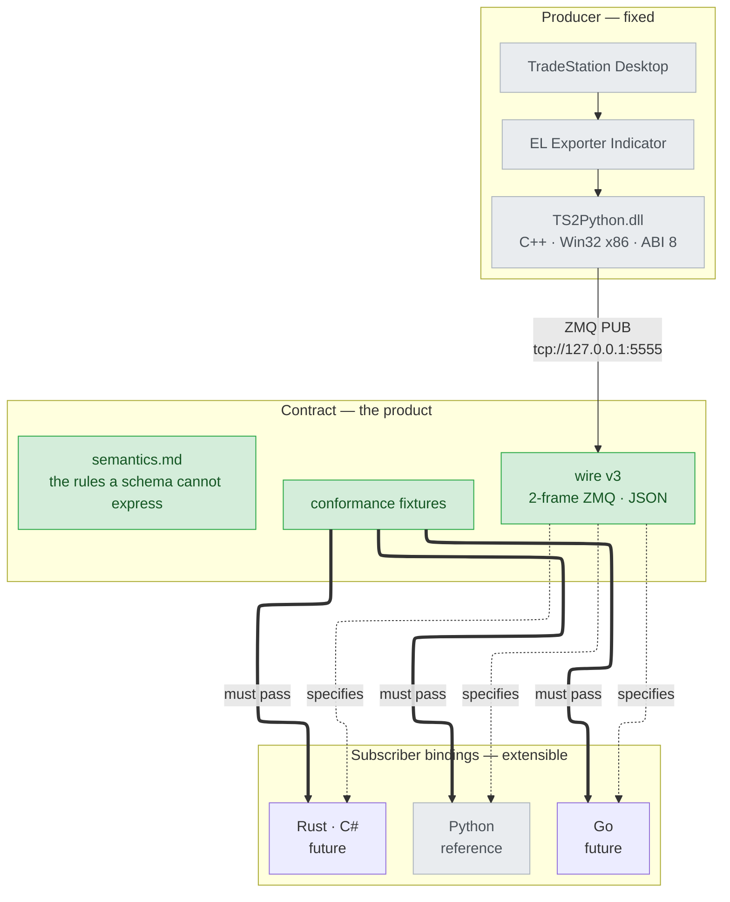

# tradestation-data-provider

[](https://github.com/millerlai/tradestation-data-provider/actions/workflows/ci.yml)
[](LICENSE)

> 📖 [繁體中文版 README](README.zh-TW.md)

Market data out of **TradeStation**, for subscribers in any language.

A TradeStation EasyLanguage indicator hands ticks and 1-minute bars to a C++
bridge DLL, which publishes them over ZeroMQ. Anything that speaks the protocol
can consume the feed.



## The product is the wire contract

What this repo promises is **the protocol on the wire**, not any one client
library. [`contract/`](contract/) is the source of truth; the Python package is
the reference binding, and the template for the next one.

Any parsing rule that lives only inside a binding is a bug — it will be missed
by the next implementation. This repo has already seen that happen: the former
spec had drifted to describing fields the DLL no longer emitted, and nobody
noticed, because nothing checked.

## Layout

| Path | What it is |
| --- | --- |
| [`contract/`](contract/) | **Wire spec, semantics, and conformance fixtures.** Start here to write a binding |
| [`EL/`](EL/) | EasyLanguage exporter indicator — the upstream origin of the feed |
| [`cpp/`](cpp/) | C++ bridge DLL (Win32 x86) and its standalone test harness |
| [`bindings/python/`](bindings/python/) | Reference Python binding — ingestion runtime, pluggable sinks, Parquet store |
| [`docs/`](docs/) | Architecture and migration notes |

## Quick start

**Consuming the feed in Python** → [`bindings/python/README.md`](bindings/python/README.md),
or go straight to the runnable scripts in
[`bindings/python/examples/`](bindings/python/examples/). Two of the four need
neither TradeStation nor the DLL: one replays the recorded fixtures in
[`contract/fixtures/`](contract/fixtures/) through the real binding, the other
demonstrates the storage tiers on data it generates itself.

**Writing a binding in another language** → [`contract/README.md`](contract/README.md).
Read [`contract/semantics.md`](contract/semantics.md) before writing any parsing
code: it holds the rules JSON Schema cannot express, and those are where
bindings actually diverge.

**Building the DLL** → [`cpp/README.md`](cpp/README.md)

```powershell
cd cpp
.\setup-build-env.bat     # once per clone: vcpkg submodule, bootstrap, deps
.\verify-build-env.bat    # exit 0 = ready; names the fix for anything missing
.\build.bat               # Release, x86 + x64  ->  cpp\Release\
```

`build.bat` locates MSBuild itself, so no Developer Command Prompt is needed.
CMake works too and writes somewhere else — mind the path when you go looking
for the harness:

```powershell
cmake --preset x86-release          # or x86-release-vs2022
cmake --build --preset x86-release  #  ->  cpp\build\x86-release\Release\
```

**Installing the DLL into TradeStation:**

```powershell
cd cpp
.\install-to-tradestation.bat
```

It finds the TradeStation `Program` folder under the usual locations on `C:` and
`D:` — and asks for the path, with an example, when it cannot. Which build gets
installed is decided by the architecture of the `ORPlat.exe` sitting there, not by
the bitness of Windows: TradeStation is a 32-bit process on a 64-bit OS. Nothing is
copied until you confirm, and replacing a `TS2Python.dll` that is already installed
is asked as its own question. Close TradeStation first — Windows keeps the loaded
DLL locked.

**Not wanting to build it yourself is fine.** Prebuilt x86 and x64 binaries are
checked into [`cpp/prebuilt/`](cpp/prebuilt/), built from this repo and tested on
Windows 11 with TradeStation 10; the installer falls back to them when there is no
local build, and prefers a local build when there is one.

Two dependencies have to be in place, and neither announces itself when missing —
EasyLanguage reports only that the DLL could not be loaded, naming no cause:

| Dependency | Who handles it |
| --- | --- |
| `libzmq-mt-4_3_5.dll` | the installer — it copies every `.dll` beside `TS2Python.dll`, because the versioned name moves with the pinned vcpkg revision |
| Microsoft Visual C++ 2015-2022 Redistributable, **x86** | you — the DLL is linked against the dynamic CRT. The installer checks and prints the download link if it is missing |

The full `dumpbin /dependents` breakdown is in
[`cpp/prebuilt/README.md`](cpp/prebuilt/README.md).

**Installing the EasyLanguage indicator** → [`EL/README.md`](EL/README.md) — paste
the source into the EasyLanguage Editor, Verify, apply it to a tick or 1-minute
chart. Install the DLL first: Verify needs it in place already.

**Inspecting the wire without TradeStation:**

```powershell
# terminal A — drives the DLL directly. Path depends on which toolchain built it:
#   build.bat / Visual Studio  ->  cpp\Release\
#   cmake --preset             ->  cpp\build\x86-release\Release\
cpp\Release\TS2Python_TestHarness.exe --mode smoke --warmup-ms 8000

# terminal B
python contract/tools/record.py
```

## Versioning

Three version numbers move independently; the pairing that matters is in
[`contract/compat.md`](contract/compat.md).

| Version | Current | Who cares |
| --- | ---: | --- |
| Wire (`"v"` in the payload) | 3 | Every binding |
| DLL ABI (`EL_DllVersion()`) | 8 | Every binding |
| Python package | 0.2.0 | Python consumers only |

Wire v1 and v2 are superseded but **still supported**: the DLL lives inside a user's
TradeStation install and does not update when a binding does.

## Status

Windows only on the producer side — TradeStation Desktop is a 32-bit Windows
process, so the DLL must be built as Win32 (x86). Subscribers have no such
constraint.

Data collection only. No strategy, order routing, or risk logic lives here; that
belongs to whatever consumes the feed.

## License

MIT — see [`LICENSE`](LICENSE).
