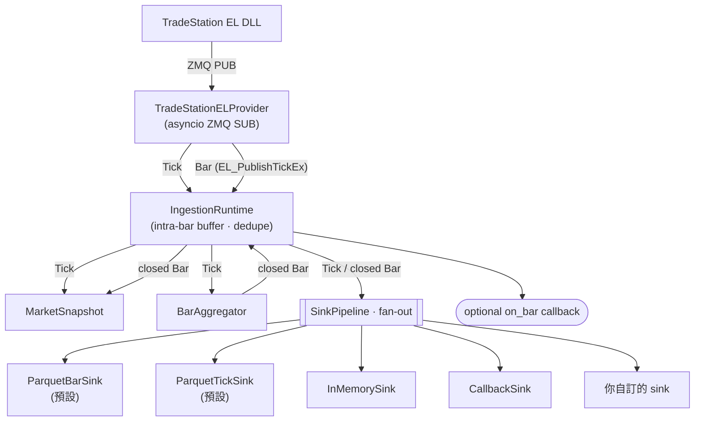

# tradestation-data-provider

> 📖 [English README](README.md)

純 Python 資料管線：訂閱 TradeStation EasyLanguage 訊號（透過 C++/ZeroMQ bridge），把 tick 與 1 分鐘 bar 派發給**可插拔的輸出 sink** — Parquet、in-memory buffer、使用者 callback，或任何你自己實作的 sink。

C++ DLL 在 [`cpp/`](cpp/) 下、獨立編譯；本 repo 是 Python 端消費者。**本專案不包含 strategy / broker / risk 邏輯** — runtime 純粹是資料收集。

## 為什麼用它

- **能自訂輸出格式**：在 `config/sinks.yaml` 宣告一個 sink、指向任何可 `import` 的 `module:attr`，runtime 就會把每筆 tick / bar 派給它。不必 fork 本專案。
- **預設行為與舊版相容**：內建 `ParquetBarSink` / `ParquetTickSink` 維持原本的 Hive-partitioned schema。
- **能在自己程式裡接收資料**：`CallbackSink` 讓你註冊 Python function，依 symbol 或全收，從 ingest loop 同步派發。
- **完整離線工具**：[`scripts/`](scripts/) 下有聚合、驗證、稽核、去重、缺值補全等 Parquet 後處理腳本。

## 架構



`IngestionRuntime` 的背景 loop：**ingest** / **advance**（wall-clock）/ **flush**（要求 flush 的 sink）/ **heartbeat**。

> 上面的圖在 GitHub 上會被 render；在 PyPI 上會以 Mermaid 程式碼塊呈現。

## 安裝

### 作為依賴使用（pip / uv / poetry）

PyPI（上架之後）：

```bash
pip install tradestation-data-provider
uv add tradestation-data-provider
poetry add tradestation-data-provider
```

直接從 GitHub 安裝（不必等 PyPI）：

```bash
pip install "git+https://github.com/millerlai/tradestation-data-provider.git"
uv add "git+https://github.com/millerlai/tradestation-data-provider.git"
poetry add "git+https://github.com/millerlai/tradestation-data-provider.git"

# 釘特定 tag、branch 或 commit
pip install "git+https://github.com/millerlai/tradestation-data-provider.git@v0.1.0"
```

### 在本專案內開發

```powershell
uv sync                       # base deps
uv sync --extra dev           # + pytest / ruff / mypy
uv run pytest                 # 272 tests、約 2 秒
```

## 快速上手

安裝後直接用：

```python
import asyncio
from tradestation_data.aggregation import BarAggregator, MarketSnapshot
from tradestation_data.providers.tradestation_el import TradeStationELProvider
from tradestation_data.runtime.ingestion import IngestionRuntime
from tradestation_data.sinks import SinkPipeline
from tradestation_data.sinks.parquet import ParquetBarSink, ParquetTickSink

async def main() -> None:
    runtime = IngestionRuntime(
        provider=TradeStationELProvider(endpoint="tcp://127.0.0.1:5555"),
        symbols=["SPY", "QQQ"],
        snapshot=MarketSnapshot(),
        aggregator=BarAggregator(),
        sinks=SinkPipeline([
            ParquetBarSink(name="bars",  root="data/bars"),
            ParquetTickSink(name="ticks", root="data/ticks"),
        ]),
    )
    await runtime.run()

asyncio.run(main())
```

或用 console script + YAML 設定檔：

```bash
tradestation-data-ingest --sinks-config config/sinks.yaml
```

## 可插拔 Sink 架構

每筆 tick 與每個 closed bar 都會 broadcast 給 `config/sinks.yaml` 中宣告的每個 sink。任何 sink 拋 exception 都會被 log、隔離 — 不會影響其他 sink。新增一個輸出目的地只需要寫一個 class。

### 內建 sinks

| Sink | 用途 |
| --- | --- |
| `tradestation_data.sinks.parquet:ParquetBarSink` | 寫 Hive-partitioned 1m bar Parquet（預設啟用）|
| `tradestation_data.sinks.parquet:ParquetTickSink` | 寫 Hive-partitioned tick Parquet（預設啟用）|
| `tradestation_data.sinks.memory:InMemorySink` | 在記憶體緩衝（測試 / notebook）；不適合長時間運行 |
| `tradestation_data.sinks.callback:CallbackSink` | 派發給動態註冊的 Python callback，可依 symbol 或全收 |

### `config/sinks.yaml` 範例

```yaml
sinks:
  - name: bars_parquet
    class: tradestation_data.sinks.parquet:ParquetBarSink
    params:
      root: data/bars
      timeframe: 1m
      compression: zstd

  - name: dispatch
    class: tradestation_data.sinks.callback:CallbackSink

  - name: my_csv
    class: my_pkg.sinks:HourlyCsvSink     # 使用者自訂 sink
    params:
      root: out/csv
```

### 寫一個自訂 sink

繼承 `BaseSink`，只實作你關心的 hook。建構子必須接受 `name=` 關鍵字參數，runtime 才能把 YAML 裡的 name 設到 instance 上。

```python
# my_pkg/sinks.py
from tradestation_data.domain.bar import Bar
from tradestation_data.sinks.base import BaseSink

class HourlyCsvSink(BaseSink):
    def __init__(self, *, name: str, root: str) -> None:
        self.name = name
        self.root = root
        # 開檔 / 設緩衝 ...

    def on_bar(self, bar: Bar) -> None:
        # 寫一列 CSV
        ...

    def close(self) -> None:
        # 最後一次 flush、關檔
        ...
```

在 `sinks.yaml` 用 `class: my_pkg.sinks:HourlyCsvSink` 引用 — 只要 `my_pkg` 能 `import` 到，runtime 就會自動載入。

完整 Sink protocol：

```python
class Sink(Protocol):
    name: str
    def on_tick(self, tick: Tick) -> None: ...
    def on_bar(self, bar: Bar) -> None: ...
    def should_flush(self) -> bool: ...   # 預設 False — 只有 buffered sink 需要 override
    def flush(self) -> None: ...          # 預設 no-op
    def close(self) -> None: ...
```

### 用 `CallbackSink` 在程式內接收資料

先在 `sinks.yaml` 宣告 `CallbackSink`，然後在程式任何地方註冊 callback：

```python
from tradestation_data.sinks.callback import get_sink

sink = get_sink("dispatch")     # name 對應 sinks.yaml

def on_spy_bar(bar):
    print(bar.symbol, bar.close)

sink.on("SPY", "bar", on_spy_bar)
sink.on_any("tick", lambda t: ...)   # 所有 symbol
```

Callback 在 ingest loop 中**同步**呼叫，請保持輕量（微秒級）。需要做重活就在 callback 內 spawn `asyncio.create_task` 或 thread。Callback 拋 exception 會被 log、隔離，其他 callback 仍會執行。

## 內建離線工具

Runtime 負責收集資料；[`scripts/`](scripts/) 下的腳本針對產出的 Parquet store 做後處理。用 `python scripts/<name>.py` 直接跑（會透過 `uv run` 進入專案 venv）。

```powershell
python scripts/run_ingestion.py                                  # 啟動即時 ingestion
python scripts/aggregate_parquet.py --symbol all --timeframe 5m `
  --input data/bars/timeframe=1m --output data/bars              # 1m → Nm 聚合
python scripts/verify_parquet.py --start-date 2026-03-20 --end-date 2026-04-17
python scripts/imputation_parquet.py --start-date 2026-03-20 --end-date 2026-04-17 --dry-run
python scripts/audit_bar_cache.py                                # 週稽核
python scripts/clear_bar_cache.py                                # 清 Tier-3 cache
python scripts/dedupe_bars.py                                    # 去重複 bar
python scripts/dump_parquet.py                                   # 看 parquet 內容
python scripts/simple_sub.py                                     # 原始 ZMQ wire 檢視
```

## 專案結構

```
tradestation-data-provider/
├── pyproject.toml
├── LICENSE
├── config/
│   ├── sinks.yaml             # 可插拔 sink pipeline
│   └── symbols.yaml           # symbol universe + 每 symbol 的 session policy
├── scripts/                   # 給人用的 CLI 包裝（見上）
├── src/tradestation_data/     # 核心 Python package
│   ├── domain/                # Bar / Tick / Order / Position
│   ├── aggregation/           # BarAggregator / MarketSnapshot
│   ├── providers/             # TradeStationELProvider (ZMQ SUB)
│   ├── storage/               # BarWriter / TickWriter / HistoryStore / Resampler
│   ├── sinks/                 # Sink protocol、pipeline、registry、內建 sinks
│   ├── runtime/               # IngestionRuntime + CLI entry
│   └── tools/                 # scripts 共用的 audit / clear cache helper
└── tests/                     # 272 個 unit + integration tests
```

## Release 流程（維護者）

1. 把 `pyproject.toml` 的 `version` 升到 `X.Y.Z`，commit。
2. `git tag vX.Y.Z && git push --tags`。
3. `.github/workflows/release.yml` 會 build sdist + wheel、做 smoke test，再透過 PyPI Trusted Publishing 上傳。

> 首次上架需先到 PyPI 專案頁設定 Trusted Publisher（workflow 名 `release.yml`、environment `pypi`）。

## 注意事項

- C++ DLL 由上游主專案編譯與部署 — 本 repo 只負責 Python 端。
- 預設資料根目錄是 `<project-root>/data/`；可用 `--data-root` 覆寫（**僅在 `sinks.yaml` 缺檔時的 fallback 路徑生效**；正常情況以 YAML 內每個 sink 的 `root` 參數為準）。
- 純 smoke test（不寫任何輸出）用 `--no-storage`，等於空 sink pipeline。
- pytest 設定 `filterwarnings = ["error", "ignore::DeprecationWarning"]` — **新 warning 會讓 build 失敗**。修原因，不要放寬 filter。

## License

MIT — 詳見 [LICENSE](LICENSE)。
