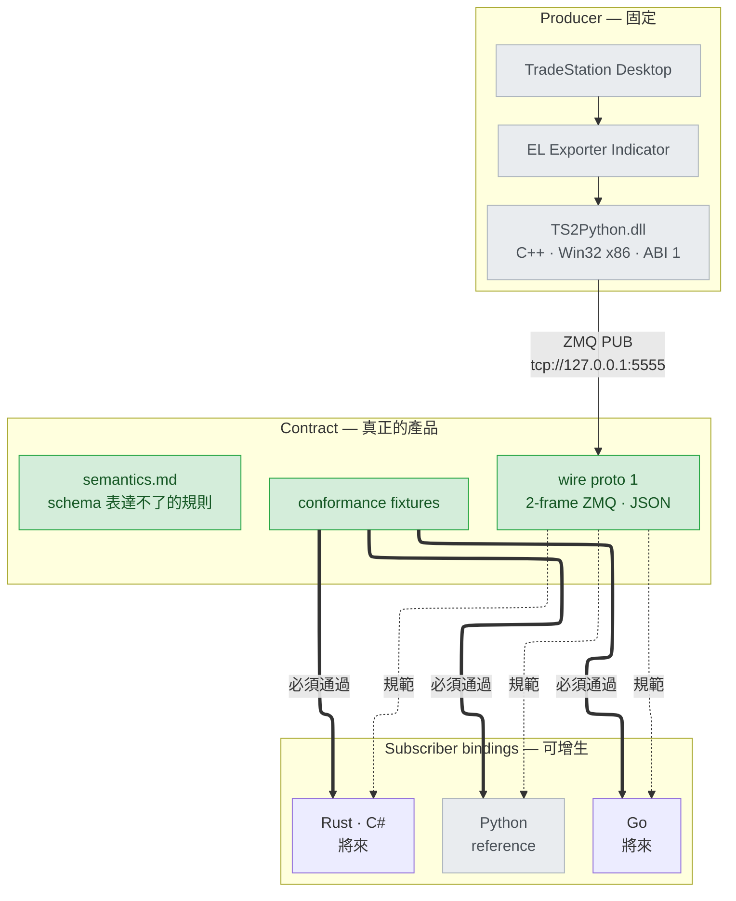

# tradestation-data-provider

[](https://github.com/millerlai/tradestation-data-provider/actions/workflows/ci.yml)
[](LICENSE)

> 📖 [English README](README.md)

把 **TradeStation** 的市場資料送出來，給任何語言的 subscriber 使用。

TradeStation 的 EasyLanguage indicator 把 tick 與整根 OHLC bar 交給 C++ bridge
DLL，由它經 ZeroMQ 發布。任何看得懂這個協定的程式都能消費這條資料流。

**這條路上不做任何計算。** Bar 就是 TradeStation 畫出來的那幾根、間隔就是那張圖的
間隔；量值欄位是 EasyLanguage reserved word 的原文轉送。你訂閱到的，就是終端機看到的。



## 產品是 wire contract

這個 repo 對外承諾的是**線上跑的協定**，不是任何一個 client 函式庫。
[`contract/`](contract/) 是唯一真實來源；Python 套件是 reference binding，
也是下一個 binding 的範本。

**只活在某個 binding 裡的解析規則就是 bug** —— 下一個實作一定會漏掉。這個 repo
已經發生過：舊的規格文件描述著 DLL 早已不再送出的欄位，長期無人察覺，因為沒有
任何東西在檢查。

## 目錄

| 路徑 | 內容 |
| --- | --- |
| [`contract/`](contract/) | **wire 規格、語意規則、conformance fixtures。** 要寫 binding 從這裡開始 |
| [`EL/`](EL/) | EasyLanguage exporter indicator —— 資料流的源頭 |
| [`cpp/`](cpp/) | C++ bridge DLL（Win32 x86）與獨立測試 harness |
| [`bindings/python/`](bindings/python/) | Reference Python binding —— ingestion runtime、可插拔 sink、Parquet 儲存 |
| [`docs/`](docs/) | 架構與遷移文件 |

## 快速開始

**用 Python 消費資料** → [`bindings/python/README.zh-TW.md`](bindings/python/README.zh-TW.md)，
或直接看 [`bindings/python/examples/`](bindings/python/examples/) 裡可直接執行的腳本。
四支裡有兩支不需要 TradeStation 也不需要 DLL：一支把
[`contract/fixtures/`](contract/fixtures/) 錄下來的 frame 餵給真正的 binding，
另一支寫出一個小的 Parquet store 再讀回來。

**用其他語言寫 binding** → [`contract/README.md`](contract/README.md)。
動手寫解析程式前**務必先讀** [`contract/semantics.md`](contract/semantics.md)：
那裡是 JSON Schema 表達不了的規則，而 binding 之間真正會分歧的正是這些。

**建置 DLL** → [`cpp/README.zh-TW.md`](cpp/README.zh-TW.md)

```powershell
cd cpp
.\setup-build-env.bat     # 每個 clone 跑一次：vcpkg submodule、bootstrap、相依套件
.\verify-build-env.bat    # exit 0 代表可以 build；缺什麼都會直接給修正指令
.\build.bat               # Release，x86 + x64  ->  cpp\Release\
```

`build.bat` 會自己找到 MSBuild，不需要開 Developer Command Prompt。
CMake 也可以，但輸出位置不同 —— 找 harness 時要注意路徑：

```powershell
cmake --preset x86-release          # 或 x86-release-vs2022
cmake --build --preset x86-release  #  ->  cpp\build\x86-release\Release\
```

**把 DLL 安裝到 TradeStation：**

```powershell
cd cpp
.\install-to-tradestation.bat
```

它會在 `C:` 與 `D:` 的常見位置找出 TradeStation 的 `Program` 資料夾 —— 找不到就
直接問你，並附上範例路徑。裝哪一版由那裡的 `ORPlat.exe` 的架構決定，**不是**看
Windows 是幾位元：TradeStation 是跑在 64 位元 OS 上的 32 位元 process。沒有經過
確認不會複製任何檔案；目標已經有 `TS2Python.dll` 時，會另外單獨問你要不要取代。
TradeStation 開著也沒關係：DLL 要等 EasyLanguage 真的載入它之後才會被 Windows 鎖
住，所以腳本檢查的是「檔案能不能開起來寫」而不是 process 清單，真的被鎖住才會停。

**不想自己 build 也沒關係。** [`cpp/prebuilt/`](cpp/prebuilt/) 裡放了從本 repo 建出
的 x86 與 x64 binary，已在 Windows 11 + TradeStation 10 上測試過；本機沒有建置輸出
時安裝腳本會自動改用它們，有本機建置時則優先用你自己建的。

有兩個相依項必須就位，而且缺了哪一個都不會有明確訊息 —— EasyLanguage 只會說 DLL
載不起來，不會說原因：

| 相依項 | 由誰負責 |
| --- | --- |
| `libzmq-mt-4_3_5.dll` | 安裝腳本 —— 它會把 `TS2Python.dll` 旁邊所有 `.dll` 一起複製，因為這個帶版號的檔名會隨釘住的 vcpkg 版本變動 |
| Microsoft Visual C++ 2015-2022 Redistributable，**x86** | 你自己 —— DLL 連的是 dynamic CRT。安裝腳本會檢查，缺少時直接印出下載連結 |

完整的 `dumpbin /dependents` 清單見 [`cpp/prebuilt/README.md`](cpp/prebuilt/README.md)。

**安裝 EasyLanguage indicator** → [`EL/README.zh-TW.md`](EL/README.zh-TW.md) ——
把原始碼貼進 EasyLanguage Editor、Verify、掛到 tick chart，或任何 wire 支援其
間隔的分鐘／日線 chart（`1m` `5m` `15m` `30m` `1h` `1d`）。
請先裝 DLL：Verify 的時候它就必須已經在位。

**不開 TradeStation 也能檢視 wire：**

```powershell
# 終端機 A —— 直接驅動 DLL。路徑取決於你用哪個 toolchain 建的：
#   build.bat / Visual Studio  ->  cpp\Release\
#   cmake --preset             ->  cpp\build\x86-release\Release\
cpp\Release\TS2Python_TestHarness.exe --mode smoke --warmup-ms 8000

# 終端機 B
python contract/tools/record.py
```

## 版本

| 版本 | 現值 | 誰在乎 |
| --- | ---: | --- |
| Wire（payload 的 `"proto"`） | 1 | 所有 binding |
| DLL ABI（`EL_DllVersion()`） | 1 | 所有 binding |
| Python 套件 | 0.3.0 | 僅 Python 消費端 |

**wire 與 ABI 各只有一個版本，更舊的一律不支援。** 沒有 `proto` 欄位的 frame 就不是
這個協定，binding 會拒收而不是猜。版本欄位叫 `proto` 而不是沿用 `v` 是刻意的 ——
前一代 wire 用 `v` 一路數到 4，若在同一個 key 上從 1 重新起算，`{"v":1}` 會同時是兩個
協定的合法開頭，錯配就會表現成「數字不對」而不是「明確拒收」。

**升級時 DLL 與 `.ELD` 必須一起換。** 兩者是分開的安裝步驟，而 indicator 綁的是
`EL_Init3` —— 舊 DLL 沒有這個匯出。所有不相容的組合都會在送出任何資料前被攔下，
各自由哪一道檢查攔到，列在 [`contract/wire.md`](contract/wire.md)。

## 現況

Producer 端僅限 Windows —— TradeStation Desktop 是 32-bit Windows process，
所以 DLL 必須以 Win32 (x86) 建置。Subscriber 端沒有這個限制。

**只做資料收集。** 策略、下單、風控都不在這裡，那屬於消費這條資料流的系統。

## 授權

MIT —— 見 [`LICENSE`](LICENSE)。
