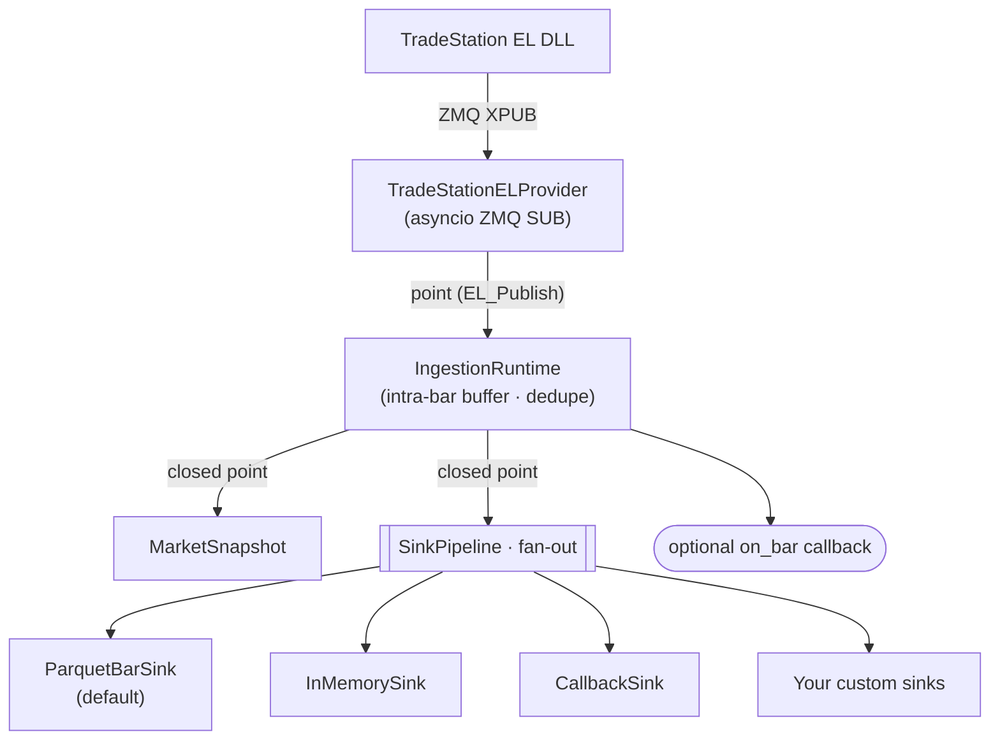

# tradestation-data-provider

[](https://github.com/millerlai/tradestation-data-provider/actions/workflows/ci.yml)
[](https://github.com/millerlai/tradestation-data-provider/blob/main/bindings/python/pyproject.toml)
[](LICENSE)
[](https://github.com/astral-sh/ruff)
[](https://mypy-lang.org/)

> 📖 [繁體中文版 README](README.zh-TW.md)

A pure-Python data pipeline that subscribes to a TradeStation EasyLanguage feed (over a C++/ZeroMQ bridge) and routes ticks and whole OHLC bars to a **pluggable set of output sinks** — Parquet, in-memory, user callbacks, or anything you implement.

**It receives, labels and stores. Nothing else.** No aggregation, no resampling, no backfill, no cache. A bar TradeStation did not publish is a bar that does not exist here, and asking for one returns zero rows rather than a plausible substitute.

This is the **reference binding** for the wire protocol defined in [`contract/`](../../contract/) — one subscriber among the languages that repo supports. The EasyLanguage indicator and the C++ DLL that publish the feed live in [`EL/`](../../EL/) and [`cpp/`](../../cpp/).

**No strategy / broker / risk wiring lives here** — the runtime is data-collection-only.

> Before changing how anything on the wire is parsed, read [`contract/semantics.md`](../../contract/semantics.md). Rules that live only in this package are the ones the next binding gets wrong.

## Why use it

- **Plug your own output format.** Declare a sink in `config/sinks.yaml`, point it at any `module:attr` you can import, and the runtime fans every point to it. No fork needed.
- **Hive-partitioned Parquet out of the box.** Built-in `ParquetBarSink`, one directory level per BarType / BarInterval / symbol / day.
- **Receive points in your own code.** `CallbackSink` lets you register Python functions per symbol or catch-all, dispatched synchronously from the ingest loop.
- **Nothing between the chart and the column.** The five quantity fields are EasyLanguage's reserved words verbatim, under `el_*` names, so what you read is auditable against the terminal.
- **Operator tooling.** Verify completeness, dedupe, dump, and impute the resulting store with the scripts under [`scripts/`](scripts/) — read-only except `dedupe_bars.py`, which rewrites in place unless you pass `--dry-run`.
- **Checked against the shared contract.** `tests/conformance/` replays recorded DLL output from [`contract/fixtures/`](../../contract/fixtures/) and asserts this binding matches expectations derived independently of it.

## Architecture



Background loops inside `IngestionRuntime`: **ingest** / **advance** (wall-clock) / **flush** (sinks that ask for it) / **heartbeat**.

> The diagram above renders on GitHub; on PyPI it displays as a Mermaid code block.

## Install

### As a dependency (pip / uv / poetry)

From PyPI (once published):

```bash
pip install tradestation-data-provider
uv add tradestation-data-provider
poetry add tradestation-data-provider
```

Directly from GitHub. The Python package is **not at the repo root** — the
repo root holds the wire contract, the EL indicator and the C++ bridge — so
the `subdirectory` fragment is required:

```bash
pip install "git+https://github.com/millerlai/tradestation-data-provider.git#subdirectory=bindings/python"
uv add "git+https://github.com/millerlai/tradestation-data-provider.git#subdirectory=bindings/python"
poetry add "git+https://github.com/millerlai/tradestation-data-provider.git#subdirectory=bindings/python"

# Pin to a tag, branch, or commit
pip install "git+https://github.com/millerlai/tradestation-data-provider.git@v0.3.0#subdirectory=bindings/python"
```

> Without the fragment pip fails with *"neither 'setup.py' nor 'pyproject.toml'
> found"*. A bare `...git@v0.1.0` does install — but only because that tag
> predates the move to `bindings/python/`, so it silently gives you a package
> from before the current protocol, which refuses every frame this DLL sends.

### For development on this repo

```powershell
uv sync                       # base deps
uv sync --extra dev           # + pytest / ruff / mypy
uv run pytest                 # full suite, a few seconds
```

## Quick start

After install, import what you need and start the runtime — or run the bundled console script.

```python
import asyncio
from tradestation_data.aggregation import MarketSnapshot
from tradestation_data.wire.el_subscriber import TradeStationELProvider
from tradestation_data.runtime.ingestion import IngestionRuntime
from tradestation_data.sinks import SinkPipeline
from tradestation_data.sinks.parquet import ParquetBarSink

async def main() -> None:
    runtime = IngestionRuntime(
        provider=TradeStationELProvider(endpoint="tcp://127.0.0.1:5555"),
        symbols=["SPY", "QQQ"],
        snapshot=MarketSnapshot(),
        sinks=SinkPipeline([
            ParquetBarSink(name="bars", root="data/bars"),
        ]),
    )
    await runtime.run()

asyncio.run(main())
```

Or use the console entry point with a YAML config:

```bash
tradestation-data-ingest --sinks-config config/sinks.yaml
```

## Examples

Four runnable scripts in [`examples/`](examples/), each building on the last.
Between them they cover the whole package: receive events, handle them your
way, read them back.

| | Example | Needs a publisher? | What it shows |
| --- | --- | --- | --- |
| 01 | [`01_print_events.py`](examples/01_print_events.py) | yes | The whole receive loop in ~20 lines |
| 02 | [`02_custom_sink.py`](examples/02_custom_sink.py) | yes | Writing your own sink; the full runtime |
| 03 | [`03_read_history.py`](examples/03_read_history.py) | **no** | Writing a small Parquet store and reading it back — it generates its own data |
| 04 | [`04_replay_fixtures.py`](examples/04_replay_fixtures.py) | **no** | Replaying recorded frames through the real binding |

Run them from `bindings/python/`:

```powershell
uv sync --extra dev

# Offline — no TradeStation, no DLL, nothing to set up.
uv run python examples/03_read_history.py
uv run python examples/04_replay_fixtures.py --fixture bars
```

**Examples 01 and 02 need something publishing on the other end.** That does
not have to be TradeStation — the C++ harness drives the DLL directly:

```powershell
# Terminal A — from bindings\python. THE SUBSCRIBER STARTS FIRST: EL_Init
# returns -7 and publishes nothing until one is attached, so the harness
# would otherwise wait out its timeout and exit non-zero. (It used to be the
# other way round, with --warmup-ms buying time to attach — a PUB socket
# silently dropped whatever it sent while nobody was listening, and now the
# publisher refuses to start instead of dropping.)
uv run python examples\01_print_events.py --count 6

# Terminal B — from the repo root. The path is where cpp\build.bat (and
# Visual Studio) put it; a CMake preset build leaves it in
# cpp\build\x86-release\Release\ instead.
cpp\Release\TS2Python_TestHarness.exe --mode smoke
```

No harness yet? Build it with `cd cpp && .\setup-build-env.bat && .\build.bat` — see [`cpp/README.md`](../../cpp/README.md).

**To test your own sink, copy example 04.** It replays the DLL output
recorded in [`contract/fixtures/`](../../contract/fixtures/) over a real
in-process ZeroMQ socket, so your sink sees byte-exact market data through
the same decode path production uses — with no TradeStation, no market
hours, and no waiting for a bar to close.

[`examples/README.md`](examples/README.md) has the full index, the harness
modes, and what to check when frames arrive but nothing prints.

## Pluggable sinks

Every tick and every closed bar is broadcast to every sink registered in `config/sinks.yaml`. One sink raising an exception is logged and isolated — it never blocks the others. Adding a new output destination means writing one class.

### Built-in sinks

| Sink | Purpose |
| --- | --- |
| `tradestation_data.sinks.parquet:ParquetBarSink` | Hive-partitioned bar Parquet, partitioned on the bar's own timeframe (enabled by default) |
| `tradestation_data.sinks.memory:InMemorySink` | Buffer events in memory (tests / notebooks); not for long runs |
| `tradestation_data.sinks.callback:CallbackSink` | Dispatch to Python callbacks registered per-symbol or catch-all |

### `config/sinks.yaml` example

```yaml
sinks:
  - name: bars_parquet
    class: tradestation_data.sinks.parquet:ParquetBarSink
    params:
      root: data/bars
      compression: zstd

  - name: dispatch
    class: tradestation_data.sinks.callback:CallbackSink

  - name: my_csv
    class: my_pkg.sinks:HourlyCsvSink     # your own sink
    params:
      root: out/csv
```

### Writing a custom sink

Subclass `BaseSink` and implement only the hooks you care about. The constructor must accept `name=` as a keyword argument so the runtime can wire the YAML name onto the instance.

```python
# my_pkg/sinks.py
from tradestation_data.domain.bar import Bar
from tradestation_data.sinks.base import BaseSink

class HourlyCsvSink(BaseSink):
    def __init__(self, *, name: str, root: str) -> None:
        self.name = name
        self.root = root
        # open file / set up buffers ...

    def on_bar(self, bar: Bar) -> None:
        # write one CSV row
        ...

    def close(self) -> None:
        # final flush, close handles
        ...
```

Reference it from `sinks.yaml` as `class: my_pkg.sinks:HourlyCsvSink` — as long as `my_pkg` is importable, the runtime will pick it up.

The full protocol:

```python
class Sink(Protocol):
    name: str
    def on_bar(self, bar: Bar) -> None: ...
    def should_flush(self) -> bool: ...   # default False — only for buffered sinks
    def flush(self) -> None: ...          # default no-op
    def close(self) -> None: ...
```

### Receiving events with `CallbackSink`

Declare a `CallbackSink` in `sinks.yaml`, then register callbacks anywhere in your application:

```python
from tradestation_data.sinks.callback import get_sink

sink = get_sink("dispatch")     # name from sinks.yaml

def on_spy_bar(bar):
    print(bar.symbol, bar.close)

sink.on("SPY", "bar", on_spy_bar)
sink.on_any("bar", lambda b: ...)   # every symbol
```

Callbacks run synchronously inside the ingest loop — keep them fast (a few microseconds). Spawn `asyncio.create_task` or a thread inside the callback if you need to do real work. A callback that raises is logged and isolated; other callbacks for the same event still fire.

## Bundled offline tools

The runtime collects data; the scripts in [`scripts/`](scripts/) operate on the resulting Parquet store. Run them with plain `python scripts/<name>.py` — they re-enter the project venv via `uv run`.

```powershell
python scripts/run_ingestion.py                                  # live ingestion
python scripts/verify_parquet.py --start-date 2026-03-20 --end-date 2026-04-17
python scripts/imputation_parquet.py --start-date 2026-03-20 --end-date 2026-04-17 `
  --output data/imputed --dry-run
python scripts/dedupe_bars.py --dry-run                          # report duplicate bars
python scripts/dump_parquet.py                                   # inspect a parquet file
python ../../contract/tools/record.py                            # raw ZMQ wire inspector
```

**One of these rewrites the collected store: `dedupe_bars.py`.** It replaces each
partition file it touches (`tmp.replace(path)`) and `--dry-run` is opt-in, so the
default run modifies data in place. Run it with `--dry-run` first and read the
report; there is no undo.

The rest only read. `imputation_parquet.py` in particular requires `--output` and
writes to a separate root under its own schema — one extra `imputed: bool`
column, so an invented bar can never be mistaken for a received one, and
`HistoryStore` refuses the directory outright rather than reading it as raw data.

Two things to know about `verify_parquet.py` in particular:

- **It is an operator's completeness check, not a guarantee about the data.** It
  answers "did every bar the session should have produced arrive" — a question
  about the collection run. It never writes, and nothing it reports changes what
  is on disk.
- **It does not know about half days.** The session window comes from
  `--start-time` / `--end-time` and applies to every day in range, so an early
  close (the day after Thanksgiving, Christmas Eve) is reported INCOMPLETE every
  time. `--holidays` only skips a day entirely; there is no way to shorten one.
  Pass a matching `--end-time` for those dates, or read the INCOMPLETE as
  expected.

## Trying it without a live feed

`data/` is in `.gitignore` and nothing is committed there. Two of the examples need no publisher at all:

```powershell
python examples/03_read_history.py    # writes a small store, then reads it back
python examples/04_replay_fixtures.py # replays contract/fixtures/ through the real binding
```

`03` generates its own bars and ticks under `data-example/` (it refuses to touch a directory that already holds something), so the store it inspects is one you can regenerate and change. Then dump what it wrote:

```powershell
python scripts/dump_parquet.py data-example/bars/bartype=1/interval=1/symbol=SPY/date=<the date it printed>/bars.parquet --head 3
```

**Do not reconcile a `1d` bar against a sum of intraday bars.** They are different measurements and will not match — `contract/semantics.md` §3.4 has the four reasons. And note that `el_volume` on an intraday bar is *not* total share volume: EasyLanguage's `Volume` and `Ticks` swap meaning between intraday and daily charts, which is exactly why every quantity column carries an `el_` prefix instead of a name that invites the assumption.

## Project layout

```
bindings/python/                   # this binding; repo root is two levels up
├── pyproject.toml
├── LICENSE                        # copy — packaging cannot reach above this dir
├── config/
│   ├── sinks.yaml                 # pluggable sink pipeline (module:attr paths)
│   └── symbols.yaml               # symbol universe + per-symbol session policy
├── scripts/                       # human-facing CLI wrappers (see above)
├── src/tradestation_data/
│   ├── domain/                    # Bar — the value range of the wire
│   ├── wire/                      # frame decoding, gap detection  [core]
│   ├── aggregation/               # MarketSnapshot / session policy   [app]
│   ├── storage/                   # BarWriter / HistoryStore
│   ├── sinks/                     # Sink protocol, pipeline, registry, built-ins
│   └── runtime/                   # IngestionRuntime + CLI entry
└── tests/
    └── conformance/               # replays contract/fixtures/ against this binding
```

`domain/` and `wire/` are the part any language binding must reimplement;
everything else is this reference application. See
[`docs/architecture.md`](../../docs/architecture.md) §5.

## Release flow (maintainers)

1. Bump `version` in `pyproject.toml`, commit.
2. `git tag vX.Y.Z && git push --tags`.
3. `.github/workflows/release.yml` builds sdist + wheel, smoke-tests the install, and publishes to PyPI via Trusted Publishing.

> First publish requires registering the workflow on the PyPI project page as a Trusted Publisher (workflow filename `release.yml`, environment `pypi`).

## Notes

- The C++ DLL is built and deployed by the upstream parent project — this repo is the Python side only.
- Default data root is `<project-root>/data/`; overridable via `--data-root` (only effective as a fallback when `sinks.yaml` is missing — the YAML's per-sink `root` parameter wins otherwise).
- Use `--no-storage` for ephemeral smoke tests (empty sink pipeline).
- `pytest` runs with `filterwarnings = ["error", ...]` — a *new* warning fails the build. The three exemptions are **narrow, message-specific ignores** for the asyncio policy API that `tests/conftest.py` still has to call (pytest-asyncio 1.3.0 owns loop creation there and exposes no `loop_factory` hook). A blanket `ignore::DeprecationWarning` used to sit there and hid that same deprecation for months. Fix the cause; never widen them back to the whole category.

## License

MIT — see [LICENSE](LICENSE).
