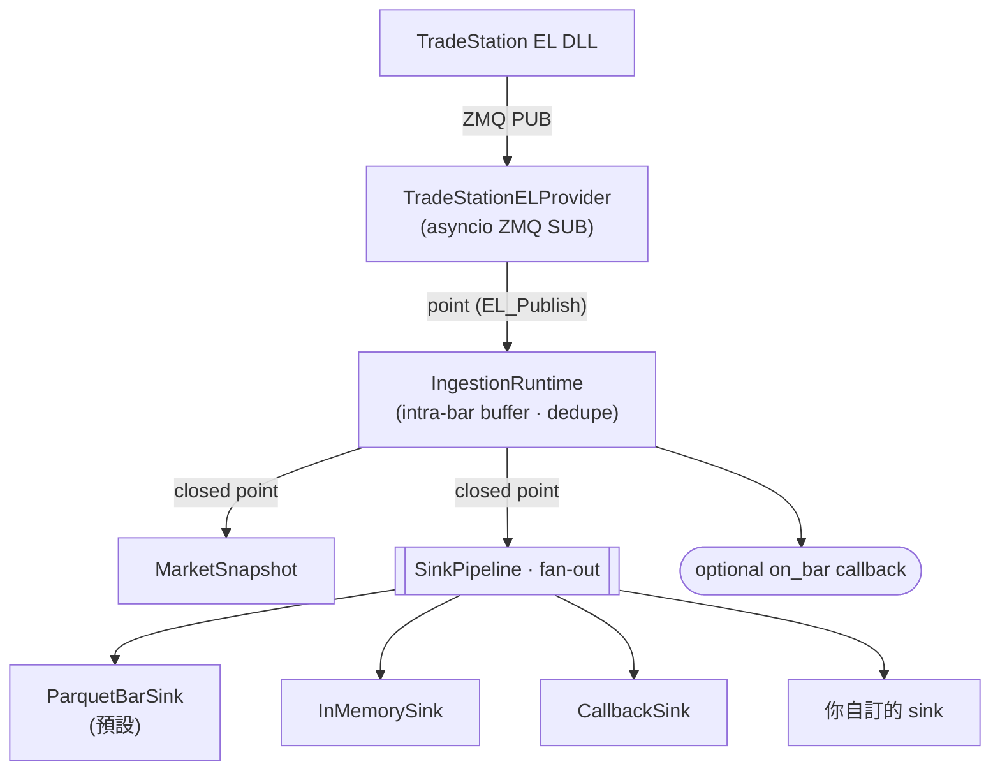

# tradestation-data-provider

[](https://github.com/millerlai/tradestation-data-provider/actions/workflows/ci.yml)
[](https://github.com/millerlai/tradestation-data-provider/blob/main/pyproject.toml)
[](LICENSE)
[](https://github.com/astral-sh/ruff)
[](https://mypy-lang.org/)

> 📖 [English README](README.md)

純 Python 資料管線：訂閱 TradeStation EasyLanguage 訊號（透過 C++/ZeroMQ bridge），把 tick 與整根 OHLC bar 派發給**可插拔的輸出 sink** — Parquet、in-memory buffer、使用者 callback，或任何你自己實作的 sink。

**它只做接收、標記時間、寫入這三件事。** 不聚合、不重取樣、不回補、不快取。TradeStation 沒發布過的 bar，在這裡就是不存在 —— 去問它會拿到 0 列，而不是一份看起來很合理的替代品。

這是 [`contract/`](../../contract/) 所定義 wire protocol 的 **reference binding** —— 該 repo 支援的多語言 subscriber 之一。發布資料的 EasyLanguage indicator 與 C++ DLL 分別在 [`EL/`](../../EL/) 與 [`cpp/`](../../cpp/)。

**本專案不包含 strategy / broker / risk 邏輯** —— runtime 純粹是資料收集。

> 修改任何 wire 解析行為前，請先讀 [`contract/semantics.md`](../../contract/semantics.md)。只活在本套件裡的規則，正是下一個 binding 會弄錯的那些。

## 為什麼用它

- **能自訂輸出格式**：在 `config/sinks.yaml` 宣告一個 sink、指向任何可 `import` 的 `module:attr`，runtime 就會把每筆 tick / bar 派給它。不必 fork 本專案。
- **開箱即用的 Hive-partitioned Parquet**：內建 `ParquetBarSink`，依 timeframe / symbol / 日期各一層目錄。
- **能在自己程式裡接收資料**：`CallbackSink` 讓你註冊 Python function，依 symbol 或全收，從 ingest loop 同步派發。
- **從圖表到欄位之間沒有任何加工**：五個量值欄位是 EasyLanguage reserved word 的原文，以 `el_*` 命名，所以你讀到的數字可以直接跟終端機對帳。
- **Operator 工具**：[`scripts/`](scripts/) 下有完整性驗證、去重、傾印、缺值補全等腳本 —— 除了 `dedupe_bars.py` 會就地改寫（除非加 `--dry-run`），其餘都只讀不寫。

## 架構



`IngestionRuntime` 的背景 loop：**ingest** / **advance**（wall-clock）/ **flush**（要求 flush 的 sink）/ **heartbeat**。

> 上面的圖在 GitHub 上會被 render；在 PyPI 上會以 Mermaid 程式碼塊呈現。

## 安裝

### 作為依賴使用（pip / uv / poetry）

PyPI（上架之後）：

```bash
pip install tradestation-data-provider
uv add tradestation-data-provider
poetry add tradestation-data-provider
```

直接從 GitHub 安裝（不必等 PyPI）。Python 套件**不在 repo 根目錄** ——
根目錄放的是 wire contract、EL indicator 與 C++ bridge —— 所以
`subdirectory` fragment 是必要的：

```bash
pip install "git+https://github.com/millerlai/tradestation-data-provider.git#subdirectory=bindings/python"
uv add "git+https://github.com/millerlai/tradestation-data-provider.git#subdirectory=bindings/python"
poetry add "git+https://github.com/millerlai/tradestation-data-provider.git#subdirectory=bindings/python"

# 釘特定 tag、branch 或 commit
pip install "git+https://github.com/millerlai/tradestation-data-provider.git@v0.3.0#subdirectory=bindings/python"
```

> 少了 fragment，pip 會以 *"neither 'setup.py' nor 'pyproject.toml' found"* 失敗。
> 不加 fragment 的 `...git@v0.1.0` 確實裝得起來 —— 但那只是因為該 tag 早於搬進
> `bindings/python/` 這次變動，等於靜默安裝一個早於現行協定的舊套件，
> 它會拒收這顆 DLL 送出的每一個 frame。

### 在本專案內開發

```powershell
uv sync                       # base deps
uv sync --extra dev           # + pytest / ruff / mypy
uv run pytest                 # 完整測試套件，數秒
```

## 快速上手

安裝後直接用：

```python
import asyncio
from tradestation_data.aggregation import MarketSnapshot
from tradestation_data.wire.el_subscriber import TradeStationELProvider
from tradestation_data.runtime.ingestion import IngestionRuntime
from tradestation_data.sinks import SinkPipeline
from tradestation_data.sinks.parquet import ParquetBarSink

async def main() -> None:
    runtime = IngestionRuntime(
        provider=TradeStationELProvider(endpoint="tcp://127.0.0.1:5555"),
        symbols=["SPY", "QQQ"],
        snapshot=MarketSnapshot(),
        sinks=SinkPipeline([
            ParquetBarSink(name="bars", root="data/bars"),
        ]),
    )
    await runtime.run()

asyncio.run(main())
```

或用 console script + YAML 設定檔：

```bash
tradestation-data-ingest --sinks-config config/sinks.yaml
```

## 範例

[`examples/`](examples/) 有四支可直接執行的腳本，後一支建立在前一支之上。
四支加起來涵蓋整個套件的用法：收事件、照自己的方式處理、再讀回來。

| | 範例 | 需要 publisher？ | 展示什麼 |
| --- | --- | --- | --- |
| 01 | [`01_print_events.py`](examples/01_print_events.py) | 需要 | 整個接收迴圈，約 20 行 |
| 02 | [`02_custom_sink.py`](examples/02_custom_sink.py) | 需要 | 自己寫一個 sink；完整 runtime |
| 03 | [`03_read_history.py`](examples/03_read_history.py) | **不用** | 寫出一個小的 Parquet store 再讀回來 —— 資料由它自己產生 |
| 04 | [`04_replay_fixtures.py`](examples/04_replay_fixtures.py) | **不用** | 用錄下來的 frame 餵真正的 binding |

從 `bindings/python/` 執行：

```powershell
uv sync --extra dev

# 離線 —— 不需要 TradeStation、不需要 DLL，不用任何前置設定。
uv run python examples/03_read_history.py
uv run python examples/04_replay_fixtures.py --fixture bars
```

**範例 01 與 02 需要另一端有東西在發佈。** 那不一定要是 TradeStation ——
C++ harness 可以直接驅動 DLL：

```powershell
# 終端機 A —— 在 repo root 執行。--warmup-ms 是留給你接上的時間：
# PUB socket 在沒有 subscriber 時送出的東西會被靜默丟棄。
# 這個路徑是 cpp\build.bat（與 Visual Studio）的輸出位置；
# 若用 CMake preset 建置，則在 cpp\build\x86-release\Release\。
cpp\Release\TS2Python_TestHarness.exe --mode smoke --warmup-ms 8000

# 終端機 B —— 在 bindings\python 執行
uv run python examples\01_print_events.py --count 6
```

還沒有 harness？用 `cd cpp && .\setup-build-env.bat && .\build.bat` 建 —— 見 [`cpp/README.zh-TW.md`](../../cpp/README.zh-TW.md)。

**要測自己寫的 sink，複製範例 04。** 它把
[`contract/fixtures/`](../../contract/fixtures/) 裡錄下來的 DLL 輸出，透過真正的
in-process ZeroMQ socket 重播，讓你的 sink 走的是與正式環境完全相同的解碼路徑，
收到逐位元組一致的市場資料 —— 不需要 TradeStation、不必等開盤、不用等 bar 收盤。

完整索引、harness 各 mode、以及「frame 有進來但什麼都沒印」時該查什麼，
見 [`examples/README.md`](examples/README.md)。

## 可插拔 Sink 架構

每筆 tick 與每個 closed bar 都會 broadcast 給 `config/sinks.yaml` 中宣告的每個 sink。任何 sink 拋 exception 都會被 log、隔離 — 不會影響其他 sink。新增一個輸出目的地只需要寫一個 class。

### 內建 sinks

| Sink | 用途 |
| --- | --- |
| `tradestation_data.sinks.parquet:ParquetBarSink` | 寫 Hive-partitioned bar Parquet，依 bar 自己的 timeframe 分區（預設啟用）|
| `tradestation_data.sinks.memory:InMemorySink` | 在記憶體緩衝（測試 / notebook）；不適合長時間運行 |
| `tradestation_data.sinks.callback:CallbackSink` | 派發給動態註冊的 Python callback，可依 symbol 或全收 |

### `config/sinks.yaml` 範例

```yaml
sinks:
  - name: bars_parquet
    class: tradestation_data.sinks.parquet:ParquetBarSink
    params:
      root: data/bars
      compression: zstd

  - name: dispatch
    class: tradestation_data.sinks.callback:CallbackSink

  - name: my_csv
    class: my_pkg.sinks:HourlyCsvSink     # 使用者自訂 sink
    params:
      root: out/csv
```

### 寫一個自訂 sink

繼承 `BaseSink`，只實作你關心的 hook。建構子必須接受 `name=` 關鍵字參數，runtime 才能把 YAML 裡的 name 設到 instance 上。

```python
# my_pkg/sinks.py
from tradestation_data.domain.bar import Bar
from tradestation_data.sinks.base import BaseSink

class HourlyCsvSink(BaseSink):
    def __init__(self, *, name: str, root: str) -> None:
        self.name = name
        self.root = root
        # 開檔 / 設緩衝 ...

    def on_bar(self, bar: Bar) -> None:
        # 寫一列 CSV
        ...

    def close(self) -> None:
        # 最後一次 flush、關檔
        ...
```

在 `sinks.yaml` 用 `class: my_pkg.sinks:HourlyCsvSink` 引用 — 只要 `my_pkg` 能 `import` 到，runtime 就會自動載入。

完整 Sink protocol：

```python
class Sink(Protocol):
    name: str
    def on_tick(self, tick: Tick) -> None: ...
    def on_bar(self, bar: Bar) -> None: ...
    def should_flush(self) -> bool: ...   # 預設 False — 只有 buffered sink 需要 override
    def flush(self) -> None: ...          # 預設 no-op
    def close(self) -> None: ...
```

### 用 `CallbackSink` 在程式內接收資料

先在 `sinks.yaml` 宣告 `CallbackSink`，然後在程式任何地方註冊 callback：

```python
from tradestation_data.sinks.callback import get_sink

sink = get_sink("dispatch")     # name 對應 sinks.yaml

def on_spy_bar(bar):
    print(bar.symbol, bar.close)

sink.on("SPY", "bar", on_spy_bar)
sink.on_any("tick", lambda t: ...)   # 所有 symbol
```

Callback 在 ingest loop 中**同步**呼叫，請保持輕量（微秒級）。需要做重活就在 callback 內 spawn `asyncio.create_task` 或 thread。Callback 拋 exception 會被 log、隔離，其他 callback 仍會執行。

## 內建離線工具

Runtime 負責收集資料；[`scripts/`](scripts/) 下的腳本針對產出的 Parquet store 做後處理。用 `python scripts/<name>.py` 直接跑（會透過 `uv run` 進入專案 venv）。

```powershell
python scripts/run_ingestion.py                                  # 啟動即時 ingestion
python scripts/verify_parquet.py --start-date 2026-03-20 --end-date 2026-04-17
python scripts/imputation_parquet.py --start-date 2026-03-20 --end-date 2026-04-17 `
  --output data/imputed --dry-run
python scripts/dedupe_bars.py --dry-run                          # 去重複 bar（先看報告）
python scripts/dump_parquet.py                                   # 看 parquet 內容
python ../../contract/tools/record.py                            # 原始 ZMQ wire 檢視
```

**其中一個會改寫收集到的 store：`dedupe_bars.py`。** 它會就地取代每一個處理過的分區檔
（`tmp.replace(path)`），而且 `--dry-run` 是選配 —— 預設跑法就直接改資料。請先用
`--dry-run` 跑一次讀報告；沒有復原機制。

其餘的只讀不寫。特別是 `imputation_parquet.py` 的 `--output` 是必填，
它寫到另一個 root、用自己的 schema —— 多一欄 `imputed: bool`，所以補出來的 bar 永遠
不可能被當成收到的 bar；`HistoryStore` 也會直接拒讀那個目錄，而不是把它當原始資料。

關於 `verify_parquet.py`，有兩件事要先知道：

- **它是 operator 的完整性檢查，不是對資料的保證。** 它回答的是「這個 session 該產出的
  bar 有沒有全部到齊」—— 那是關於採集過程的問題。它不寫入任何東西，它報告的內容也不會
  改變磁碟上的資料。
- **它不處理半日市。** session 區間來自 `--start-time` / `--end-time`，且套用到範圍內
  每一天，所以提早收盤的日子（感恩節隔天、聖誕夜）每次都會被報成 INCOMPLETE。
  `--holidays` 只能整天略過，沒有辦法縮短某一天。那些日期請另外傳對應的 `--end-time`，
  或把 INCOMPLETE 理解為預期內。

## 沒有即時資料時怎麼試跑

`data/` 在 `.gitignore` 內，而且裡面沒有任何被追蹤的檔案。四支範例中有兩支完全不需要 publisher：

```powershell
python examples/03_read_history.py    # 寫出一個小 store，再讀回來
python examples/04_replay_fixtures.py # 把 contract/fixtures/ 的 frame 餵給真正的 binding
```

`03` 會自己在 `data-example/` 下產生 bar 與 tick（該目錄若已有東西它會拒絕動手），所以它檢視的那份 store 是你可以重新產生、也可以隨意修改的。接著就能傾印它寫出來的內容：

```powershell
python scripts/dump_parquet.py data-example/bars/bartype=1/interval=1/symbol=SPY/date=<它印出來的日期>/bars.parquet --head 3
```

**不要拿 intraday 加總去核對 `1d` 的 bar。** 兩者是不同口徑，本來就不會相等 —— `contract/semantics.md` §3.4 列了四個原因。另外要注意：intraday bar 上的 `el_volume` **不是**總成交股數 —— EasyLanguage 的 `Volume` 與 `Ticks` 在 intraday 圖與 daily 圖上意義互換，而這正是每個量值欄位都帶 `el_` 前綴、而不是取一個會讓人自行假設的名字的原因。

## 專案結構

```
bindings/python/                   # 本 binding；repo 根目錄在上兩層
├── pyproject.toml
├── LICENSE                        # 副本 —— 打包後端無法引用本目錄之上
├── config/
│   ├── sinks.yaml                 # 可插拔 sink pipeline（值為 module:attr）
│   └── symbols.yaml               # symbol universe + 每 symbol 的 session policy
├── scripts/                       # 給人用的 CLI 包裝（見上）
├── src/tradestation_data/
│   ├── domain/                    # Bar / Tick —— wire 的值域
│   ├── wire/                      # frame 解碼、缺漏偵測          [core]
│   ├── aggregation/               # MarketSnapshot / session policy  [app]
│   ├── storage/                   # BarWriter / HistoryStore
│   ├── sinks/                     # Sink protocol、pipeline、registry、內建 sinks
│   └── runtime/                   # IngestionRuntime + CLI entry
└── tests/
    └── conformance/               # 用 contract/fixtures/ 驗證本 binding
```

`domain/` 與 `wire/` 是任何語言 binding 都必須重新實作的部分，其餘都是本
reference application。見 [`docs/architecture.md`](../../docs/architecture.md) §5。

## Release 流程（維護者）

1. 把 `pyproject.toml` 的 `version` 升到 `X.Y.Z`，commit。
2. `git tag vX.Y.Z && git push --tags`。
3. `.github/workflows/release.yml` 會 build sdist + wheel、做 smoke test，再透過 PyPI Trusted Publishing 上傳。

> 首次上架需先到 PyPI 專案頁設定 Trusted Publisher（workflow 名 `release.yml`、environment `pypi`）。

## 注意事項

- C++ DLL 見 [`cpp/README.zh-TW.md`](../../cpp/README.zh-TW.md)；本目錄只負責 Python binding。
- 預設資料根目錄是 `<project-root>/data/`；可用 `--data-root` 覆寫（**僅在 `sinks.yaml` 缺檔時的 fallback 路徑生效**；正常情況以 YAML 內每個 sink 的 `root` 參數為準）。
- 純 smoke test（不寫任何輸出）用 `--no-storage`，等於空 sink pipeline。
- pytest 設定 `filterwarnings = ["error", ...]` — **新 warning 會讓 build 失敗**。那三條例外是**針對特定訊息的窄 ignore**，只涵蓋 `tests/conftest.py` 仍不得不呼叫的 asyncio policy API（pytest-asyncio 1.3.0 在測試裡掌管 loop 建立，且沒有提供 `loop_factory` 掛點）。這裡原本放的是一條包山包海的 `ignore::DeprecationWarning`，它把同一個 deprecation 藏了好幾個月。請修原因，**永遠不要**把它放寬回整個 category。

## License

MIT — 詳見 [LICENSE](LICENSE)。
