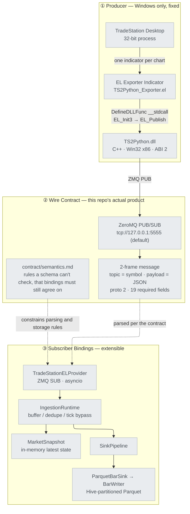
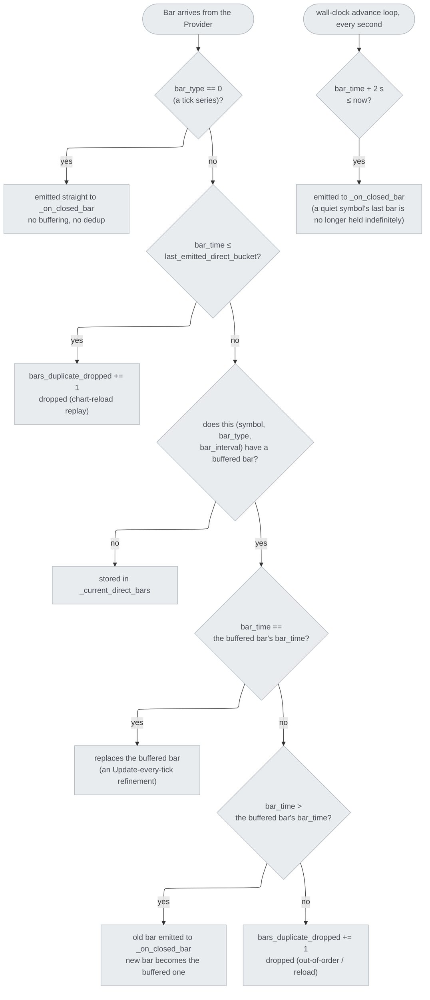
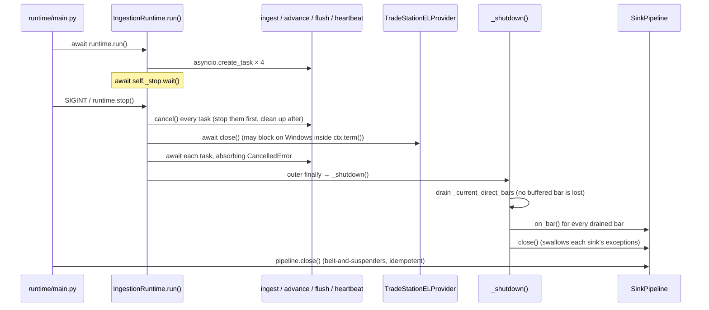

# tradestation-data-provider — System Architecture

> 📖 [繁體中文版](architecture.zh-TW.md)

> This is a human-readable architecture overview. The AI agent's line-by-line behavioral
> rules live in [`CLAUDE.md`](../CLAUDE.md) at the repo root; the two should stay
> consistent, and where they conflict, the code and [`contract/`](../contract/) win (see
> §11). This document was written against, and every version number and behavior verified
> against, the following authoritative sources: `cpp/src/ts2python.cpp`,
> `cpp/include/ts2python.h`, `contract/wire.md`, `contract/semantics.md`,
> `contract/error_codes.md`, `bindings/python/src/tradestation_data/**`.

---

## 1. System Positioning

### 1.1 What this is

A **market data provider for a single vendor (TradeStation)**. It takes every data
point a user has opened on a chart in TradeStation Desktop (Windows, a 32-bit
process) — tick series, intraday minute bars, daily bars — and broadcasts it
through an EasyLanguage indicator → a C++ bridge DLL → ZeroMQ PUB, for subscribers
in any language to consume.

### 1.2 The product is the wire contract, not the Python package

What this repo promises externally is **the protocol running on the wire**, not
`import tradestation_data`. [`contract/`](../contract/) is the sole source of
truth; `bindings/python/` is currently the only reference binding, and the
template to copy when writing the next language binding (Go, Rust, C#, …).

Any parsing rule that lives only inside one binding is a bug — the next
implementation will miss it. That has actually happened in this repo: an earlier
spec document described fields the DLL had already stopped emitting, and nobody
noticed for a long time, because nothing checked whether the two agreed. That is
exactly why the `contract/fixtures/` conformance suite exists (§9).

### 1.3 Non-Goals (deliberately out of scope)

| Out of scope | Why |
| --- | --- |
| **Strategy / order routing / risk** | This is the data-collection-only fork. `domain/` has exactly one type, `Bar`, because the wire has exactly one shape. |
| **Aggregation, resampling, backfill, caching** | `HistoryStore` only reads; it never derives. See §7.6 and §10. |
| **Timeframe vocabulary / name mapping** | `bar_type`/`bar_interval` are EasyLanguage's own words, carried verbatim onto the wire and into storage — there is no translation layer that turns them into names like `"5m"`/`"1d"`. |
| **A non-Windows producer** | Constrained by TradeStation Desktop, a 32-bit Windows process. The subscriber side has no such constraint — the Python binding runs on Windows/macOS/Linux. |
| **Compatibility with the old protocol** | Wire `proto` / DLL ABI are always **2**; there is no older version to stay compatible with. An old payload cannot pass the version gate — it fails structurally (§5.4). |

---

## 2. Three-Layer Overview



The three layers have completely different volatility, and that is the whole basis
of the design:

| Layer | Volatility | Why |
| --- | --- | --- |
| ① Producer | Fixed | Locked to TradeStation Desktop as the one vendor; EL + the C++ DLL are the only way to talk to it |
| ② Contract | Changes rarely, under a strict process | The shared foundation of every language binding — one change affects all of them |
| ③ Bindings | Free to multiply | Python is the reference; future languages (Go/Rust/C#/…) each implement the same contract independently |

---

## 3. Repo Layout

| Path | What it holds | Related sections |
| --- | --- | --- |
| [`contract/`](../contract/) | Wire spec, semantics rules, conformance fixtures — **the sole source of truth** | §5 §6 §9 |
| [`EL/`](../EL/) | EasyLanguage exporter indicator | §4.1 |
| [`cpp/`](../cpp/) | C++ bridge DLL (Win32 x86) + standalone test harness | §4.2 §4.3 |
| [`bindings/python/`](../bindings/python/) | Reference binding: ingestion runtime, pluggable sinks, Parquet store | §7 |
| [`bindings/python/examples/`](../bindings/python/examples/) | 4 runnable examples, 2 of which need neither the DLL nor TradeStation | §7 |
| `docs/` | This document | — |

There is no `config/` at the repo root — `symbols.yaml` / `sinks.yaml` are the
Python binding's own runtime settings, not part of the contract; the next
language binding will have its own configuration shape.

---

## 4. Producer Side: TradeStation → EL Indicator → C++ DLL

### 4.1 EL Exporter Indicator (`EL/TS2Python_Exporter.el`)

Attached as an Indicator to any chart, it calls `EL_Publish` once per data point,
forwarding every reserved word TradeStation supplies for that point exactly as
given: `Date`+`Time`, `BarType`, `BarInterval`, `Category`, OHLC, the five
quantity reserved words, `InsideBid`/`InsideAsk`. **No interval is refused, and no
field is dropped** — that judgment belongs to the consumer, not to this
indicator.

Key behaviors:

- **Zero state**: every symbol/value comes from TradeStation's own built-in
  variables, so one compiled indicator covers every chart type.
- **Version latch**: right after `EL_Init3` succeeds it checks
  `EL_DllVersion()`; on a mismatch, publishing stops entirely and the mismatch is
  logged — it never calls any publish export with an incompatible signature.
- **Sub-minute / aggregated-tick charts**: detected and logged once in the Print
  Log, but **publishing continues regardless**. Such a chart's `BarType`/`BarInterval`
  are indistinguishable from a 1-minute chart's, and `ts_str` only has minute
  resolution — the wire's `ts` (the receive-side clock) is what separates multiple
  frames sharing the same minute. A subscriber that treats these as an ordinary
  minute chart will coalesce several bars within one minute into one (see the
  buffering rule in §7.3).

### 4.2 C++ Bridge DLL (`cpp/src/ts2python.cpp`)

A single global state, serialized by `std::mutex`: one `zmq::context_t` plus one
PUB `zmq::socket_t`.

| Responsibility | Implementation notes |
| --- | --- |
| **Init** (`EL_Init3`) | Idempotent (a repeat call returns `1`, without re-binding or changing `sid`); `SNDHWM=100000`, `linger=0`; on success, stamps a new `g_sid` at microsecond precision and clears `g_seq` |
| **Publish** (`EL_Publish`) | 16 parameters, `__stdcall`; narrows the five quantities first (`double` → `int64`, range-checked against `±9.0e15`, failing with `-4` rather than clamping); then reserves a sequence number (`reserve_seq`, consumed even if the send that follows fails); assembles the payload with `snprintf` (a 768-byte buffer); sends as a 2-frame ZMQ message |
| **Quote nulling** | `InsideBid`/`InsideAsk` ≤ 0 (including NaN) are always turned into JSON `null` — "no quote" is said once on the wire, rather than left for every binding to separately remember what 0 means |
| **DLL pinning** | On the first successful init, `GetModuleHandleExW` pins the DLL into the process's address space, avoiding a deadlock that would occur if TradeStation's `FreeLibrary` triggered `zmq_ctx_term()` under the loader lock |
| **Tombstone exports** | `EL_Init`, `EL_Init2`, `EL_PublishTick`, `EL_PublishBar` all just `return -6;` — see §4.3 |

### 4.3 DLL ABI Version and the Compatibility Matrix

`EL_DllVersion()` returns `2`, paired with the wire `proto`'s `2` —
**version identification is guarded by the name of the init export, not by names
staying the same**: `EL_PublishTick`/`EL_PublishBar` once kept the previous
generation's names while their signatures changed, and under `__stdcall` the
callee pops the stack, so a call with a mismatched signature **corrupts the
stack** rather than returning an error. This publish call was given an
entirely new name, `EL_Publish`, and the two old names were left in `.def` as
tombstones.

| Deployment scenario | Where it's caught | What the operator sees in the Print Log |
| --- | --- | --- |
| New `.ELD` + old DLL | The old DLL has no `EL_Init3` export | `DefineDLLFunc` fails right at Verify time |
| New `.ELD` + a mismatched new DLL | The indicator's `EL_DllVersion()` latch | A version-mismatch message; the indicator stops publishing |
| Old `.ELD` (calling `EL_Init`) + new DLL | Tombstone returns `-6` | `EL_Init FAILED rc=-6` |
| Old `.ELD` (calling `EL_Init2`) + new DLL | Tombstone returns `-6` | `EL_Init2 FAILED rc=-6` |

All four directions fail **readably** — none of them reaches stack corruption,
and none of them produces bad data that looks plausible. **The DLL and the
`.ELD` must be upgraded as a pair**, since they are two separate install steps.

---

## 5. Wire Contract (`contract/`)

### 5.1 Transport and Frame Structure

| Item | Value |
| --- | --- |
| Pattern | ZeroMQ **PUB/SUB**, fire-and-forget, no delivery guarantee |
| Publisher | The DLL `bind`s, defaulting to `tcp://127.0.0.1:5555` |
| Subscriber | `connect`s to the same endpoint and subscribes to each symbol precisely |
| Frame count | 2 (`ZMQ_SNDMORE`): frame 1 = UTF-8 symbol topic, frame 2 = UTF-8 JSON payload |
| High-water marks | Publisher `SNDHWM=100000`; Python binding `RCVHWM=1_000_000` |
| Prefix-match trap | ZMQ `SUBSCRIBE` is a prefix match — subscribing to `SPY` also delivers `SPYG` messages. A binding **must** re-filter by exact string equality after receipt (`contract/semantics.md` §5) |

### 5.2 Payload — Exactly One Shape

**No `kind`, and no `tf`.** Whether it comes from a tick chart, a minute chart, or
a daily chart, the same set of fields is sent every time:

```json
{
  "proto": 2, "seq": 1, "sid": 1785646054360588,
  "ts": 1785646062.364744, "ts_str": "2026-04/18-13:30:45",
  "bar_type": 0, "bar_interval": 1, "category": 2,
  "o": 450.0, "h": 450.0, "l": 450.0, "c": 450.0,
  "el_volume": 100, "el_ticks": 195,
  "el_upticks": 100, "el_downticks": 80, "el_open_interest": 0,
  "bid": 449.99, "ask": 450.01
}
```

| Field | Type | Meaning |
| --- | --- | --- |
| `proto` | int | Protocol version, **always 2**; a payload missing this key is not this protocol |
| `seq` | int | Per-symbol, monotonically increasing; every frame must carry one (§6.5) |
| `sid` | int | Publisher session id (microsecond precision); changes on a DLL restart — that's a reset, not a loss |
| `ts` | float | DLL receive-side wall clock (UTC epoch seconds); used for latency measurement, for ordering same-minute frames on a tick chart, and as the last resort when `ts_str` is absent |
| `ts_str` | string | EL's `Date`+`Time`, `yyyy-MM/dd-HH:mm:ss`, 24-hour ET wall clock, verbatim. **The sole authoritative source for `bar_time`** (§6.1) |
| `bar_type` | int | EL's `BarType`, verbatim. 0 = tick series, 1 = intraday minutes, 2 = daily |
| `bar_interval` | int | EL's `BarInterval`, verbatim; the minute count when `bar_type` = 1 |
| `category` | int | EL's `Category`, verbatim: 0 Future / 2 Stock / 3 Stock Option / 4 Index / … (the lookup key for §6.2) |
| `o` `h` `l` `c` | float | EL's OHLC; on a 1-tick series all four are equal |
| `el_volume` `el_ticks` `el_upticks` `el_downticks` `el_open_interest` | int | EL's five reserved words, verbatim, **required** — a missing field is refused outright (§6.2) |
| `bid` `ask` | float \| null | `InsideBid`/`InsideAsk`; `null` when the publisher had no quote |

Why the wire no longer splits tick from bar shapes, and why `bar_type`/`bar_interval`
are no longer mapped to names like `"5m"`/`"1d"`: both used to be judgments the
publisher made off the wire, on the consumer's behalf (which fields mattered on
which chart, and which interval deserved a name) — and the moment that judgment
was wrong or stale, the consumer had no way to see it. The full tradeoff is
recorded in [`contract/wire.md`](../contract/wire.md).

### 5.3 Why the Version Field Is Called `proto` Rather Than `v`

The previous generation of the wire used `"v"`, counting up to `4`. This rewrite
restarts numbering from `1`; had it reused `"v"`, `{"v":1}` would have been a
legal opening for both the old and new protocols at once — an old v1 bar used
`kind:"bar_1m"`, which the new version gate would let through (`v==1`), only to
be judged an unknown shape at the `kind` check and have the **entire batch of
bars silently dropped**. An old v1 tick would have matched shape, and only at
field-read time would `el_volume` turn out missing — if a binding defaulted
missing fields, the disk would end up with a batch of quantities that are all
zero and look entirely plausible.

Renaming one field makes this whole class of problem **structurally
impossible**: an old payload has no `proto` key at all, so "the version
matches" and "this is actually old data" can never both be true at once.

### 5.4 Error Codes (`contract/error_codes.md`)

| Code | Meaning | Returned by |
| --- | --- | --- |
| `0` | Success | All |
| `1` | Already initialized, an idempotent no-op | `EL_Init3` |
| `-1` | Publish called before a successful init | `EL_Publish` |
| `-2` | ZMQ send failed (hit the high-water mark, or an exception) | `EL_Publish` |
| `-3` | Init's bind/socket creation failed (most commonly: the port is already in use) | `EL_Init3` |
| `-4` | Invalid argument (a null pointer, or a quantity outside `int64`'s representable range) | `EL_Init3` `EL_Publish` |
| `-6` | ABI mismatch — the caller is a `.ELD` older than this protocol | The four tombstone exports |

The real danger isn't these return codes — it's ZMQ PUB's **silent drop** past
`SNDHWM`, which returns no error code at all and leaves the publisher none the
wiser. That is exactly why the payload carries `seq` (§6.5).

---

## 6. Semantic Rules — What Schema Can't Check, but Every Binding Must Agree On

> `contract/semantics.md` matters more than the JSON Schema: schema only
> validates "the field exists, the type is right." What actually makes different
> language bindings produce inconsistent data is semantics.

### 6.1 Time Authority: `bar_time` = `ts_str`, and It's a Close Time

| Field | Correct use | Wrong use |
| --- | --- | --- |
| `ts_str` | **The sole authoritative source for `bar_time`**: parsed as `America/New_York` (the IANA tz database, not the system's local timezone), converted to UTC, floored to the minute | Treating it as having second-level resolution (it only has minute resolution) |
| `ts` | The DLL's receive-side wall clock; the ordering key for same-minute frames on a tick chart; the last resort when `ts_str` is **absent** (present but unparseable is a different state — see below) | A source for `bar_time` |

**`ts_str` being absent and `ts_str` failing to parse are two states that must be
handled separately:**

| State | Binding behavior | Why |
| --- | --- | --- |
| The field doesn't exist, or is `""` | Allowed to fall back to `ts` (the receive clock), but **must log it once** | The publisher is honestly declaring it has no such information |
| The field has a value that fails to parse | **Must refuse the whole frame**, must not fall back to `ts` | Falling back to `ts` during a historical replay collapses the whole session onto one `bar_time` — the zh-TW host's `FormatTime("tt")` incident actually made this happen |

**`bar_time` has no shift and no grid alignment.** EasyLanguage's `Time` is a
**close** time, and `bar_time` carries it through verbatim — no subtracting a
minute, no aligning to a grid anchored at 09:30. This repo used to do both, at
the cost of a 60-minute chart dropping one bar a day: TradeStation restarts its
intraday grid at the RTH open and close, so two genuinely different close points
land on the same grid slot after alignment, and the later one overwrites the
earlier one. **A consumer that wants left-edge labels subtracts for itself** —
that's the consumer's job, not this transport's.

### 6.2 The Five `el_*` Quantities — Intraday and Daily Swap Meaning, in Two Pairs Running Opposite Directions

The wire carries five quantities, **each one the raw value of the identically
named EasyLanguage reserved word**; the publisher makes no selection, conversion,
or correction, and neither does a binding. The `el_` prefix on the field names is
part of the spec, not decoration — this repo once dropped it down to a plain
`volume`, at the cost of a volume column that was systematically about half of
the real number.

Per TradeStation's official definition (for equities — see the
[EL reserved-words page](https://help.tradestation.com/10_00/eng/tsdevhelp/elword/el_definitions/easylanguage_words_related_to_ticks,_volume_&_open_interest.htm)):

| EL reserved word | **intraday** (minute / tick / volume bar) | **daily and above** |
| --- | --- | --- |
| `Volume` | Only the up-tick share volume | Total share volume |
| `Ticks` | **Total share volume** | Total tick count; equals `Volume` on equities (OI = 0) |
| `UpTicks` | Up-tick share volume | Total share volume |
| `DownTicks` | Down-tick share volume | 0 (equities) / Open Interest (futures) |
| `OpenInt` | 0 (equities) / down-tick volume (futures) | Open Interest (futures) / 0 otherwise |

**There are two swapped pairs, running in opposite directions**: `Volume`/`Ticks`
is the well-known one; `DownTicks`/`OpenInt` is the second — intraday, `OpenInt`
borrows `DownTicks`'s meaning; daily, `DownTicks` borrows `OpenInt`'s meaning.

> **Measured live (2026-08-02, SPY / @ES / VXX / a SPY option, all intraday
> charts)**: `el_open_interest` **always returns the value of `el_downticks` on
> an intraday chart**, regardless of instrument category — `@ES` futures match
> the official documentation, but the three equity/option rows (`SPY`/`VXX`/the
> option) are not documented and were measured this way. **A futures daily bar's
> `el_downticks` IS open interest** — summing that column sums OI, not volume.

A consumer wanting "total volume" reads the field this table names for the
`bar_type`: **`el_ticks` intraday, `el_volume` daily**. **Do not "verify" a daily
bar by summing intraday bars** — `1d` is the exchange's officially consolidated
figure after settlement (including late-reported block trades), while intraday
is whatever was assembled from the live stream at the time; the two measurements
have different scope and are not supposed to match
(`contract/semantics.md` §3.4 has the full four-point reasoning and the measured
numbers).

### 6.3 When `bid`/`ask` Are Invalid

The DLL already turns `InsideBid`/`InsideAsk` ≤ 0 (including NaN) into JSON
`null`; the binding only needs one more belt-and-braces check
(`_quote_or_none`). **There is no hard-coded list of index/breadth symbols** —
an earlier version had one, with `VXX` on it, and VXX is a tradeable ETN that
measured 567,776 shares of volume in a single bar, so its real quote was being
thrown away for nothing. `category` (§5.2) now travels on every frame, so a
consumer that wants that behavior has a fact to key off instead of a guessed
list.

### 6.4 Session Rules

| Rule | Value |
| --- | --- |
| US equity RTH | 09:30–16:00 **ET** |
| Session assignment | A bar before 04:00 ET belongs to the **previous** session |
| `breadth`-symbol retention | Reset daily at 09:30 ET; no pre-market retention |
| Other symbols (`etf`/`volatility`/`mega_cap`) retention | Not reset; 60 minutes of pre-market data retained by default |

Defaults are determined by `category` in
`bindings/python/config/symbols.yaml`, and can be overridden per symbol
(`aggregation/session.py::SessionPolicy.for_category`). This is a **market
rule**, not an implementation detail of any one binding — if a binding interprets
it independently, its session boundaries will disagree with every other
binding's.

### 6.5 Sequence Numbers and Gap Detection (`seq` / `sid`)

| Rule | Explanation |
| --- | --- |
| Per-symbol, shared by tick and bar | The counting unit is the symbol, not (symbol, kind) — a subscriber listening to one topic can only detect its own loss with a single shared counter |
| The first message seen for a symbol | Establishes the baseline; it must **not** be reported as loss — nobody was listening when earlier messages were sent |
| A change in `sid` | Means the publisher restarted; state must reset. The idempotent init path (returning `1`) does **not** change `sid`, so re-Verifying the indicator is never mistaken for a restart |
| `seq < expected` | TCP guarantees single-publisher ordering, so a smaller sequence number is a duplicate/replay — **the expectation must not be rolled back** |
| A sequence number is consumed even on send failure | That data really was lost, and showing it as a gap is the honest answer |
| `messages_lost == None` | "Cannot tell" and "confirmed zero" are two different states that must be expressible separately (see `gap_detection_available` in §7.2) |

`messages_lost` (transport-layer loss) and `frames_refused` (received but failed
to parse — e.g. a `proto` mismatch) must be read **together**: a stream in which
every single frame is refused still reports `messages_lost == 0` — this is
exactly what the "binding upgraded first, DLL not yet upgraded" window really
looks like.

---

## 7. Python Reference Binding — Internal Architecture

### 7.1 Module Layers

```
tradestation_data/
├── wire/          ZMQ SUB + payload parsing (TradeStationELProvider)
├── domain/        Bar — the only data type this binding has
├── runtime/        IngestionRuntime (buffer/dedupe/lifecycle), CLI (main.py), symbols.yaml loading
├── aggregation/   MarketSnapshot (in-memory latest state), SessionPolicy
├── sinks/         Sink protocol, SinkPipeline, built-in sinks, dynamic loading from sinks.yaml
└── storage/       BarWriter (write), HistoryStore (read) — Hive-partitioned Parquet
```

### 7.2 End-to-End Data Flow: One Data Point's Journey

```mermaid
---
config:
  flowchart:
    defaultRenderer: elk
---
flowchart LR
    DLL["EL_Publish<br/>(cpp)"] -->|"ZMQ PUB<br/>2-frame"| RECV["socket.recv_multipart()<br/>wire/el_subscriber.py"]
    RECV --> TOPICCHK{"topic string<br/>exactly equal?"}
    TOPICCHK -->|"no (prefix mismatch)"| DROP1["dropped<br/>topic_prefix_mismatch_dropped"]
    TOPICCHK -->|"yes"| PARSE["_parse_payload()<br/>proto gate + seq observed + quantities required"]
    PARSE -->|"proto≠2 / missing field / bad JSON"| DROP2["frames_refused += 1<br/>logged, stream continues (no raised error)"]
    PARSE -->|"ok"| BAR["Bar (domain/bar.py)"]
    BAR --> INGEST["IngestionRuntime<br/>._handle_provider_bar()"]
    INGEST -->|"see the §7.3 decision diagram"| CLOSED["_on_closed_bar()"]
    CLOSED --> SNAP["MarketSnapshot.on_bar()"]
    CLOSED --> PIPE["SinkPipeline.on_bar()"]
    PIPE --> PQ["ParquetBarSink → BarWriter.write()"]
    PQ -->|"should_flush() fires"| DISK["bars.parquet<br/>bartype=N/interval=M/symbol=SYM/date=YYYY-MM-DD/"]

    classDef existing fill:#e9ecef,stroke:#adb5bd,color:#495057
    class DLL,RECV,TOPICCHK,DROP1,PARSE,DROP2,BAR,INGEST,CLOSED,SNAP,PIPE,PQ,DISK existing
```



### 7.3 `IngestionRuntime`: Buffering, Deduplication, and the Tick Bypass

EL's "Update every tick" mode calls `EL_Publish` repeatedly for the same bar
within one bucket, each call carrying a more refined OHLC.
`IngestionRuntime._handle_provider_bar` buffers the latest one for each
`(symbol, bar_type, bar_interval)` and only actually emits it when the next
bucket arrives (or on a wall-clock timeout, or on shutdown) — so a sink only
ever sees the **final** version of each bucket's bar.

**`bar_type == 0` (a tick series) bypasses this buffer entirely**: the buffer's
precondition is that `bar_time` uniquely identifies one bar, but `ts_str` only
has minute resolution, so every print within one minute on a tick chart shares
the same `bar_time`. Routed through the buffer, each new tick would replace the
previous one and only one print per minute would ever be emitted — an actively
trading tick chart would lose nearly its entire stream. So every frame on a tick
chart **is emitted the moment it arrives**; the wire's `ts` is what orders
prints sharing a minute, and whether to deduplicate is left to the consumer.



**The buffer key includes the timeframe**, not just the symbol: one DLL, one PUB
socket, and one topic now carry every interval the user has open at once. Keyed
on symbol alone, a 1-minute bar's arrival would prematurely evict and emit a
5-minute bar still accumulating, and the 5-minute chart's real update would then
be dropped as a "duplicate" — while the 1-minute partition looks perfectly
healthy the whole time, masking the problem.

**"A quiet symbol still gets its last bar" uses `bar_time + 2 seconds`, not
`bar_time + interval`.** `bar_time` is already a close time (§6.1); the old
formula added an interval on top of a close time, which delayed every bar by a
full interval — a full day, for a daily chart. That formula has been removed,
and no per-chart-type "duration table" is needed either.

### 7.4 `MarketSnapshot` and Session Policy

An in-memory view of the latest state, safe under asyncio's single-threaded
model: `last_closed_bar`, a bounded `recent_bars` deque, `session_date`,
`session_open_bar`. Coroutines that span an `await` should call
`view_of()`/`views()` to get an immutable snapshot, avoiding a data race with
concurrent ingestion updates. `SessionPolicy` (§6.4) decides whether
`recent_bars` clears when the 09:30 ET boundary is crossed, and how much
pre-market data is retained.

### 7.5 Sink Pipeline and Built-In Sinks

`IngestionRuntime` doesn't write to `BarWriter` directly — it writes to a
`SinkPipeline`, which broadcasts every closed bar to every registered sink,
**isolating each sink's exceptions** (`sink_on_bar_failed` is logged and
execution continues, without affecting the other sinks). The pipeline is built
from `config/sinks.yaml` via `sinks.registry.build_pipeline_from_config()`;
`class:` is a `module:attr` string pointing at any callable that returns a
`Sink` protocol implementation — users can point it at their own module to
register a custom sink without touching this repo.

| Built-in sink | Purpose |
| --- | --- |
| `ParquetBarSink` | The default persistence sink. A thin layer over `BarWriter` (§7.6), exposing only `on_bar`/`should_flush`/`flush`/`close` |
| `InMemorySink` | A bounded per-symbol deque, for tests / notebook exploration only |
| `CallbackSink` | Dynamic Python callback dispatch; `get_sink(name)` retrieves the instance declared in `sinks.yaml` from a module-level `WeakValueDictionary`; `close()` removes it from the registry immediately |

### 7.6 Storage: `BarWriter` / `HistoryStore`

**The write side (`storage/bar_writer.py`)** partitions on EasyLanguage's own
`BarType`/`BarInterval`, mapping to no name at all — so "an interval this
binding has no name for" no longer means "this data doesn't exist":

```
{root}/bartype={N}/interval={M}/symbol={SYM}/date={YYYY-MM-DD}/bars.parquet   # bar_type != 2
{root}/bartype=2/interval={M}/symbol={SYM}/bars.parquet                       # bar_type == 2, no date= level
```

`BarType 2` (daily) has no `date=` level, because one day's worth of daily bars
is a single row, and a closed Parquet file costs roughly 2.9 KB of schema/footer
overhead no matter how many rows it holds — twenty years of one symbol is only
about 5,000 rows. So the whole file is **rewritten in full on every flush**
(the existing rows are read back, merged with the new ones, deduplicated on
`bar_time` keeping the last write, sorted, written to a temp file, then swapped
in with `os.replace`).

**Buffering and flush triggers**: `max_buffered_bars` (accumulated across every
partition) or `max_flush_seconds` (measured from the oldest buffered bar).
Writing one bar at a time used to cost one Parquet row group per bar — measured
on 78 five-minute bars, writing one at a time produced 145,977 bytes across 78
row groups, versus 5,936 bytes in 1 row group when buffered.

**Sealing a partition (only `date=` partitions)** requires **both** signals to
hold at once:

1. A bar for a **later day** of the same (timeframe, symbol) arrives; **and**
2. That day is over in ET, **and** a full `max_flush_seconds` has passed with no
   new data.

Signal (1) alone would leave the **newest** day of a finished replay waiting
forever (no later day is ever coming); signal (2) alone would seal a day partway
through a replay burst (five days of data can arrive within seconds), and
`write()` refuses a sealed partition — turning "not readable yet" into "the data
is really gone." The quiet period is what separates "this day is over" from
"this day has merely gone quiet for now." **Today's partition is never sealed by
(2)**, because once a `pq.ParquetWriter` is `close()`d, it can't be reopened and
resumed.

**The read side (`storage/history_store.py`) only reads, and never derives**: a
query for an interval that was never published returns zero rows, never
invents a plausible-looking substitute, and never writes on the read path. A
consumer wanting a derived interval has to either chart it in TradeStation, or
build it from what's stored here. Query bounds are always normalized to UTC
first (a naive input is read as ET — this is a US-equity API, and the `date=`
partitions themselves are defined in ET), and files are pre-selected by the
`date=` directory name before opening any of them, so a query never gets dragged
down by today's still-open, footerless file (it only affects today; already
sealed past days remain readable).

### 7.7 The Windows Event Loop Special Case

pyzmq's asyncio integration uses `loop.add_reader()`, which Windows' default
`ProactorEventLoop` **does not support** — the SUB socket connects normally, but
`recv_multipart()` never wakes up, **with no error to explain it**. Every entry
point must force a selector loop:

```python
loop_factory = asyncio.SelectorEventLoop if sys.platform == "win32" else None
asyncio.run(coro, loop_factory=loop_factory)
```

`loop_factory` is used rather than `asyncio.set_event_loop_policy(...)`: the
whole policy API is deprecated as of 3.14 and slated for removal in 3.16, at
which point the old spelling would stop this CLI from starting at all on the
only platform TradeStation runs on. `tests/conftest.py` is the one remaining
caller of the policy API, because pytest-asyncio 1.3.0 doesn't yet expose a
`loop_factory` hook; `pyproject.toml`'s `filterwarnings` carries three
**narrowly scoped** ignores for exactly this, and must not be widened back to
`ignore::DeprecationWarning`.

### 7.8 Shutdown Ordering



**Background tasks are cancelled first, then the provider is closed, and sinks
are cleaned up last**: the order used to close the provider first, but on
Windows `zmq ctx.term()` can block long enough for a second Ctrl+C to interrupt
the inner `finally`, skipping `_shutdown()` and leaving `bars.parquet` with no
footer forever. `_shutdown()` now sits in the **outer** `finally`, so it runs
no matter what throws or gets interrupted above it. `_wake_on_task_death`
guarantees that any background loop dying unexpectedly wakes `_stop`, instead
of leaving the process alive and quietly still logging heartbeats while nothing
is being ingested anymore.

---

## 8. Producer-Side Configuration Summary (Python binding)

| Config file | Contents |
| --- | --- |
| `config/symbols.yaml` | The symbol list, `category` (determines the default session policy in §6.4), `role` (`trade`/`context`, advisory only, not enforced) |
| `config/sinks.yaml` | The sink pipeline declaration (§7.5); defaults to a single `ParquetBarSink` writing to `data/bars/` |

`--data-root` only acts as a fallback when `--sinks-config` is missing; to
redirect output under normal operation, edit `sinks.yaml`'s `root`, not the CLI
flag.

---

## 9. The Conformance Suite (`contract/fixtures/`)

The claim of a multi-language binding becomes a verifiable fact here: every
binding must pass the same set of fixtures.

| Fixture | Harness mode | Frame count | Covers |
| --- | --- | --- | --- |
| `smoke.jsonl` | `smoke` | 6 | tick+bar, per-symbol `seq`, bucket floored to the minute, timestamps landing verbatim |
| `noquote.jsonl` | `noquote` | 3 | No quote → `null` on the wire, including a non-index symbol with no quote |
| `bars.jsonl` | `bars` | 9 | Every `BarType`/`BarInterval` combination, **none of them refused** (including a 2-minute chart, a weekly chart, a 2-day chart — the old DLL used to return `-5` and send nothing) |
| `session.jsonl` | `session` | 2 | The first and last bar of a session, pinning "the publisher's own value gets stored, unchanged" |

**Two rules**:

1. **A fixture must be recorded with `contract/tools/record.py` +
   `TS2Python_TestHarness.exe`, never hand-written.** A hand-written fixture just
   writes down "what we think the wire looks like" a second time, and can't catch
   any gap between the implementation and the spec.
2. **`expected/` must never be generated by any binding.** Expected results are
   derived independently from the rules in `semantics.md`; generating an expected
   value from the code under test can only prove it agrees with itself.

Known coverage gaps (`contract/fixtures/README.md`): `ts_str` → UTC on a DST
transition day, detection behavior after a `seq` gap, a `sid` change within one
recording session — the harness currently has no way to deliberately produce
these scenarios.

An `el_volume`/`el_upticks` swap **can never be caught by a fixture**:
TradeStation's own definition makes these two fields equal in both the intraday
and daily régimes, so real data itself can't distinguish a swap — this one has
to be guaranteed by reading the code, and it's written up in §6.2 precisely so
the next implementer doesn't mistake "every fixture passes" for "all five fields
are correct."

---

## 10. Testing, CI/CD, and Packaging

| Item | Details |
| --- | --- |
| Python version matrix | 3.12 / 3.13 / 3.14, on ubuntu-latest + windows-latest (`.github/workflows/ci.yml`) |
| Lint / Format | `ruff check` / `ruff format --check`, line length 100; `contract/tools/` is linted separately against the repo-root `.ruff.toml` |
| Type checking | `mypy` strict on `src/` (`tests/` excluded) |
| Tests | `pytest -q`, `asyncio_mode=auto`, `filterwarnings=["error", ...]` — **a new warning fails the build outright** |
| Build | `uv build` → `hatchling`; the wheel packages only `src/tradestation_data`; the sdist additionally includes `tests/`, `config/{sinks,symbols}.yaml`, the READMEs, and the license |
| Release | A `v*` tag push → build → smoke-tested by installing into an isolated venv and running `tradestation-data-ingest --help` → published to PyPI via Trusted Publishing (OIDC, no API tokens) |

The C++ side only builds Win32 (x86) — TradeStation is a 32-bit process. MSBuild
imports vcpkg from the submodule via `cpp/vcpkg-local.props`/`.targets`, and
disables the global `%LOCALAPPDATA%\vcpkg\vcpkg.user.props` integration so
different clones can't contaminate each other.

---

## 11. What This Binding Does Not Do

**The Python binding only receives, labels, and stores — nothing else.** No
aggregation, no resampling, no backfill, no cache, no writing a derived value
into the live store — all of these used to exist in this repo and have since
been removed entirely: `BarAggregator`, `Resampler`, `bar_coverage`, the
`source = derived:*` provenance mechanism, `publisher_version`. Likewise,
`domain/timeframe.py`, `align_bucket_start`, `SESSION_ANCHORED_TIMEFRAMES`, and
the 04:00 ET daily grid anchor have all been deleted — a chart is named only by
EasyLanguage's own `BarType`/`BarInterval`, verbatim.

The reason: a bar that was computed becomes **indistinguishable** from one that
was actually published, the moment it's persisted. `HistoryStore.load_bars`
therefore answers zero rows for an interval that was never published, and never
conjures up a plausible-looking bar on the read path —
`tests/test_history_store.py::test_load_bars_never_derives_bars_it_was_not_given`
pins this down as a test.

---

## 12. Reference Index

| Want to know… | See |
| --- | --- |
| Every field of the wire frame, the export list, the compatibility matrix | [`contract/wire.md`](../contract/wire.md) |
| Semantic rules the wire schema can't check (time, `el_*`, session, sequencing) | [`contract/semantics.md`](../contract/semantics.md) |
| The payload's JSON Schema | [`contract/point.schema.json`](../contract/point.schema.json) |
| DLL C ABI return codes | [`contract/error_codes.md`](../contract/error_codes.md) |
| How to record / add a conformance fixture | [`contract/fixtures/README.md`](../contract/fixtures/README.md) |
| How to write the next language's binding | [`contract/README.md`](../contract/README.md) |
| Python binding commands, conventions, and the AI agent's line-by-line rules | [`CLAUDE.md`](../CLAUDE.md) |
| C++ build environment | [`cpp/README.md`](../cpp/README.md) |
| EasyLanguage indicator installation | [`EL/README.md`](../EL/README.md) |
| How to use the Python binding | [`bindings/python/README.md`](../bindings/python/README.md) |

> **Known documentation drift**: the repo-root `README.md`'s Versioning table and
> the top of `contract/README.md` still label the wire `proto` and the DLL ABI as
> `1`; this document, along with `contract/wire.md`, `contract/semantics.md`,
> `cpp/src/ts2python.cpp` (`kDllVersion = 2`), and
> `bindings/python/.../wire/el_subscriber.py` (`PROTO_VERSION = 2`), have all been
> verified against the code as **2**. Those two spots haven't been updated yet
> and are worth fixing on their own.
