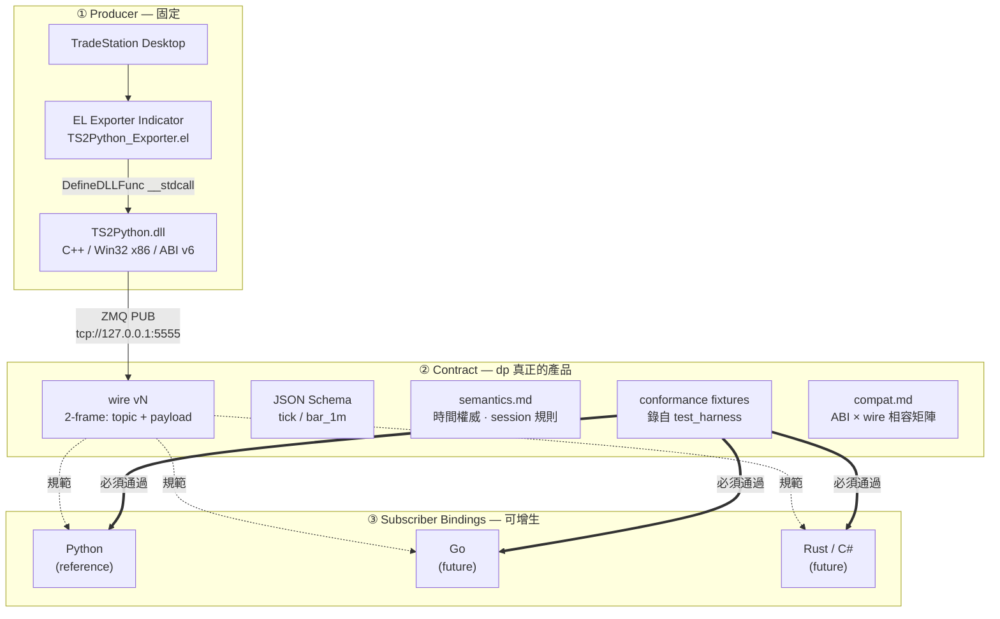
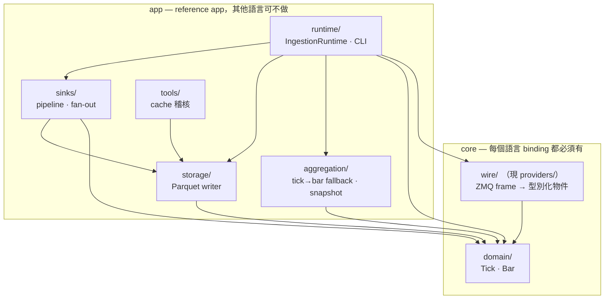
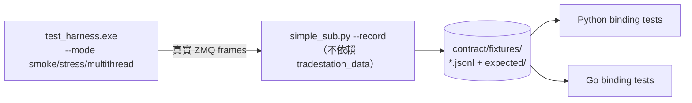
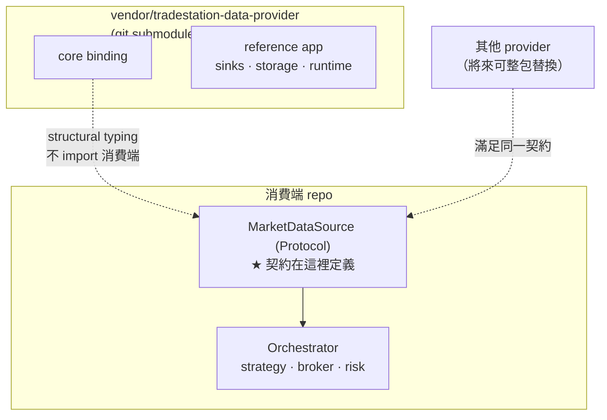

# tradestation-data-provider — 架構設計

> 本文是 dp 的架構 SSoT。消費端如何整合見 [`migration/tradingagent-submodule.md`](migration/tradingagent-submodule.md)。

---

## 1. 定位

### 1.1 這是什麼

**TradeStation 這一家的市場資料 provider。** 從 TradeStation Desktop 取得即時 tick 與
1-minute bar，經 EasyLanguage indicator → C++ bridge DLL → ZeroMQ PUB，供任意語言的
subscriber 消費。

### 1.2 產品是 wire contract，不是 Python package

dp 對外承諾的東西不是 `import tradestation_data`，而是**線上跑的那個協定**。
Python package 是目前唯一的 reference binding，將來會有 Go / Rust / C# 等其他
subscriber binding，全部對同一份 contract。

因此：

- `contract/` 是本 repo 最高優先級的資產，任何 binding 的行為以它為準。
- 任何「只有 Python 知道」的解析規則都是 bug，必須上移到 contract。

### 1.3 Non-Goals

| 不做 | 理由 |
| --- | --- |
| **泛用 vendor 抽象層** | dp 只服務 TradeStation。「換 vendor」是消費端整包替換 dp，不是在 dp 內部切換 provider。 |
| **定義消費端契約** | 消費端自己宣告需要什麼介面，dp 靠 structural typing 滿足它。dp 不 import 消費端任何東西，也不知道消費端存在。 |
| **策略 / 下單 / 風控** | 屬消費端。dp 是 data-collection-only。 |
| **更換 producer 語言** | EL + C++ DLL 固定。可增生的是 subscriber 側。 |
| **非 Windows producer** | 受 TradeStation Desktop 限制。subscriber 側不受此限。 |

---

## 2. 三層架構

三層的可變性完全不同，這是整個設計的基礎：



| 層 | 可變性 | 誰負責 |
| --- | --- | --- |
| ① Producer | 固定 | 本 repo（EL + cpp） |
| ② Contract | 版本化演進（v1 JSON → v2 MessagePack） | 本 repo（contract/） |
| ③ Bindings | 增生 | 本 repo（Python）+ 未來各語言 |

---

## 3. Repo Layout

標記：`（現有）` 不動 · `←` 從 TA 搬入 · `★` 新增 · `⇢` 位置變更 · `[core]` / `[app]` 見 §5

```
tradestation-data-provider/
│
├─ contract/                             ★ ② 語言中立 SSoT — 本 repo 最高優先資產
│  ├─ README.md                          ★ contract 入口：讀者是「要寫新 binding 的人」
│  ├─ v1/
│  │  ├─ envelope.md                     ★ 2-frame 規則（topic frame + payload frame）
│  │  ├─ tick.schema.json                ★ EL_PublishTick payload
│  │  └─ bar_1m.schema.json              ★ EL_PublishTickEx payload
│  ├─ semantics.md                       ★ 時間權威關係 · session 規則 · symbology 語意
│  ├─ compat.md                          ★ DLL ABI × wire version 相容矩陣
│  ├─ error_codes.md                     ← TA/docs/error_codes.md（30 行，整份）
│  ├─ fixtures/                          ★ 錄自 test_harness 的真實 frame
│  │  ├─ smoke.jsonl                     ★ --mode smoke
│  │  ├─ breadth_no_bidask.jsonl         ★ $TICK：volume=0 · bid/ask=null
│  │  ├─ dst_transition.jsonl            ★ DST 轉換日的 ts_str → UTC
│  │  ├─ session_boundary.jsonl          ★ 盤前 / 半日市
│  │  ├─ multithread.jsonl               ★ --mode multithread，frame 交錯
│  │  └─ expected/*.json                 ★ 語言中立的期望解析結果
│  └─ tools/
│     └─ record.py                       ⇢ 由 scripts/simple_sub.py 演進（加 --record）
│                                        　 Python 僅作腳本語言，不依賴任何 binding
│
├─ EL/                                   ← ① 從 TA 搬入（提案 A）
│  ├─ README.md                          ←
│  └─ TS2Python_Exporter.el              ←   TradeStation 側訊號源頭
│                                        　 （TA/EL/monarch 為策略用，留在 TA）
│
├─ cpp/                                  （現有）① bridge DLL — 語言固定為 C++
│  ├─ CMakeLists.txt · CMakePresets.json · vcpkg.json
│  ├─ TS2Python.sln · TS2Python.vcxproj · TS2Python_TestHarness.vcxproj (+.filters)
│  ├─ README.md · README.zh-TW.md        　 §4 的 wire 說明改為指向 contract/
│  ├─ include/ts2python.h                　 C ABI（EL_Init / EL_PublishTick[Ex] / …）
│  ├─ src/ts2python.cpp                  　 ZMQ PUB publisher
│  ├─ src/test_harness.cpp               　 ★ 不依賴 TradeStation 的 frame 產生器
│  ├─ src/TS2Python.def
│  └─ build-tools/vcpkg/                 　 submodule
│
├─ bindings/                             ★ ③ subscriber bindings
│  └─ python/                            ⇢ 由 repo 根目錄搬入（reference binding）
│     ├─ pyproject.toml                  ⇢
│     ├─ uv.lock                         ⇢
│     ├─ README.md                       ★ 本 binding 專屬說明
│     ├─ config/
│     │  └─ sinks.yaml                   ⇢ Python 專屬（值是 module:attr 路徑）
│     ├─ src/tradestation_data/
│     │  ├─ __init__.py · py.typed
│     │  ├─ domain/                      [core] bar.py · tick.py · position.py
│     │  │                               　 order.py → 見 §3.2 待決策
│     │  ├─ wire/                        [core] ⇢ 由 providers/ 改名（§5.2）
│     │  │  ├─ base.py                   　 原 providers/base.py，語意收窄
│     │  │  ├─ el_subscriber.py          　 原 tradestation_el.py
│     │  │  └─ webapi.py                 ← 從 TA 搬入的 Phase 6 stub
│     │  ├─ aggregation/                 [app] bar_aggregator · session · snapshot
│     │  ├─ storage/                     [app] bar_writer · tick_writer
│     │  │                               　    history_store · resampler
│     │  ├─ sinks/                       [app] base · pipeline · registry
│     │  │                               　    parquet · memory · callback
│     │  ├─ runtime/                     [app] config · ingestion · main
│     │  └─ tools/                       [app] audit_bar_cache · clear_bar_cache
│     ├─ scripts/                        ⇢ 9 支 Parquet 維運腳本
│     │                                  　 （simple_sub.py 已升格 contract/tools/）
│     └─ tests/                          ⇢ 32 支現有測試
│        └─ conformance/                 ★ 對 contract/fixtures 跑驗證
│
├─ config/
│  └─ symbols.yaml                       （現有，留根）symbology — 語言中立，
│                                        　 所有 binding 共用；規則本文進 semantics.md
│
├─ docs/
│  ├─ architecture.md                    ★ 本文
│  ├─ design.md                          ← TA/docs/design.md 的 provider 段落
│  │                                     　 （§3.1–3.4 · §5；全文 1473 行，需節選）
│  ├─ benchmarks.md                      ← 待評估是否 provider 相關
│  └─ migration/
│     └─ tradingagent-submodule.md       ★ 消費端遷移筆記
│
├─ .github/                              （現有）路徑需隨 bindings/ 更新
│  ├─ dependabot.yml
│  └─ workflows/{ci.yml, release.yml}
│
├─ .claude/ · .gitignore · .gitmodules   （現有）
├─ CHANGELOG.md · CLAUDE.md · CONTRIBUTING.md · LICENSE · SECURITY.md   （現有）
└─ README.md · README.zh-TW.md           （現有）改寫：主角是 contract，非 Python
```

### 3.1 各層歸屬判準

| 放哪 | 判準 | 例子 |
| --- | --- | --- |
| `contract/` | **換 binding 語言後必須一致**的東西 | 時間權威來源、session 規則、error code |
| `config/`（根） | 語言中立的執行期設定 | `symbols.yaml`（symbology） |
| `bindings/python/config/` | 只有該 binding 看得懂的設定 | `sinks.yaml`（值是 `module:attr`） |
| `bindings/<lang>/` | 該語言的實作、測試、腳本 | 其餘全部 |

`config/sinks.yaml` 之所以必須下放，是因為它的內容是 Python import 路徑：

```yaml
class: tradestation_data.sinks.parquet:ParquetBarSink
```

Go binding 讀到這行毫無意義。反之 `symbols.yaml` 描述的是市場事實（symbol 分類、
session 政策），任何 binding 都需要。

### 3.2 消費端職責殘留 — 已決議移除

分家時從 TA 一併帶過來、但不屬於 data provider 職責的東西：

| 項目 | 現況 | 決策 |
| --- | --- | --- |
| `domain/order.py` | `Order` `Fill` `OrderIntent` `OrderStatus` `OrderType` `Side` **僅 `tests/test_domain.py` 使用**，無 production code 引用 | **移除。** 歸消費端（TA 的 `brokers/` 是真正使用者）。dp 不下單，不需要訂單模型 |
| `MarketSnapshot` 的部位追蹤 | `aggregation/snapshot.py:91,162-169` 的 `_positions` / `position_of()` / `positions` / `set_position()`，依賴 `domain/position.py` | **移除。** 部位追蹤屬消費端；連帶 `domain/position.py` 一併移除 |

移除後 `domain/` 只剩 `bar.py` 與 `tick.py` —— 這正是 wire 上實際存在的兩種事件，
與 `MarketEvent = Tick | Bar` 完全對齊。**「dp 的 domain 等於 wire 的值域」** 成為一條
可檢查的不變式：任何新增的 domain 型別若在 wire 上沒有對應，就是職責越界的訊號。

> **決策（已採納）** — Python 移至 `bindings/python/`，讓第二個 binding 進來時是純新增。
> 代價是 `pyproject.toml` / CI / README 路徑要改，消費端的 submodule 引用路徑也變深；
> 在 repo 尚未上 PyPI 的此刻執行成本最低。

### 3.1 EL 為何必須在本 repo

EL indicator 是 TradeStation 訊號的**源頭**。缺了它，dp 無法端到端自我驗證
「能不能從 TradeStation 拿到資料」，也無法宣稱自己是完整的 TradeStation provider。

---

## 4. Wire Contract

### 4.1 v1 現況

每次 publish 送出兩個 frame：

| Frame | 內容 | 型別 |
| --- | --- | --- |
| 1 | Topic | UTF-8 symbol（`SPY` / `VXX` / `$TICK`） |
| 2 | Payload | JSON，兩種 shape 之一 |

```jsonc
// tick — EL_PublishTick，單筆成交
{ "v": 1, "kind": "tick", "ts": ..., "ts_utc": ..., "ts_str": "2026-04/18-13:30:45",
  "px": 450.0, "vol": 100, "bid": 449.99, "ask": 450.01, "tc": 1 }

// bar_1m — EL_PublishTickEx，已成形的分鐘 bar
{ "v": 1, "kind": "bar_1m", "ts": ..., "ts_utc": ..., "ts_str": "2026-04/18-13:31:00",
  "o": ..., "h": ..., "l": ..., "c": ..., "vol": ..., "bid": ..., "ask": ..., "tc": ... }
```

Topic 放在獨立 frame 是為了讓 subscriber 的 filter 在 topic 上做，payload 擴充
schema 時不影響訂閱行為。

### 4.2 時間語意（跨 binding 必須一致）

三個時間戳的權威關係目前只寫在 `cpp/README.md` 一行散文裡，必須升格為
`contract/semantics.md` 的正式規範：

| 欄位 | 來源 | 用途 |
| --- | --- | --- |
| `ts` | DLL 收訊端 wall clock（UTC epoch） | 延遲量測。**不可**用於 bar 對齊 |
| `ts_utc` | EL 字串經 `std::chrono::zoned_time`（America/New_York）轉 UTC | 參考值 |
| `ts_str` | EL 原始 `yyyy-MM/dd-HH:mm:ss`，逐字透傳 | **bar `bucket_start` 的唯一權威來源** |

> 「以 `ts_str` 為權威」是**跨 binding 的強制規範**。若 Go binding 自行改用
> `ts_utc`，兩個 binding 算出的 bar 邊界會在 DST 轉換日不一致。這類決策不能只存在於
> 某一個 binding 的實作裡。

#### bucket_start 為左標籤

Bar 以 **`bucket_start` 左標籤**表示，區間為半開的 `[t, t+step)`。
一個 US RTH 09:30–16:00 的 1m session 產生 390 根 bar，`bucket_start` 為
**09:30 … 15:59**（最後一根涵蓋 `[15:59, 16:00)`），**不是** 09:31 … 16:00。

> 這條規範是被真實 bug 逼出來的：`scripts/verify_parquet.py` 的 `_expected_bars()`
> 原本產生右標籤序列（09:31…16:00），與 `BAR_SCHEMA.bucket_start` 不符，導致完整的
> session 被誤判為缺漏。左/右標籤是市場資料最典型的靜默錯誤來源之一 —— 兩邊都「看起來
> 對」，但差一根 bar。正因如此它必須是 contract 級規範，且 conformance fixtures 要涵蓋
> session 首尾兩根 bar。

### 4.3 ⚠️ 缺口：無法偵測資料遺漏

**這是與專業市場資料 API 之間最大的落差。**

ZeroMQ PUB/SUB 是 fire-and-forget。兩側程式碼都明文承認會靜默丟訊息：

```cpp
// cpp/src/ts2python.cpp:135
// PUB silently drops past SNDHWM (PUB never blocks publisher).
sock->set(zmq::sockopt::sndhwm, 100000);
```
```python
# providers/tradestation_el.py:107
# Default RCVHWM is 1000 — PUB/SUB silently drops past that when the ...
self._socket.setsockopt(zmq.RCVHWM, 1_000_000)
```

調高 HWM 只降低丟包機率，**subscriber 沒有任何方式知道自己漏了資料**。對於要拿來
做交易決策與模型訓練的資料流，「靜默缺漏」比「明確報錯」危險得多。

**建議（需 wire 版本升級 + 動 publisher）：**

| 新增欄位 | 型別 | 語意 |
| --- | --- | --- |
| `seq` | uint64 | **per-symbol** 單調遞增序號，從 1 起算 |
| `sid` | uint64 | publisher session id（`EL_Init` 當下的 epoch） |

- **per-symbol 而非全域**：subscriber 可能只訂閱 `SPY`，全域序號的跳號會被其他
  symbol 的訊息汙染，無法判斷自己是否漏收。
- **`sid` 用於區分「publisher 重啟導致 seq 歸零」與「真的漏收」**，否則重啟會被誤判
  成巨大 gap。
- subscriber 端據此可產出 gap 事件與 `messages_lost` 指標，並在 conformance fixtures
  中加入 gap 情境。

> **決策（已採納）** — 實作為 **wire v2**，`EL_DllVersion()` 同步升至 **7**。
> 「producer 語言固定」指的是實作語言仍為 C++，不代表 publisher 不能演進；缺漏偵測
> 無法在 subscriber 單側補上，必須由 publisher 提供序號。
>
> 相容性：subscriber 讀到 `"v": 1`（無 `seq`）時降級為不偵測並記錄一次警告，
> 不得直接拒收 —— 舊 DLL 仍可能部署在使用者機器上。降級行為列入 `contract/compat.md`。

### 4.4 版本矩陣

三個版本號各自獨立演進，`ts2python.h` 已明說 DLL 版本「bumps independently of wire
protocol」，但目前沒有任何地方記錄它們的對應關係：

| 版本 | 現值 | 目標 | 誰在乎 |
| --- | --- | --- | --- |
| wire version（payload `"v"`） | 1 | **2**（加 `seq` / `sid`） | 所有 binding |
| DLL ABI（`EL_DllVersion()`） | 6 | **7** | 所有 binding |
| Python package version | 0.1.0 | — | 僅 Python 消費端 |

消費端 pin 的是 package version，但真正決定「能不能通」的是前兩者。
`contract/compat.md` 就是那張表。`design.md §2` 規劃的 JSON v1 → MessagePack v2
遷移一旦啟動，這張表就是硬需求。

---

## 5. Python Binding 內部分層

現有模組混了兩種壽命完全不同的東西，必須切開，否則將來寫 Go binding 時
「要移植哪些」講不清楚：

下圖的**箭頭一律表示「依賴」**（`A --> B` 讀作「A import B」），邊取自實際 import 關係。



實際依賴關係（用於驗證上圖）：

| 模組 | 依賴 |
| --- | --- |
| `domain` | —（無出邊，整個 package 的根） |
| `providers` | `domain` |
| `aggregation` | `domain` |
| `storage` | `domain` |
| `sinks` | `domain` `storage` |
| `tools` | `storage` |
| `runtime` | `domain` `providers` `aggregation` `storage` `sinks`（組裝點） |

**這一刀已經是乾淨的**：core（`domain` + `providers`）對 app 零依賴。因此本節不是
重構提案，而是把既有的分層明文化 —— 不需改動任何 import 方向。

| 現有模組 | 分類 | 新語言 binding |
| --- | --- | --- |
| `providers/` `domain/` | **core** — 解 frame、轉型別 | 必做 |
| `aggregation/` | app（見下） | 選做 |
| `storage/` `sinks/` `runtime/` `tools/` | **app** — Parquet 落地、CLI、sink pipeline | 不必 |

### 5.1 `aggregation/` 歸屬：app 側，但規則上移 contract

EL 已能直接送出成形的 bar（`EL_PublishTickEx`），所以 `BarAggregator` 是
tick-only symbol 的 **fallback**，不屬於 contract。

但 **session policy 是市場規則，不是 Python 實作細節** —— 09:30 ET reset、
pre-market 保留窗、breadth 類 symbol 是否清空 deque，這些目前寫在
`config/symbols.yaml` 註解裡的規則，換語言後必須一致。

因此：**規則進 `contract/semantics.md` + fixtures，實作留各語言 app 層。**

### 5.2 `providers/base.py` 重新定位

現行 docstring 寫「...other vendors」，語意越界了。它不是泛用 vendor 抽象，而是
dp **內部**給兩種 TradeStation 接入方式（EL bridge / 未來 WebAPI）共用的介面。
命名與註解需收窄，避免消費端誤把它當成可依賴的通用契約。

---

## 6. Conformance Suite

讓「多語言 subscriber」從口號變成可驗證的機制。



### 6.1 fixtures 必須錄製，不可手寫

手寫的 fixture 只是把假設寫第二遍，抓不到 DLL 真實行為與文件的落差。
零件已存在，只差串接：

- `cpp/src/test_harness.cpp` — *"exercises TS2Python.dll **without TradeStation**"*
- `scripts/simple_sub.py` — *"intentionally does **not** depend on the
  `tradestation_data` package"*，正因如此才有資格當中立錄製器（只需加 `--record`）

### 6.2 必須涵蓋的情境

| 情境 | 為何重要 |
| --- | --- |
| breadth symbol（`$TICK` / `$ADD`） | `volume=0`、`bid`/`ask` 為 `null`，易被 binding 誤判 |
| DST 轉換日 | `ts_str` → UTC 的正確性，跨 binding 最容易不一致 |
| 盤前 / 半日市 | session 邊界 |
| multithread 模式 | frame 交錯順序 |
| gap（若採行 §4.3） | 缺漏偵測本身 |

---

## 7. 消費端整合（submodule）

消費端（例如 TradeStation-TradingAgent）以 git submodule 引入 dp。
**契約由消費端定義，dp 靠 structural typing 滿足它。**



### 7.1 為何契約不能由 dp 定義

若 dp 定義 `MarketDataProvider` 而消費端 `from tradestation_data... import` 它，
**替換掉 dp 的那天這行 import 就死了** —— 那正是 submodule 化想避免的耦合。

Python 的 `Protocol` 是 structural typing：消費端宣告自己需要什麼形狀，dp 只是碰巧
滿足。dp 完全不需要知道消費端存在。

### 7.2 dp 側需要提供的整合面

| 提供什麼 | 說明 |
| --- | --- |
| 穩定的 core binding 型別 | `Tick` / `Bar` / subscriber |
| 可組裝的 reference app | `SinkPipeline` 讓消費端自訂輸出，不必 fork |
| 版本 tag | 消費端 pin submodule commit 的依據 |
| `contract/compat.md` | 消費端判斷 DLL 與 binding 是否相容 |

具體遷移步驟見 [`migration/tradingagent-submodule.md`](migration/tradingagent-submodule.md)。
