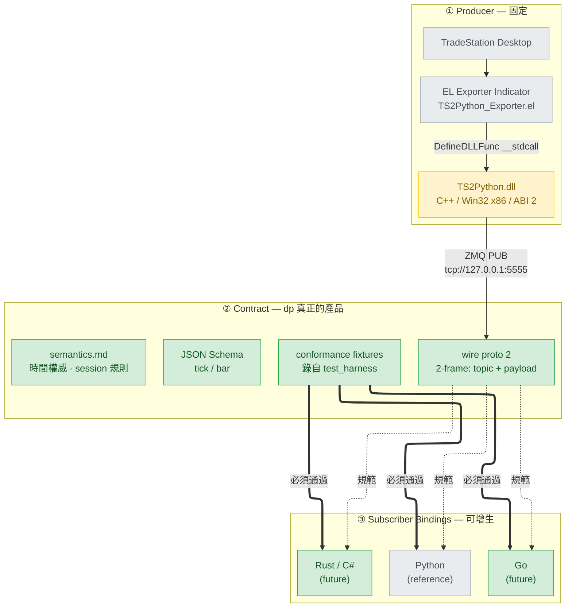
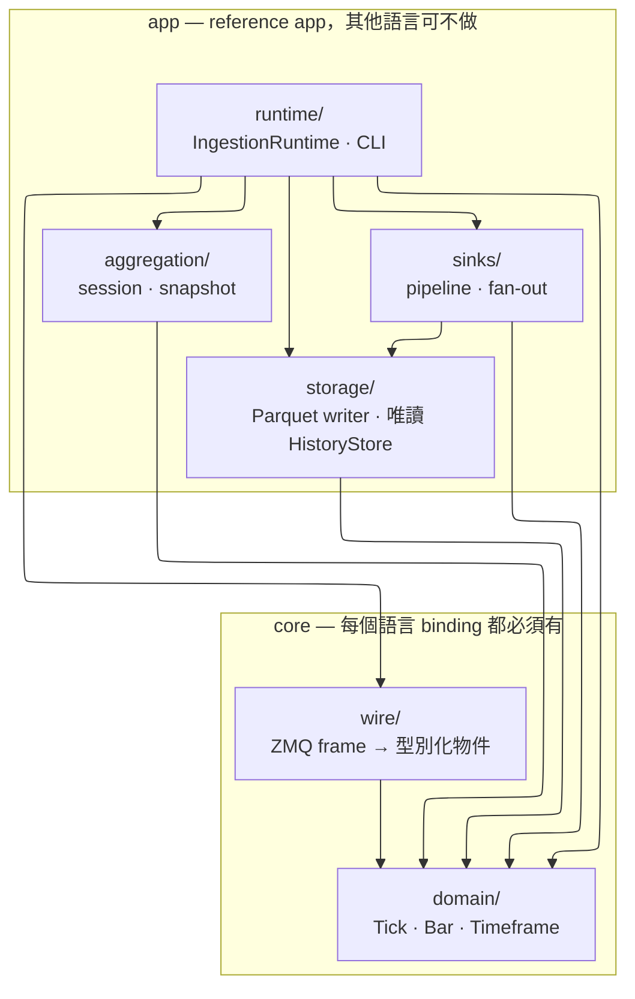
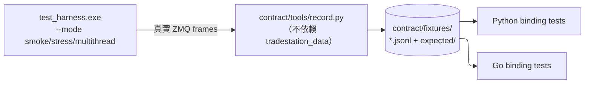
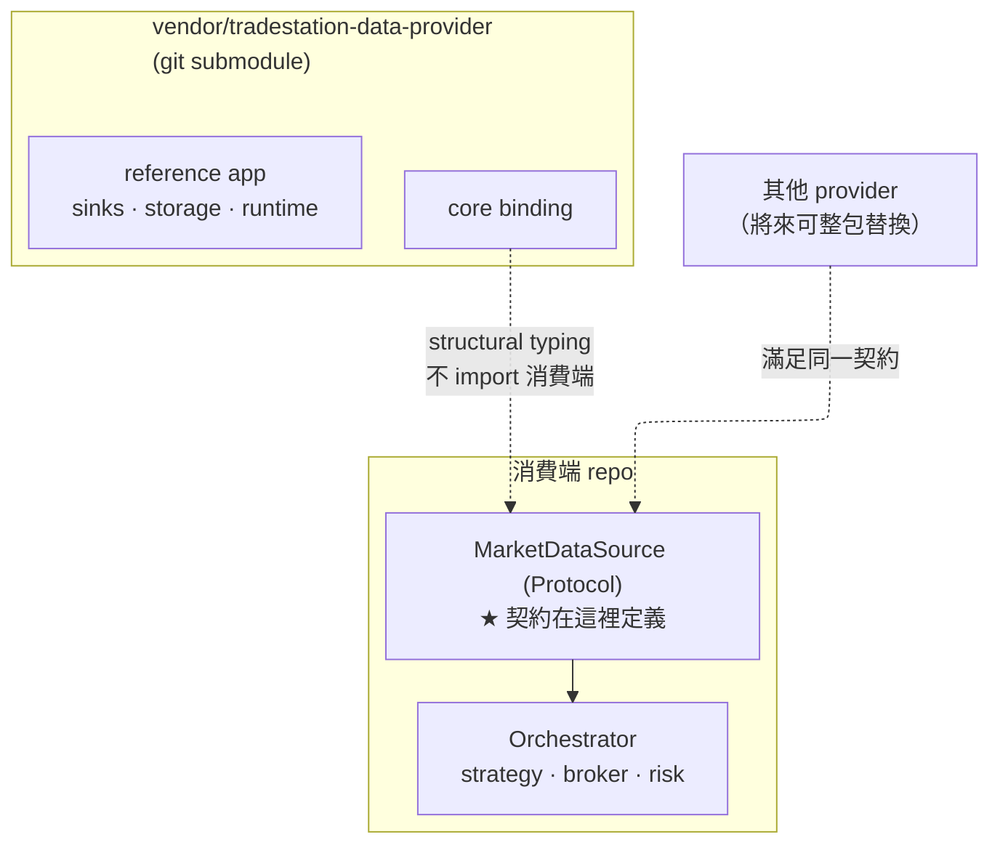

# tradestation-data-provider — 架構設計

> 本文是 dp 的架構 SSoT。消費端如何整合見 [`migration/tradingagent-submodule.md`](migration/tradingagent-submodule.md)。

---

## 1. 定位

### 1.1 這是什麼

**TradeStation 這一家的市場資料 provider。** 從 TradeStation Desktop 取得即時 tick 與
1-minute bar，經 EasyLanguage indicator → C++ bridge DLL → ZeroMQ PUB，供任意語言的
subscriber 消費。

### 1.2 產品是 wire contract，不是 Python package

dp 對外承諾的東西不是 `import tradestation_data`，而是**線上跑的那個協定**。
Python package 是目前唯一的 reference binding，將來會有 Go / Rust / C# 等其他
subscriber binding，全部對同一份 contract。

因此：

- `contract/` 是本 repo 最高優先級的資產，任何 binding 的行為以它為準。
- 任何「只有 Python 知道」的解析規則都是 bug，必須上移到 contract。

### 1.3 Non-Goals

| 不做 | 理由 |
| --- | --- |
| **泛用 vendor 抽象層** | dp 只服務 TradeStation。「換 vendor」是消費端整包替換 dp，不是在 dp 內部切換 provider。 |
| **定義消費端契約** | 消費端自己宣告需要什麼介面，dp 靠 structural typing 滿足它。dp 不 import 消費端任何東西，也不知道消費端存在。 |
| **策略 / 下單 / 風控** | 屬消費端。dp 是 data-collection-only。 |
| **更換 producer 語言** | EL + C++ DLL 固定。可增生的是 subscriber 側。 |
| **非 Windows producer** | 受 TradeStation Desktop 限制。subscriber 側不受此限。 |

---

## 2. 三層架構

三層的可變性完全不同，這是整個設計的基礎：



| 層 | 可變性 | 誰負責 |
| --- | --- | --- |
| ① Producer | 固定 | 本 repo（EL + cpp） |
| ② Contract | **單一版本**（`proto` 2 / ABI 2；更舊的一律拒收） | 本 repo（contract/） |
| ③ Bindings | 增生 | 本 repo（Python）+ 未來各語言 |

---

## 3. Repo Layout

> 以下為**實際落地**的結構（非規劃稿）。建置產物與 `.venv` 由 `.gitignore` 排除。

```
tradestation-data-provider/
│
├─ contract/                             ② 語言中立 SSoT — 本 repo 最高優先資產
│  ├─ README.md                          　 入口：讀者是「要寫新 binding 的人」
│  ├─ semantics.md                       　 schema 表達不了的規則（§1 時間權威、
│  │                                     　 §2 時間戳原樣+分鐘取整、§3 報價有效性、
│  │                                     　 §4 session、§5 前綴、§6 序號）
│  ├─ error_codes.md                     　 C ABI 回傳碼（含墓碑的 -6）
│  ├─ wire.md                            　 frame 結構與 payload，自成一體
│  │                                     　 （為何叫 proto、刪 ts_utc 的取捨、
│  │                                     　 　新舊部署不相容的四種情境）
│  ├─ point.schema.json 　　　　　　　 一個 frame 形狀，單一版本
│  ├─ fixtures/
│  │  ├─ README.md                       　 錄製規矩：不得手寫、expected 不得由 binding 產生
│  │  ├─ smoke.jsonl                     　 3 topic + 1 bar · per-symbol seq
│  │  ├─ noquote.jsonl                   　 無報價（歷史回放形狀）→ wire 上是 null
│  │  ├─ bars.jsonl                      　 每個非 1m 的 tf + `-5` 拒收路徑
│  │  ├─ session.jsonl                   　 RTH 首尾 bar（原樣落地的錨）
│  │  └─ expected/{smoke,noquote,bars,session}.json
│  └─ tools/
│     └─ record.py                        　 wire 檢視器 + fixture 錄製器，不依賴任何 binding
│
├─ EL/                                   ① TradeStation 側訊號源頭
│  ├─ README.md
│  └─ TS2Python_Exporter.el
│
├─ cpp/                                  ① bridge DLL — 語言固定為 C++
│  ├─ CMakeLists.txt · CMakePresets.json · vcpkg.json
│  ├─ TS2Python.sln · *.vcxproj (+.filters)
│  ├─ vcpkg-local.props · .targets       　 從 submodule 匯入 vcpkg，不靠全域整合
│  ├─ setup-build-env.bat                　 submodule → bootstrap → 裝相依（冪等）
│  ├─ verify-build-env.bat               　 逐項檢查環境，每項附修正指令
│  ├─ build.bat                          　 x86 + x64 一次建完
│  ├─ README.md · README.zh-TW.md
│  ├─ include/ts2python.h                　 C ABI（EL_Init3 / EL_Publish
│  │                                     　 　+ EL_Init·EL_Init2 墓碑）
│  ├─ src/ts2python.cpp                  　 ZMQ PUB publisher · seq/sid · 報價正規化
│  ├─ src/test_harness.cpp               　 不依賴 TradeStation 的 frame 產生器
│  ├─ src/TS2Python.def
│  └─ build-tools/vcpkg/                 　 submodule
│
├─ bindings/python/                      ③ reference binding
│  ├─ pyproject.toml · uv.lock            　 刻意沒有 .python-version：它會蓋掉
│  │                                     　 　`uv sync --python <v>` 剛裝好的直譯器
│  ├─ LICENSE                            　 副本 — 打包後端無法引用專案根之上
│  ├─ README.md · README.zh-TW.md
│  ├─ config/{sinks,symbols}.yaml
│  ├─ src/tradestation_data/
│  │  ├─ domain/      [core] bar.py · tick.py · timeframe.py
│  │  ├─ wire/        [core] base.py · el_subscriber.py
│  │  ├─ aggregation/ [app]  session · snapshot
│  │  ├─ storage/     [app]  bar_writer · tick_writer · history_store
│  │  ├─ sinks/       [app]  base · pipeline · registry · parquet · memory · callback
│  │  └─ runtime/     [app]  config · ingestion · main
│  ├─ scripts/                           　 6 支 Parquet 維運腳本（全部唯讀 store）
│  └─ tests/
│     └─ conformance/                     　 對 contract/fixtures 跑驗證
│
├─ docs/
│  ├─ architecture.md                     　 本文
│  └─ migration/tradingagent-submodule.md 　 消費端遷移筆記
│
├─ .ruff.toml                            　 僅為 repo 根的防護，見 §3.4
├─ .github/{dependabot.yml, workflows/{ci.yml, release.yml}}
├─ .claude/ · .gitignore · .gitmodules
├─ CHANGELOG.md · CLAUDE.md · CONTRIBUTING.md · LICENSE · SECURITY.md
└─ README.md · README.zh-TW.md            　 主角是 contract，非 Python
```

**與原規劃的差異**（刻意為之，理由記於各處）：

| 規劃過但沒做 | 為何 |
| --- | --- |
| 搬入 `wire/webapi.py` | 那是 36 行全 `NotImplementedError` 的 stub，唯一作用是讓 Protocol 看起來有兩個實作。意圖已由 `wire/base.py` 的 docstring 記載 |
| 建立 `docs/design.md` | 消費端那份 1473 行文件是用它的視角寫的，且 §5 已與實作脫節。屬契約的內容改為萃取進 `contract/` |
| `config/` 留在 repo 根 | 打包後端無法引用專案根之上，見 §3.3 |

### 3.1 各層歸屬判準

| 放哪 | 判準 | 例子 |
| --- | --- | --- |
| `contract/` | **換 binding 語言後必須一致**的東西 | 時間權威來源、session 規則、error code |
| `bindings/<lang>/config/` | 該 binding 的執行期設定與範例檔 | `sinks.yaml` `symbols.yaml` |
| `bindings/<lang>/` | 該語言的實作、測試、腳本 | 其餘全部 |

`sinks.yaml` 屬於 binding 的理由最直接 —— 它的值就是 Python import 路徑：

```yaml
class: tradestation_data.sinks.parquet:ParquetBarSink
```

Go binding 讀到這行毫無意義。

### 3.2 消費端職責殘留 — 已決議移除

分家時從 TA 一併帶過來、但不屬於 data provider 職責的東西：

| 項目 | 現況 | 決策 |
| --- | --- | --- |
| `domain/order.py` | `Order` `Fill` `OrderIntent` `OrderStatus` `OrderType` `Side` **僅 `tests/test_domain.py` 使用**，無 production code 引用 | **移除。** 歸消費端（TA 的 `brokers/` 是真正使用者）。dp 不下單，不需要訂單模型 |
| `MarketSnapshot` 的部位追蹤 | `aggregation/snapshot.py` 的 `_positions` / `position_of()` / `positions` / `set_position()`，依賴 `domain/position.py` | **移除。** 部位追蹤屬消費端；連帶 `domain/position.py` 一併移除 |

移除後 `domain/` 只剩 `bar.py`、`tick.py` 與 `timeframe.py` —— 前兩者正是 wire 上實際
存在的兩種事件，與 `MarketEvent = Tick | Bar` 完全對齊；`timeframe.py` 是 `tf` 這個
wire 欄位的值域。**「dp 的 domain 等於 wire 的值域」** 是一條可檢查的不變式：任何新增
的 domain 型別若在 wire 上沒有對應，就是職責越界的訊號。

> **決策（已採納）** — Python 移至 `bindings/python/`，讓第二個 binding 進來時是純新增。
> 代價是 `pyproject.toml` / CI / README 路徑要改，消費端的 submodule 引用路徑也變深；
> 在 repo 尚未上 PyPI 的此刻執行成本最低。

### 3.3 為何 repo 根沒有 `config/`

原本規劃把 `symbols.yaml` 留在根，理由是 symbology 語言中立。實作時被一個硬限制推翻：

> **hatchling 的 `license-files` 與 sdist `include` 都以 `pyproject.toml` 所在目錄為
> 根，無法引用上層檔案。** `pyproject.toml` 一旦進 `bindings/python/`，repo 根的
> `config/symbols.yaml` 與 `LICENSE` 就打包不進 sdist。

重新檢視後，這個限制指向了更正確的切法：

- **symbol 清單是使用者的標的選擇** —— 別人會交易不同的 symbol，它是**範例 config**。
- **真正語言中立的是 `category` 的語意** —— `etf` / `breadth` / `volatility` /
  `mega_cap` 各自對應什麼 session 政策 —— 那已經在
  [`contract/semantics.md`](../contract/semantics.md) §4.1。
- 何況 Go binding 未必用 YAML。

結論：**規則進 contract，範例檔進 binding。** `LICENSE` 則在 `bindings/python/` 放一份
副本，這是多語言 monorepo 的常規做法。

### 3.4 repo 根的 `.ruff.toml`

`bindings/python/pyproject.toml` 只在該子樹內生效。從 repo 根執行 `ruff check .`
會找不到設定、退回預設值，然後走進 vendored 的 vcpkg 檢出目錄改寫第三方原始碼 ——
**這已經發生過一次**（import 排序、F401、UP015 共動了 10 個檔案）。

根目錄的 `.ruff.toml` 只做一件事：排除 `cpp/` 與 `contract/fixtures/`。

### 3.5 EL 為何必須在本 repo

EL indicator 是 TradeStation 訊號的**源頭**。缺了它，dp 無法端到端自我驗證
「能不能從 TradeStation 拿到資料」，也無法宣稱自己是完整的 TradeStation provider。

---

## 4. Wire Contract

> 規範文字在 [`../contract/wire.md`](../contract/wire.md)。本節只講設計理由；
> 兩者衝突時以 `contract/` 為準。

### 4.1 現況

每次 publish 送出兩個 frame：

| Frame | 內容 | 型別 |
| --- | --- | --- |
| 1 | Topic | UTF-8 symbol（`SPY` / `VXX` / `$TICK`） |
| 2 | Payload | JSON，兩種 shape 之一 |

```jsonc
// 一種形狀，不論來自什麼圖。沒有 kind，沒有 tf。
{ "proto": 2, "seq": 1, "sid": 1785646054360588,
  "ts": 1785646062.364744, "ts_str": "2026-04/18-13:30:45",
  "bar_type": 0, "bar_interval": 1, "category": 2,
  "o": 450.0, "h": 450.0, "l": 450.0, "c": 450.0,
  "el_volume": 100, "el_ticks": 195, "el_upticks": 100,
  "el_downticks": 80, "el_open_interest": 0,
  "bid": 449.99, "ask": 450.01 }
```

Topic 放在獨立 frame 是為了讓 subscriber 的 filter 在 topic 上做，payload 擴充
schema 時不影響訂閱行為。

**版本欄位叫 `proto` 而不是 `v`。** 前一代 wire 用 `v` 一路數到 4；這次是重寫，版本
從 1 重新起算。若沿用同一個 key，`{"v":1}` 會同時是兩個協定的合法開頭，而錯配的失敗
形態會是**數字看起來合理但其實是別的東西**（舊 v1 的 tick 在形狀上吻合，只在欄位層
分歧）。換一個 key 讓這整類問題在結構上不存在：舊 payload 沒有 `proto`，「版本相符」
與「其實是舊資料」永遠不會同時成立。

#### 4.1.1 量值欄位一律原文轉送

五個 `el_*` 欄位是 EasyLanguage reserved word 的原文，publisher 不做選擇也不做換算。

這一點曾經不是這樣。`Volume` 與 `Ticks` 在 intraday 圖與 daily 圖上意義相反，indicator
因此依 `BarType` 交換欄位，好讓 wire 上的 `vol` 在每個 timeframe 都是「總成交股數」。
**那次交換發生在 wire 之外，數字看起來一律合理**，於是必須再發明一個 `pv`
（publisher convention）欄位才分得出來 —— 一個版本號，用來描述另一個版本號沒說到的
語意。移除交換之後，`pv` 失去存在理由，一併刪除。

`el_` 前綴是規範的一部分：看到 `el_volume` 的人會去查 EasyLanguage 的定義，看到
`volume` 的人不會 —— 而後者正是這個 repo 已經踩過、且數字全程看起來合理的那個 bug。

### 4.2 時間語意（跨 binding 必須一致）

| 欄位 | 來源 | 用途 |
| --- | --- | --- |
| `ts` | DLL 收訊端 wall clock（UTC epoch） | 延遲量測。**不可**用於 bar 對齊；歷史回放時每根 bar 共用同一個 `ts` |
| `ts_str` | EL 原始 `yyyy-MM/dd-HH:mm:ss`，逐字透傳 | **bar `bar_time` 的唯一權威來源** |

> 「以 `ts_str` 為權威」是**跨 binding 的強制規範**。這類決策不能只存在於某一個
> binding 的實作裡。

**`ts_utc` 已從 wire 移除，這是取捨不是冗餘清理。** 它是 DLL 用
`std::chrono::zoned_time` 解析 `ts_str` 的結果，而 binding 是用自己的時區資料庫解析
同一個字串 —— 那條「>5s drift 就 log」是唯一能發現「兩端時區資料庫不一致」的訊號。
**且 DLL 從此不再解析 `ts_str`，也就不再驗證它**：無效的時間字串會原樣送出，錯誤
發現點往後移一層到 binding。兩件事都明寫在 `contract/wire.md`。

#### bar_time 是 publisher 給的時間，原樣落地

`bar_time` = `ts_str` 以 `America/New_York` 解析、轉 UTC、秒歸零。**沒有位移，
也沒有格線對齊。** EasyLanguage 的 `Time` 是 bar 的收盤時間，所以 `bar_time`
也是收盤時間；要左緣標籤的消費端自己減。

> 這裡曾經做過轉換：減一分鐘，再對齊一條錨在 09:30 ET 的格線。**它每天吃掉一根
> bar。** TradeStation 的盤中格線在 RTH 開盤與收盤各重啟一次，所以 06:00 session
> 的 60 分鐘圖一天發 15 根、含兩根殘根 —— 收盤 09:00 與 09:30 雙雙落在 08:30，
> 後者覆蓋前者。段長取決於使用者的 chart session 設定，而 wire 上沒有這個資訊，
> 所以沒有任何格線修得好。實測與規範見 `contract/semantics.md` §2。

### 4.3 資料遺漏偵測

ZeroMQ PUB/SUB 是 fire-and-forget。兩側程式碼都明文承認會靜默丟訊息：

```cpp
// cpp/src/ts2python.cpp:135
// PUB silently drops past SNDHWM (PUB never blocks publisher).
sock->set(zmq::sockopt::sndhwm, 100000);
```
```python
# tradestation_data/wire/el_subscriber.py
# Default RCVHWM is 1000 — PUB/SUB silently drops past that when the ...
self._socket.setsockopt(zmq.RCVHWM, 1_000_000)
```

調高 HWM 只降低丟包機率，對於要拿來做交易決策與模型訓練的資料流，「靜默缺漏」比「明確報錯」危險得多。
因此每個 frame 都帶以下兩個欄位供 subscriber 偵測缺漏：

| 欄位 | 型別 | 語意 |
| --- | --- | --- |
| `seq` | uint64 | **per-symbol** 單調遞增序號，從 1 起算；tick 與 bar 共用同一個計數器 |
| `sid` | uint64 | publisher session id（init 當下的 UTC epoch 微秒） |

- **per-symbol 而非全域**：subscriber 可能只訂閱 `SPY`，全域序號的跳號會被其他
  symbol 的訊息汙染，無法判斷自己是否漏收。
- **`sid` 用於區分「publisher 重啟導致 seq 歸零」與「真的漏收」**，否則重啟會被誤判
  成巨大 gap。
- subscriber 端據此產出 `messages_lost` 指標。

> **被協定閘門拒收的 frame 仍要計入序號。** 它一樣佔用了 publisher 那個 per-symbol
> 計數器的一格；若在拒收路徑上跳過 `observe()`，`_expected` 會停在最後一個被接受的
> seq，下一個被接受的 frame 就會報出一個根本沒發生的 gap —— 使用者會看著一條什麼都
> 沒掉的連線持續回報遺漏。

### 4.4 版本

| 版本 | 現值 | 誰在乎 |
| --- | ---: | --- |
| wire（payload `"proto"`） | **1** | 所有 binding |
| DLL ABI（`EL_DllVersion()`） | **1** | 所有 binding |
| Python package version | 0.3.0 | 僅 Python 消費端 |

**兩者各只有一個版本，沒有相容矩陣。** 前一代有一份 `compat.md` 在維護
「ABI × wire × publisher convention」的三維對應；那份表格存在的前提是舊版本必須繼續
被讀，而現在不是了 —— 沒有 `proto` 的 payload 直接拒收。

`ts2python.h` 仍然寫著 DLL 版本「bumps independently of wire protocol」，這句話依然
成立：兩者可以各自往前走。只是目前它們都是 1，而且**升級時必須同時換**——
indicator 綁的是 `EL_Init3`，舊 DLL 沒有這個匯出。四種不相容部署各由哪一道檢查攔下，
列在 [`../contract/wire.md`](../contract/wire.md)。

---

## 5. Python Binding 內部分層

現有模組混了兩種壽命完全不同的東西，必須切開，否則將來寫 Go binding 時
「要移植哪些」講不清楚：

下圖的**箭頭一律表示「依賴」**（`A --> B` 讀作「A import B」），邊取自實際 import 關係。



實際依賴關係（用於驗證上圖）：

| 模組 | 依賴 |
| --- | --- |
| `domain` | —（無出邊，整個 package 的根） |
| `wire` | `domain` |
| `aggregation` | `domain` |
| `storage` | `domain` |
| `sinks` | `domain` `storage` |
| `runtime` | `domain` `wire` `aggregation` `storage` `sinks`（組裝點） |

**這一刀已經是乾淨的**：core（`domain` + `wire`）對 app 零依賴。因此本節不是
重構提案，而是把既有的分層明文化 —— 不需改動任何 import 方向。

| 現有模組 | 分類 | 新語言 binding |
| --- | --- | --- |
| `wire/` `domain/` | **core** — 解 frame、轉型別 | 必做 |
| `aggregation/` | app（見下） | 選做 |
| `storage/` `sinks/` `runtime/` | **app** — Parquet 落地、CLI、sink pipeline | 不必 |

### 5.1 `aggregation/` 歸屬：app 側，但規則上移 contract

`aggregation/` 現在只剩 `session.py` 與 `snapshot.py`。**`BarAggregator` 已刪除** ——
它是 tick→1m 的 fallback，而這個 binding 不再從 tick 推算任何 bar：需要某個間隔的
bar，就在 TradeStation 開那個間隔的圖。

留下的 `snapshot.py` 是記憶體內的最新狀態視圖，屬 app。但 **session policy 是市場
規則，不是 Python 實作細節** —— 09:30 ET reset、pre-market 保留窗、breadth 類 symbol
是否清空 deque，這些換語言後必須一致。

因此：**規則進 `contract/semantics.md` §4 + fixtures，實作留各語言 app 層。**

### 5.2 `wire/base.py` 的定位

它不是泛用 vendor 抽象，而是 dp **內部**給兩種 TradeStation 接入方式
（EL bridge / 未來 WebAPI）共用的介面。舊 docstring 寫「...other vendors」，語意越界
了 —— 已收窄，避免消費端誤把它當成可依賴的通用契約。想替換掉整包 dp 的消費端，
應該宣告自己的 Protocol 並讓 dp 以 structural typing 滿足它（§7.1）。

---

## 6. Conformance Suite

讓「多語言 subscriber」從口號變成可驗證的機制。



### 6.1 fixtures 必須錄製，不可手寫

手寫的 fixture 只是把假設寫第二遍，抓不到 DLL 真實行為與文件的落差。
兩個零件已經串起來了：

- `cpp/src/test_harness.cpp` — *"exercises TS2Python.dll **without TradeStation**"*
- `contract/tools/record.py --record <path>` — *"intentionally does **not** depend
  on the `tradestation_data` package"*，正因如此才有資格當中立錄製器

**現在四份 fixture 全數錄自真 DLL，沒有例外。** 前一代留過一份手寫的 `v1_legacy`，
理由是當時的 DLL 已不再發 wire v1；proto 2 之後不再有「需要支援的舊版本」，那份
連同其餘 legacy fixture 一併刪除。

`expected/*.json` 則是另一條規矩：**必須依 `semantics.md` 手工推導，不得由 binding
產生**。用受測的程式碼產生期望值，只能證明它跟自己一致。

### 6.2 必須涵蓋的情境

| 情境 | 為何重要 | 現況 |
| --- | --- | --- |
| breadth symbol（`$TICK` / `$ADD`） | 五個 `el_*` 全為 0、`bid`/`ask` 為 `null`，易被 binding 誤判 | `noquote` |
| 非 index symbol 的 null 報價 | 只測 index symbol 分不出 §3.1（publisher 送 null）與 §3.2（binding 判無效） | `noquote` |
| 每一個 BarType/BarInterval | 原值 → `bartype=`/`interval=` 分區，沒有任何組合被拒收 | `bars` |
| session 首尾 bar | 釘住「publisher 給什麼就存什麼」 | `session` |
| bar 全程無報價 | bar quote 在本協定結構上不存在，binding 不該有任何判斷 | 四份皆驗 |
| DST 轉換日 | `ts_str` → UTC 的正確性，跨 binding 最容易不一致 | 尚無（單元測試有，fixture 無） |
| multithread 模式 | frame 交錯順序 | 尚無 |
| gap | 缺漏偵測本身 | 尚無（單元測試有，fixture 無） |

---

## 7. 消費端整合（submodule）

消費端（例如 TradeStation-TradingAgent）以 git submodule 引入 dp。
**契約由消費端定義，dp 靠 structural typing 滿足它。**



### 7.1 為何契約不能由 dp 定義

若 dp 定義 `MarketDataProvider` 而消費端 `from tradestation_data... import` 它，
**替換掉 dp 的那天這行 import 就死了** —— 那正是 submodule 化想避免的耦合。

Python 的 `Protocol` 是 structural typing：消費端宣告自己需要什麼形狀，dp 只是碰巧
滿足。dp 完全不需要知道消費端存在。

### 7.2 dp 側需要提供的整合面

| 提供什麼 | 說明 |
| --- | --- |
| 穩定的 core binding 型別 | `Tick` / `Bar` / `Timeframe` / subscriber |
| 可組裝的 reference app | `SinkPipeline` 讓消費端自訂輸出，不必 fork |
| 版本 tag | 消費端 pin submodule commit 的依據 |
| `contract/wire.md` | 消費端判斷 DLL 與 binding 是否相容 —— 現在只有一組合法組合，判斷因此退化成「是不是都升到最新」 |

> **消費端最需要知道的一件事：dp 不再從 tick 聚出 bar。** 舊的 `BarAggregator` 已刪除。
> 需要某個間隔的 bar，就在 TradeStation 開那個間隔的圖，或自己從儲存的資料建。

具體遷移步驟見 [`migration/tradingagent-submodule.md`](migration/tradingagent-submodule.md)。
