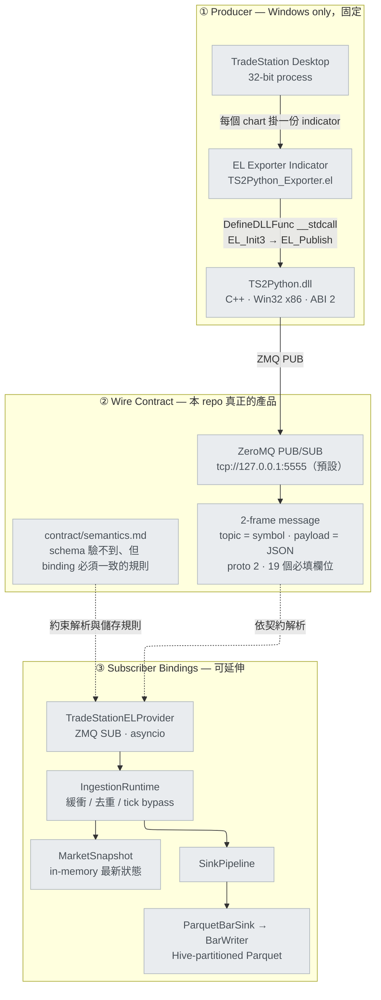
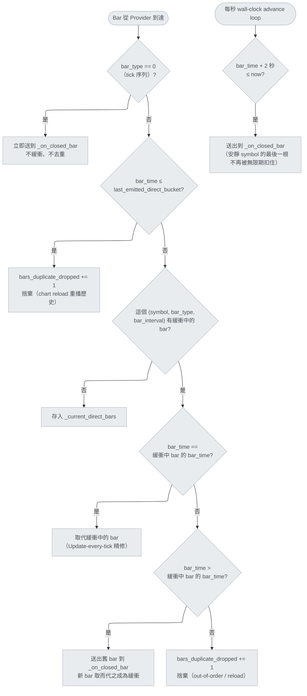
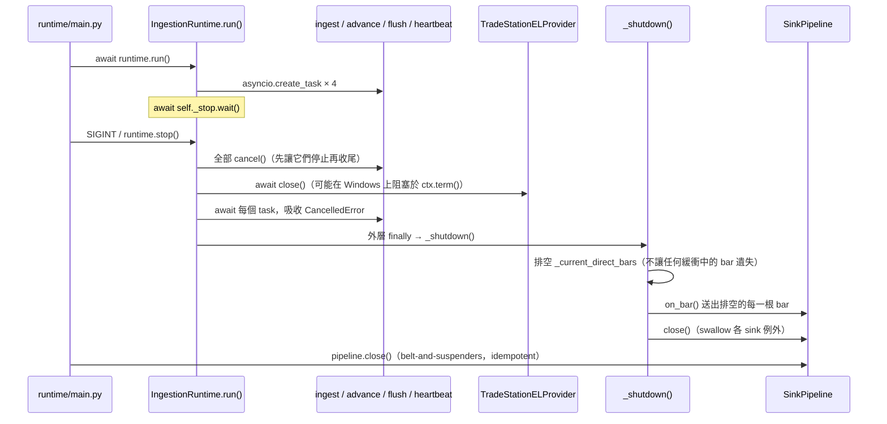

# tradestation-data-provider — 系統架構書

> 📖 [English version](architecture.md)

> 本文是給人讀的架構總覽；AI 代理的逐行行為規則在根目錄 [`CLAUDE.md`](../CLAUDE.md)，
> 兩者應保持一致，如有衝突以程式碼與 [`contract/`](../contract/) 為準（見 §11）。
> 本文對照下列權威來源撰寫，並逐一驗證版本號與行為：`cpp/src/ts2python.cpp`、
> `cpp/include/ts2python.h`、`contract/wire.md`、`contract/semantics.md`、
> `contract/error_codes.md`、`bindings/python/src/tradestation_data/**`。

---

## 1. 系統定位

### 1.1 這是什麼

一個**單一資料供應商（TradeStation）的市場資料 provider**。從 TradeStation Desktop
（Windows、32-bit process）取得使用者在圖表上開啟的每一個資料點——tick 序列、盤中
分鐘 bar、日線 bar——經 EasyLanguage indicator → C++ bridge DLL → ZeroMQ PUB 廣播
出去，供任意語言的 subscriber 消費。

### 1.2 產品是 wire contract，不是 Python package

本 repo 對外承諾的是**線上跑的那個協定**，不是 `import tradestation_data`。
[`contract/`](../contract/) 是唯一的 source of truth；`bindings/python/` 是目前唯一的
reference binding，也是撰寫下一個語言 binding（Go、Rust、C#……）時要照抄的範本。

任何解析規則如果只活在某個 binding 裡，就是一個 bug——下一個實作會漏掉它。這件事在本
repo 真實發生過：舊版規格文件描述的欄位早已與 DLL 實際輸出脫節，而且長期無人發現，因為
沒有任何機制去檢查兩者是否一致。這正是 `contract/fixtures/` conformance suite 存在的
理由（§9）。

### 1.3 Non-Goals（刻意不做的事）

| 不做 | 理由 |
| --- | --- |
| **策略 / 下單 / 風控** | 這是 data-collection-only 的 fork。`domain/` 只有一個型別 `Bar`，因為 wire 只有一種形狀。 |
| **聚合、重採樣、回補、快取** | `HistoryStore` 只讀，不推算。詳見 §7.6 與 §10。 |
| **時間框架詞彙 / 命名映射** | `bar_type`/`bar_interval` 是 EasyLanguage 自己的詞，逐字上 wire、逐字入庫，沒有 `"5m"`/`"1d"` 這類名字的翻譯層。 |
| **非 Windows producer** | 受 TradeStation Desktop（32-bit Windows process）限制。Subscriber 端不受此限，Python binding 支援 Windows/macOS/Linux。 |
| **相容舊協定** | Wire `proto` / DLL ABI 恆為 **2**，沒有需要相容的舊版本。舊 payload 在結構上就無法通過版本閘門（§5.4）。 |

---

## 2. 三層架構總覽



三層的可變性完全不同，這是整個設計的基礎：

| 層 | 可變性 | 原因 |
| --- | --- | --- |
| ① Producer | 固定 | 綁死 TradeStation Desktop 這一家；EL + C++ DLL 是唯一能跟它對話的方式 |
| ② Contract | 極少變、變動有嚴格流程 | 是多語言 binding 的共同基礎，改一次影響所有 binding |
| ③ Bindings | 可自由增生 | Python 是 reference；Go/Rust/C# 等未來語言各自對同一份 contract 實作 |

---

## 3. Repo 目錄結構

| 路徑 | 內容 | 對應章節 |
| --- | --- | --- |
| [`contract/`](../contract/) | wire 規格、語意規則、conformance fixtures ——**唯一的 source of truth** | §5 §6 §9 |
| [`EL/`](../EL/) | EasyLanguage exporter indicator | §4.1 |
| [`cpp/`](../cpp/) | C++ bridge DLL（Win32 x86）+ standalone test harness | §4.2 §4.3 |
| [`bindings/python/`](../bindings/python/) | reference binding：ingestion runtime、pluggable sinks、Parquet store | §7 |
| [`bindings/python/examples/`](../bindings/python/examples/) | 4 支可執行範例，2 支不需要 DLL/TradeStation | §7 |
| `docs/` | 本文件 | — |

repo 根沒有 `config/`——symbols.yaml / sinks.yaml 屬於 Python binding 自己的執行期設定，
不是 contract 的一部分；下一個語言 binding 會有自己的設定檔形式。

---

## 4. Producer 端：TradeStation → EL Indicator → C++ DLL

### 4.1 EL Exporter Indicator（`EL/TS2Python_Exporter.el`）

以 Indicator 形式掛在任意圖表上，每個資料點呼叫一次 `EL_Publish`，把 TradeStation
為該點提供的每一個保留字原樣轉出：`Date`+`Time`、`BarType`、`BarInterval`、
`Category`、OHLC、五個 quantity 保留字、`InsideBid`/`InsideAsk`。**沒有任何 interval
被拒收，也沒有任何欄位被丟棄**——這個判斷屬於消費端，不屬於這支 indicator。

關鍵行為：

- **Zero state**：所有 symbol/數值都來自 TS 內建變數，一份編譯好的 indicator 涵蓋每一種圖表。
- **Version latch**：`EL_Init3` 成功後立刻檢查 `EL_DllVersion()`；版本不符則整根停止
  publish 並記錄，不會用不相容的簽章去呼叫任何 publish 匯出。
- **Sub-minute / aggregated-tick 圖表**：偵測到後只在 Print Log 記錄一次，**照樣繼續發布**——
  這類圖表的 `BarType`/`BarInterval` 與 1-分鐘圖無法區分，`ts_str` 只有分鐘解析度，
  wire 上的 `ts`（收訊時鐘）才是區分同分鐘內多筆 frame 的依據；subscriber 端若把它們
  當一般分鐘圖處理，會把一分鐘內的多根 bar 併成一根（見 §7.3 的緩衝規則）。

### 4.2 C++ Bridge DLL（`cpp/src/ts2python.cpp`）

單一全域狀態，`std::mutex` 序列化：一個 `zmq::context_t` + 一個 PUB `zmq::socket_t`。

| 職責 | 實作要點 |
| --- | --- |
| **Init**（`EL_Init3`） | idempotent（重覆呼叫回傳 `1`，不重新 bind、不改 `sid`）；`SNDHWM=100000`、`linger=0`；成功後以微秒精度戳新的 `g_sid` 並清空 `g_seq` |
| **Publish**（`EL_Publish`） | 16 個參數，`__stdcall`；先 narrow 五個 quantity（`double`→`int64`，範圍檢查 `±9.0e15`，失敗回 `-4` 而不是 clamp）；再取號（`reserve_seq`，即使後續送出失敗也消耗）；`snprintf` 組 payload（768 bytes 緩衝區）；2-frame ZMQ 送出 |
| **Quote null 化** | `InsideBid`/`InsideAsk` ≤ 0（含 NaN）一律轉成 JSON `null`，把「沒有報價」這件事說在 wire 上，而不是留給每個 binding 各自記得 0 代表什麼 |
| **DLL pinning** | 首次 init 成功後用 `GetModuleHandleExW` 把自己釘進 process 位址空間，避免 TradeStation `FreeLibrary` 觸發 `zmq_ctx_term()` 在 loader lock 下死鎖 |
| **墓碑匯出** | `EL_Init`、`EL_Init2`、`EL_PublishTick`、`EL_PublishBar` 全部只 `return -6;`，見 §4.3 |

### 4.3 DLL ABI 版本與相容性矩陣

`EL_DllVersion()` 回傳 `2`，與 wire `proto` 的 `2` 成對——**版本識別由 init 匯出名稱把關，
不是靠名稱不變**：`EL_PublishTick`/`EL_PublishBar` 曾經沿用前一代名字卻換了簽章，
`__stdcall` 由 callee 清堆疊，簽章不符的呼叫會**弄壞堆疊**而不是回傳錯誤。這次的 publish
改叫全新名字 `EL_Publish`，兩個舊名字留在 `.def` 裡當墓碑。

| 部署情境 | 攔截點 | Operator 在 Print Log 看到什麼 |
| --- | --- | --- |
| 新 `.ELD` + 舊 DLL | 舊 DLL 沒有 `EL_Init3` 匯出 | `DefineDLLFunc` 在 Verify 階段就報錯 |
| 新 `.ELD` + 版本不符的新 DLL | indicator 的 `EL_DllVersion()` latch | 版本不符訊息，indicator 停止發布 |
| 舊 `.ELD`（呼叫 `EL_Init`）+ 新 DLL | 墓碑回 `-6` | `EL_Init FAILED rc=-6` |
| 舊 `.ELD`（呼叫 `EL_Init2`）+ 新 DLL | 墓碑回 `-6` | `EL_Init2 FAILED rc=-6` |

四個方向都是**可讀的失敗**，沒有一個走到堆疊損毀，也沒有一個產出錯誤但看起來合理的資料。
**升級 DLL 與 `.ELD` 必須成對**，因為它們是兩個獨立的安裝步驟。

---

## 5. Wire Contract（`contract/`）

### 5.1 Transport 與 Frame 結構

| 項目 | 值 |
| --- | --- |
| Pattern | ZeroMQ **PUB/SUB**，fire-and-forget，無送達保證 |
| Publisher | DLL `bind`，預設 `tcp://127.0.0.1:5555` |
| Subscriber | `connect` 同一 endpoint，逐一精確訂閱 symbol |
| Frame 數 | 2（`ZMQ_SNDMORE`）：frame 1 = UTF-8 symbol topic，frame 2 = UTF-8 JSON payload |
| 高水位 | Publisher `SNDHWM=100000`；Python binding `RCVHWM=1_000_000` |
| Prefix match 陷阱 | ZMQ `SUBSCRIBE` 是前綴比對，訂閱 `SPY` 也會收到 `SPYG`——binding **必須**在收訊後以字串完全相等再過濾一次（`contract/semantics.md` §5） |

### 5.2 Payload —— 只有一種形狀

**沒有 `kind`，也沒有 `tf`。** 不論來自 tick 圖、分鐘圖還是日線圖，同一組欄位全部送出：

```json
{
  "proto": 2, "seq": 1, "sid": 1785646054360588,
  "ts": 1785646062.364744, "ts_str": "2026-04/18-13:30:45",
  "bar_type": 0, "bar_interval": 1, "category": 2,
  "o": 450.0, "h": 450.0, "l": 450.0, "c": 450.0,
  "el_volume": 100, "el_ticks": 195,
  "el_upticks": 100, "el_downticks": 80, "el_open_interest": 0,
  "bid": 449.99, "ask": 450.01
}
```

| 欄位 | 型別 | 意義 |
| --- | --- | --- |
| `proto` | int | 協定版本，**恆為 2**，缺這個鍵就不是這個協定 |
| `seq` | int | per-symbol 單調遞增，每個 frame 都必須有（§6.5） |
| `sid` | int | publisher session id（微秒精度），DLL 重啟會變——那是重置不是遺漏 |
| `ts` | float | DLL 收訊端 wall clock（UTC epoch 秒）；延遲量測 + tick 圖同分鐘內排序 + `ts_str` 缺席時最後手段 |
| `ts_str` | string | EL 的 `Date`+`Time`，`yyyy-MM/dd-HH:mm:ss` 24 小時制 ET 牆鐘，逐字。**`bar_time` 的唯一權威來源**（§6.1） |
| `bar_type` | int | EL `BarType` 逐字。0=tick 序列，1=盤中分鐘，2=日線 |
| `bar_interval` | int | EL `BarInterval` 逐字，`bar_type`=1 時是分鐘數 |
| `category` | int | EL `Category` 逐字：0 期貨 / 2 股票 / 3 股票選擇權 / 4 指數…（§6.2 的查表鑰匙） |
| `o` `h` `l` `c` | float | EL 的 OHLC；1-tick 序列上四者相等 |
| `el_volume` `el_ticks` `el_upticks` `el_downticks` `el_open_interest` | int | EL 五個保留字原值，**必填**，缺欄位一律拒收（§6.2） |
| `bid` `ask` | float \| null | `InsideBid`/`InsideAsk`；publisher 沒有報價時為 `null` |

為什麼不再分 tick 與 bar 兩種形狀、`bar_type`/`bar_interval` 不再映射成 `"5m"`/`"1d"`
之類的名字：兩者都曾是 publisher 在 wire 之外替消費端做的判斷（哪些欄位在哪種圖上有意義、
哪個 interval 值得有名字），而那個判斷一旦做錯或過時，消費端完全看不出來。詳細取捨記在
[`contract/wire.md`](../contract/wire.md)。

### 5.3 為什麼版本欄位叫 `proto` 而不是 `v`

前一代 wire 用 `"v"` 一路編號到 `4`。這次重寫從 `1` 重新起算，若沿用 `"v"`，
`{"v":1}` 會同時是新舊協定的合法開頭——舊 v1 的 bar 用 `kind:"bar_1m"`，新版本閘門
會放行（`v==1`），再於 `kind` 判定為未知形狀而**靜默丟棄整批 bar**；舊 v1 的 tick
形狀相符，會一路讀到欄位缺失才發現沒有 `el_volume`，若 binding 對缺欄位套預設值，
磁碟上就會多出一批「看起來完全合理的全 0 量值」。

改一個欄位名讓這整類問題**在結構上不存在**：舊 payload 沒有 `proto` 這個 key，
「版本相符」與「其實是舊資料」永遠不會同時成立。

### 5.4 錯誤碼（`contract/error_codes.md`）

| Code | 意義 | 由誰回傳 |
| --- | --- | --- |
| `0` | 成功 | 全部 |
| `1` | 已初始化，冪等 no-op | `EL_Init3` |
| `-1` | 未初始化就呼叫 publish | `EL_Publish` |
| `-2` | ZMQ 送出失敗（觸及 high-water mark 或例外） | `EL_Publish` |
| `-3` | init 的 bind/socket 建立失敗（最常見：port 已被佔用） | `EL_Init3` |
| `-4` | 參數無效（null 指標，或量值超出 `int64` 可表示範圍） | `EL_Init3` `EL_Publish` |
| `-6` | ABI 不符——呼叫端是早於本協定的 `.ELD` | 四個墓碑匯出 |

真正危險的不是這些回傳碼，而是 ZMQ PUB 超過 `SNDHWM` 時的**靜默丟棄**——完全不回傳
錯誤碼，publisher 也不知情。這正是 payload 帶 `seq` 的原因（§6.5）。

---

## 6. 語意規則 —— schema 驗不到、但每個 binding 必須一致

> `contract/semantics.md` 比 JSON Schema 重要：schema 只驗證「欄位存在、型別正確」，
> 真正會讓不同語言 binding 產出不一致資料的是語意規則。

### 6.1 時間權威：`bar_time` = `ts_str`，且是收盤時間

| 欄位 | 正確用途 | 錯誤用途 |
| --- | --- | --- |
| `ts_str` | **`bar_time` 唯一權威來源**：以 `America/New_York`（IANA tz database，非系統本地時區）解析、轉 UTC、秒歸零 | 當成有秒級解析度（它只有分鐘解析度） |
| `ts` | DLL 收訊端 wall clock；tick 圖同分鐘內排序依據；`ts_str` **缺席**（非空字串但解析失敗）時的最後手段 | `bar_time` 的來源 |

**`ts_str` 缺席與解析失敗是兩種必須分開處理的狀態：**

| 狀態 | binding 行為 | 原因 |
| --- | --- | --- |
| 欄位不存在或為 `""` | 允許退回 `ts`，但**必須記錄一次** | publisher 誠實宣告沒有這個資訊 |
| 欄位有值但解析不了 | **必須拒收整個 frame**，不得退回 `ts` | 退回 `ts` 在歷史回放時會讓整個 session 塌成同一個 `bar_time`——zh-TW 主機 `FormatTime("tt")` 曾讓這件事真的發生過 |

**`bar_time` 沒有位移、沒有格線對齊。** EasyLanguage 的 `Time` 是**收盤**時間，
`bar_time` 逐字沿用——不減一分鐘、不對齊 09:30 錨點的格線。這個 repo 曾經兩者都做，
代價是 60 分鐘圖一天丟一根 bar：TradeStation 在 RTH 開盤與收盤重啟 intraday 網格，
兩個實際不同的收盤點對齊後會落在同一個格子裡，後者覆蓋前者。**要左緣標籤的消費端
自己減**，這是消費端的事。

### 6.2 五個 `el_*` 量值——intraday 與 daily 語意互換，兩組方向相反

wire 帶五個量值，**每一個都是 EasyLanguage 同名保留字的原值**，publisher 不做任何
選擇、換算或修正，binding 也不得。欄位名的 `el_` 前綴是規範的一部分——本 repo 曾經
把它省略成單純的 `volume`，代價是一份系統性低估約一半的成交量資料。

依 TradeStation 官方定義（股票商品，[EL 保留字文件](https://help.tradestation.com/10_00/eng/tsdevhelp/elword/el_definitions/easylanguage_words_related_to_ticks,_volume_&_open_interest.htm)）：

| EL 保留字 | **intraday**（分鐘/tick/volume bar） | **daily 以上** |
| --- | --- | --- |
| `Volume` | 只有上漲 tick 的成交量 | 總成交量 |
| `Ticks` | **總成交量** | 總 tick 數，股票上恆等於 `Volume`（OI=0） |
| `UpTicks` | 上漲 tick 的成交量 | 總成交量 |
| `DownTicks` | 下跌 tick 的成交量 | 0（股票）／Open Interest（期貨） |
| `OpenInt` | 0（股票）／下跌 tick 的量（期貨） | Open Interest（期貨）／其餘為 0 |

**互換有兩組，方向相反**：`Volume`/`Ticks` 是眾所周知的那一組；`DownTicks`/`OpenInt`
是第二組，intraday 時 `OpenInt` 借用 `DownTicks` 的意義，daily 時 `DownTicks` 借用
`OpenInt` 的意義。

> **實測（2026-08-02，live SPY / @ES / VXX / SPY 選擇權，盤中圖）**：`el_open_interest`
> 在盤中圖上**一律回傳 `el_downticks` 的值**，與商品類別無關——`@ES` 期貨符合官方文件，
> 但 `SPY`/`VXX`/選擇權三列文件沒說、實測如此。**期貨日線的 `el_downticks` 是未平倉量**，
> 對它加總會加到 OI 而非成交量。

想要「總成交量」的消費端自己依上表取用：**intraday 取 `el_ticks`，daily 取
`el_volume`**。**不要用 intraday bar 加總去「驗證」daily bar**——`1d` 是交易所結算後的
官方彙總（含盤後延遲申報、大宗交易），intraday 是即時串流當下組出來的，兩者口徑不同，
本來就不該相等（`contract/semantics.md` §3.4 有完整的四點理由與實測數字）。

### 6.3 `bid`/`ask` 何時無效

DLL 已經把 `InsideBid`/`InsideAsk` ≤ 0（含 NaN）轉成 JSON `null`。binding 只需再做一次
belt-and-braces 檢查（`_quote_or_none`）。**沒有硬編碼的 index/breadth symbol 清單**——
舊版本曾經有，`VXX` 在清單上，而 VXX 是可交易的 ETN，實測單根 bar 有 567,776 股成交量，
它的真實報價被白白丟棄。`category`（§5.2）現在逐 frame 都在，消費端要那個行為時有事實
可查，不必用猜的清單。

### 6.4 Session 規則

| 規則 | 值 |
| --- | --- |
| US equity RTH | 09:30–16:00 **ET** |
| Session 歸屬 | 04:00 ET 之前的 bar 屬於**前一個** session |
| `breadth` symbol 保留政策 | 09:30 ET 每日重置，無盤前保留 |
| 其他 symbol（`etf`/`volatility`/`mega_cap`）保留政策 | 不重置，預設保留 60 分鐘盤前資料 |

由 `bindings/python/config/symbols.yaml` 的 `category` 決定預設，可逐 symbol 覆寫
（`aggregation/session.py::SessionPolicy.for_category`）。這是**市場規則**，不是某個
binding 的實作細節——任何 binding 自行詮釋，session 邊界就會與其他 binding 不一致。

### 6.5 序號與缺漏偵測（`seq` / `sid`）

| 規則 | 說明 |
| --- | --- |
| per-symbol，tick/bar 共用 | 計數單位是 symbol，不是 (symbol, kind)；訂閱單一 topic 的 subscriber 才能靠自己的計數器偵測遺漏 |
| 首次見到某 symbol | 建立基準，**不得**回報遺漏——訊息發送當下它根本沒在聽 |
| `sid` 變更 | 代表 publisher 重啟，重置狀態；idempotent init（回傳 `1`）**不會**改 `sid`，重新 Verify indicator 不會被誤判成重啟 |
| `seq < expected` | TCP 保證單一 publisher 順序，較小序號是重複/重播，**不得回退期望值** |
| 序號在送出失敗時仍消耗 | 那筆資料確實遺失，顯示為 gap 才誠實 |
| `messages_lost == None` | 「無法判斷」與「確認為 0」是兩種不同狀態，必須能分開表達（見 §7.2 的 `gap_detection_available`） |

`messages_lost`（傳輸層遺失）與 `frames_refused`（收到但解析失敗，如 proto 不符）必須
一起讀：一條每個 frame 都被拒收的串流，`messages_lost` 依然讀 0——這正是「binding 先
升級、DLL 還沒升級」那段視窗期的真實現象。

---

## 7. Python Reference Binding 內部架構

### 7.1 模組分層

```
tradestation_data/
├── wire/          ZMQ SUB + payload 解析（TradeStationELProvider）
├── domain/        Bar —— 整個 binding 唯一的資料型別
├── runtime/        IngestionRuntime（緩衝/去重/生命週期）、CLI（main.py）、symbols.yaml 載入
├── aggregation/   MarketSnapshot（in-memory 最新狀態）、SessionPolicy
├── sinks/         Sink protocol、SinkPipeline、內建 sinks、sinks.yaml 動態載入
└── storage/       BarWriter（寫）、HistoryStore（讀）——Hive-partitioned Parquet
```

### 7.2 端到端資料流：一個資料點的旅程

```mermaid
---
config:
  flowchart:
    defaultRenderer: elk
---
flowchart LR
    DLL["EL_Publish<br/>(cpp)"] -->|"ZMQ PUB<br/>2-frame"| RECV["socket.recv_multipart()<br/>wire/el_subscriber.py"]
    RECV --> TOPICCHK{"topic 字串<br/>完全相等?"}
    TOPICCHK -->|"否（前綴誤配）"| DROP1["丟棄<br/>topic_prefix_mismatch_dropped"]
    TOPICCHK -->|"是"| PARSE["_parse_payload()<br/>proto 閘門 + seq 觀測 + quantities 必填"]
    PARSE -->|"proto≠2 / 缺欄位 / JSON 壞掉"| DROP2["frames_refused += 1<br/>記錄後繼續（不拋錯終止串流）"]
    PARSE -->|"成功"| BAR["Bar（domain/bar.py）"]
    BAR --> INGEST["IngestionRuntime<br/>._handle_provider_bar()"]
    INGEST -->|"詳見 §7.3 決策圖"| CLOSED["_on_closed_bar()"]
    CLOSED --> SNAP["MarketSnapshot.on_bar()"]
    CLOSED --> PIPE["SinkPipeline.on_bar()"]
    PIPE --> PQ["ParquetBarSink → BarWriter.write()"]
    PQ -->|"should_flush() 觸發"| DISK["bars.parquet<br/>bartype=N/interval=M/symbol=SYM/date=YYYY-MM-DD/"]

    classDef existing fill:#e9ecef,stroke:#adb5bd,color:#495057
    class DLL,RECV,TOPICCHK,DROP1,PARSE,DROP2,BAR,INGEST,CLOSED,SNAP,PIPE,PQ,DISK existing
```



### 7.3 `IngestionRuntime`：緩衝、去重、tick bypass

EL 的「Update every tick」模式會在同一個 bucket 內對同一根 bar 重複呼叫 `EL_Publish`
多次、每次 OHLC 更精確。`IngestionRuntime._handle_provider_bar` 為每個
`(symbol, bar_type, bar_interval)` 緩衝最新一根，只在下一個 bucket 到達（或 wall-clock
超時、或 shutdown）時才真正送出——這樣 sink 只看到每個 bucket **最終**版本的一根 bar。

**`bar_type == 0`（tick 序列）完全繞過這個緩衝**：緩衝的前提是 `bar_time` 能唯一辨識
一根 bar，但 `ts_str` 只有分鐘解析度，tick 圖裡一分鐘內每一筆成交共用同一個
`bar_time`。若照樣走緩衝，每一筆新 tick 會取代前一筆、直到分鐘結束才送出一筆，
一支活躍 tick 圖幾乎整條串流都會消失。所以 tick 圖的每一個 frame**到達即送出**，
wire 上的 `ts` 才是同分鐘內排序的依據，是否去重交給消費端自己決定。



**緩衝鍵包含 timeframe**，不能只用 symbol：一個 DLL、一個 PUB socket、一個 topic 現在
同時承載使用者開啟的每一種 interval。若只用 symbol 當鍵，1 分鐘圖的 bar 到達會誤把
正在累積的 5 分鐘 bar 提前送出，之後 5 分鐘圖真正的更新反而被當成「重複」丟棄——而
1 分鐘分區看起來完全正常，掩蓋了問題。

**「安靜 symbol 也要收到最後一根」用的是 `bar_time + 2 秒`，不是 `bar_time + interval`。**
`bar_time` 本身已經是收盤時間（§6.1），舊版公式在收盤時間上再加一個 interval，等於把
每根 bar 晚放一個完整 interval，日線圖甚至晚一整天——這個公式已被移除，也不需要一張
「每種 chart type 的 duration 表」。

### 7.4 `MarketSnapshot` 與 Session Policy

Asyncio 單執行緒下的 in-memory 最新狀態：`last_closed_bar`、有界 `recent_bars` deque、
`session_date`、`session_open_bar`。跨 `await` 的協程應呼叫 `view_of()`/`views()` 取得
不可變快照，避免與併發的 ingestion 更新產生資料競爭。`SessionPolicy`
（§6.4）決定 09:30 ET 邊界跨越時 `recent_bars` 是否清空、盤前資料保留多久。

### 7.5 Sink Pipeline 與內建 Sinks

`IngestionRuntime` 不直接寫 `BarWriter`，而是寫一個 `SinkPipeline`：把每一根收盤的 bar
廣播給每一個已註冊的 sink，**單一 sink 的例外被隔離**（`sink_on_bar_failed` 記錄後繼續，
不影響其他 sink）。Pipeline 由 `config/sinks.yaml` 透過
`sinks.registry.build_pipeline_from_config()` 建構；`class:` 是 `module:attr` 字串，
指向任何回傳 `Sink` protocol 實作的可呼叫物件——使用者可以指到自己的 module 註冊自訂
sink，不必修改本 repo。

| 內建 Sink | 用途 |
| --- | --- |
| `ParquetBarSink` | 預設持久化。薄薄一層包住 `BarWriter`（§7.6），對外只暴露 `on_bar`/`should_flush`/`flush`/`close` |
| `InMemorySink` | 有界 per-symbol deque，僅供測試 / notebook 探索 |
| `CallbackSink` | 動態 Python callback 分派；`get_sink(name)` 從模組級 `WeakValueDictionary` 取回 `sinks.yaml` 宣告的實例，`close()` 立即從 registry 移除 |

### 7.6 儲存層：`BarWriter` / `HistoryStore`

**寫入端（`storage/bar_writer.py`）** 按 EasyLanguage 自己的 `BarType`/`BarInterval`
partition，不映射成任何名字——這樣「這個 binding 沒有名字的 interval」不再等於
「這筆資料不存在」：

```
{root}/bartype={N}/interval={M}/symbol={SYM}/date={YYYY-MM-DD}/bars.parquet   # bar_type != 2
{root}/bartype=2/interval={M}/symbol={SYM}/bars.parquet                       # bar_type == 2，無 date= 層
```

`BarType 2`（日線）沒有 `date=` 層，因為一天份的日線 partition 只有一列，而一個關閉的
Parquet 檔案不論裝多少列都要付約 2.9 KB 的 schema/footer 成本——20 年一支 symbol 也才
約 5,000 列，所以整檔在每次 flush 時**整份重寫**（讀回現有列 + 合併新列 + 依
`bar_time` 去重取最後一筆 + 排序 + 寫暫存檔 + `os.replace` 原子替換）。

**緩衝與 flush 觸發**：`max_buffered_bars`（跨所有 partition 累計）或
`max_flush_seconds`（自最舊緩衝 bar 起算）。單筆即寫曾經讓每根 bar 各佔一個 Parquet
row group——實測 78 根 5 分鐘 bar，逐筆寫 145,977 bytes / 78 row groups，緩衝後一次寫
5,936 bytes / 1 row group。

**Partition 的 sealing（僅 `date=` partition）**，需要**兩個訊號同時成立**：

1. 同一 (timeframe, symbol) 的**更晚一天**的 bar 到達；
2. 這一天在 ET 已經過去，且**已經一整個 `max_flush_seconds` 沒有新資料**。

只有 (1) 會讓一次重播的**最新一天**永遠等不到 sealing（沒有更晚的一天會來），只有 (2)
會在重播突發（五天資料幾秒內全部到齊）進行到一半時就把當天封起來，而 `write()` 拒收已
sealed 的 partition——把「還沒能讀」的問題變成「資料真的丟了」。安靜期就是用來區分
「這天結束了」與「這天只是暫時沒有新資料」。**今天的 partition 永遠不會被 (2) 封存**，
因為 `pq.ParquetWriter` 一旦 `close()` 就不能重新開啟續寫。

**讀取端（`storage/history_store.py`）只讀，不推算**：查詢一個從未發布過的 interval
回傳零列，絕不生出一個看似合理的替代值，也絕不在讀路徑上寫入。想要衍生的 interval，
消費端自己在 TradeStation 圖表上開，或用這裡儲存的資料自行組。查詢邊界一律先正規化成
UTC（naive 輸入視為 ET——這是一個美股 API，`date=` partition 本身就是以 ET 定義的），
再用 `date=` 目錄名稱先篩選檔案，避免今天仍開著寫入、還沒有 footer 的檔案拖垮整個查詢
（只影響今天，已 seal 的過去天數照樣可讀）。

### 7.7 Windows Event Loop 特例

pyzmq 的 asyncio 整合用 `loop.add_reader()`，Windows 預設的 `ProactorEventLoop`
**不支援**這個 API——SUB socket 能正常 `connect()`，但 `recv_multipart()` 永遠不會被
喚醒，**沒有任何錯誤訊息**。每一個進入點都必須強制使用 selector loop：

```python
loop_factory = asyncio.SelectorEventLoop if sys.platform == "win32" else None
asyncio.run(coro, loop_factory=loop_factory)
```

用 `loop_factory` 而不是 `asyncio.set_event_loop_policy(...)`：整個 policy API 在
3.14 已 deprecated、3.16 會移除，屆時舊寫法會讓這支 CLI 在 TradeStation 唯一支援的
平台（Windows）上直接無法啟動。`tests/conftest.py` 是唯一還在用 policy API 的地方，
因為 pytest-asyncio 1.3.0 尚未開放 `loop_factory` hook；`pyproject.toml` 對這件事的
`filterwarnings` 是三條**窄範圍**忽略，不可放寬回 `ignore::DeprecationWarning`。

### 7.8 Shutdown 順序



**先 cancel 背景任務，再關 provider，最後才收尾 sink**：曾經的順序是先關 provider，
但 Windows 上 `zmq ctx.term()` 可能阻塞夠久，讓使用者按下第二次 Ctrl+C 打斷內層
`finally`，跳過 `_shutdown()`，讓 `bars.parquet` 永遠留在沒有 footer 的狀態。
`_shutdown()` 現在放在**外層** `finally`，即使上面任何一步拋例外或被中斷也一定執行。
`_wake_on_task_death` 確保任何背景 loop 意外死亡都會喚醒 `_stop`，而不是讓 process
安靜地活著、心跳照跳、卻什麼都不再 ingest。

---

## 8. Producer 端設定摘要（Python binding）

| 設定檔 | 內容 |
| --- | --- |
| `config/symbols.yaml` | Symbol 清單、`category`（決定 §6.4 的預設 session policy）、`role`（`trade`/`context`，僅供參考不強制） |
| `config/sinks.yaml` | Sink pipeline 宣告（§7.5），預設單一 `ParquetBarSink` 寫到 `data/bars/` |

`--data-root` 只在 `--sinks-config` 缺失時當 fallback；正常情況下要換輸出位置是改
`sinks.yaml` 的 `root`，不是 CLI flag。

---

## 9. Conformance Suite（`contract/fixtures/`）

多語言 binding 的口號要變成可驗證的事實，靠的是這裡：每個 binding 都必須通過同一組
fixture。

| Fixture | Harness mode | Frame 數 | 涵蓋 |
| --- | --- | --- | --- |
| `smoke.jsonl` | `smoke` | 6 | tick+bar、per-symbol `seq`、bucket 分鐘取整、時間戳原樣落地 |
| `noquote.jsonl` | `noquote` | 3 | 無報價 → `null`，含非 index symbol 的無報價案例 |
| `bars.jsonl` | `bars` | 9 | 每一種 `BarType`/`BarInterval` 組合，**沒有任何組合被拒收**（含 2 分鐘圖、週線、2 日圖——舊版會回 `-5` 整根不送） |
| `session.jsonl` | `session` | 2 | Session 首尾兩根 bar，釘住「publisher 給什麼就存什麼」 |

**兩條規矩**：

1. **Fixture 必須用 `contract/tools/record.py` + `TS2Python_TestHarness.exe` 錄製，
   不得手寫。** 手寫只是把「我們以為 wire 長怎樣」寫第二遍，抓不到實作與規格的落差。
2. **`expected/` 不得由任何 binding 產生。** 期望結果依 `semantics.md` 的規則獨立推導；
   用受測程式碼產生期望值只能證明它跟自己一致。

已知的覆蓋缺口（`contract/fixtures/README.md`）：DST 轉換日的 `ts_str`→UTC、`seq`
跳號後的偵測行為、同一次錄製內的 `sid` 變更——harness 目前尚無法刻意製造這些情境。

`el_volume` 與 `el_upticks` 互換這種錯誤**永遠無法靠 fixture 抓到**：TradeStation 官方
定義本身就讓這兩欄在 intraday 與 daily 兩種 régime 下是同一個數字，真實資料本身無法
區分互換——這一欄只能靠讀 code 保證，寫在 §6.2 也是為了不讓下一個實作者以為
「fixture 全過」等於「五個欄位都對」。

---

## 10. 測試、CI/CD 與封裝

| 項目 | 內容 |
| --- | --- |
| Python 版本矩陣 | 3.12 / 3.13 / 3.14，ubuntu-latest + windows-latest（`.github/workflows/ci.yml`） |
| Lint / Format | `ruff check` / `ruff format --check`，line length 100；`contract/tools/` 用 repo 根 `.ruff.toml` 單獨 lint |
| Type check | `mypy` strict on `src/`（`tests/` 排除） |
| Test | `pytest -q`，`asyncio_mode=auto`，`filterwarnings=["error", ...]`——**新警告直接讓 build 失敗** |
| Build | `uv build` → `hatchling`；wheel 只打包 `src/tradestation_data`；sdist 額外含 `tests/`、`config/{sinks,symbols}.yaml`、README、LICENSE |
| Release | `v*` tag push → build → 裝進隔離 venv 跑 `tradestation-data-ingest --help` 當 smoke test → PyPI Trusted Publishing（OIDC，無 API token） |

C++ 側只建置 Win32（x86）——TradeStation 是 32-bit process。MSBuild 透過
`cpp/vcpkg-local.props`/`.targets` 從 submodule 匯入 vcpkg，並關閉
`%LOCALAPPDATA%\vcpkg\vcpkg.user.props` 的全域 integrate，避免不同 clone 之間互相污染。

---

## 11. 目前不做的事（What this binding does not do）

**Python binding 只負責接收、標記、儲存，僅此而已。** 沒有聚合、沒有重採樣、沒有回補、
沒有快取、沒有把推算值寫進 live store——這些過去都存在於這個 repo，現已全部移除：
`BarAggregator`、`Resampler`、`bar_coverage`、`source = derived:*` 的 provenance
機制、`publisher_version`。同樣地，`domain/timeframe.py`、
`align_bucket_start`、`SESSION_ANCHORED_TIMEFRAMES` 與 04:00 ET 每日格線錨點也已刪除
——一個 chart 只由 EasyLanguage 自己的 `BarType`/`BarInterval` 命名，逐字如此。

理由：一根被計算出來的 bar，一旦落盤，就與一根真正發布出來的 bar**無法區分**。
`HistoryStore.load_bars` 對從未發布過的 interval 因此回答零列，絕不在讀路徑上憑空生出
一根看起來合理的 bar——`tests/test_history_store.py::test_load_bars_never_derives_bars_it_was_not_given`
把這件事釘死在測試裡。

---

## 12. 參考文件索引

| 想知道… | 看 |
| --- | --- |
| Wire frame 的每一個欄位、匯出、相容性矩陣 | [`contract/wire.md`](../contract/wire.md) |
| Wire schema 驗不到的語意規則（時間、`el_*`、session、序號） | [`contract/semantics.md`](../contract/semantics.md) |
| Payload 的 JSON Schema | [`contract/point.schema.json`](../contract/point.schema.json) |
| DLL C ABI 回傳碼 | [`contract/error_codes.md`](../contract/error_codes.md) |
| 如何錄製 / 新增 conformance fixture | [`contract/fixtures/README.md`](../contract/fixtures/README.md) |
| 怎麼寫下一個語言的 binding | [`contract/README.md`](../contract/README.md) |
| Python binding 的指令、慣例、AI 代理逐行規則 | [`CLAUDE.md`](../CLAUDE.md) |
| C++ 建置環境 | [`cpp/README.md`](../cpp/README.md) |
| EasyLanguage indicator 安裝 | [`EL/README.md`](../EL/README.md) |
| Python binding 使用方式 | [`bindings/python/README.md`](../bindings/python/README.md) |

> **已知的文件漂移**：repo 根 `README.md`〈Versioning〉表與 `contract/README.md` 開頭
> 仍把 wire `proto` 與 DLL ABI 標示為 `1`；本文與 `contract/wire.md`、
> `contract/semantics.md`、`cpp/src/ts2python.cpp`（`kDllVersion = 2`）、
> `bindings/python/.../wire/el_subscriber.py`（`PROTO_VERSION = 2`）均已核對為 **2**。
> 這兩處尚未同步更新，值得單獨修正。
