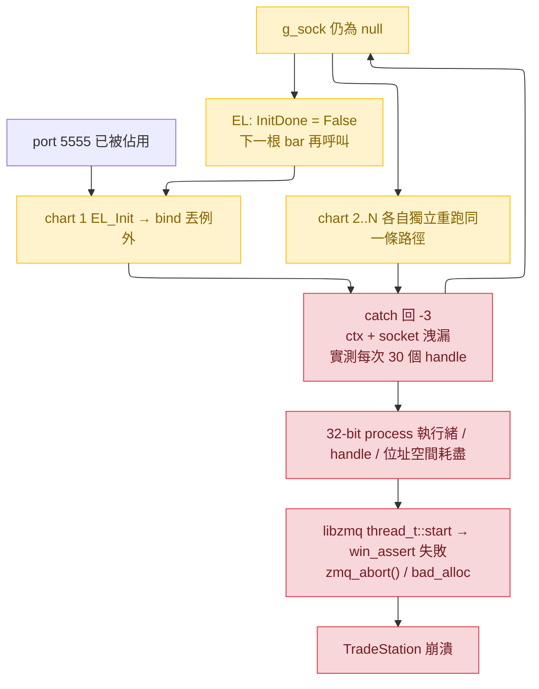

# cpp/ 多圖崩潰調查與 code review 缺陷清單

日期：2026-08-11 · 範圍：`cpp/src`、`cpp/include`（對照 `EL/`、`contract/`）
基準：`510462c`（`feat(abi)!: EL_Init announces its chart and waits for a subscriber` 之後）

---

## Part 1 — 多圖崩潰的分析

### 先排除的假設

初版 review 把崩潰歸因於「舊 `.ELD` 綁到一參數 `EL_Init`、`__stdcall` 由被呼叫端清堆疊
造成堆疊損毀」。**這條不成立**：使用者確認兩端都是新版，而且兩端宣告逐項比對後一致 ——

| | `.ELD`（`EL/TS2Python_Exporter.el:140-145`） | DLL（`cpp/include/ts2python.h:83-135`） |
|---|---|---|
| `EL_Init` | `LPSTR, LPSTR, int, int, int`（5） | `const char*, const char*, int, int, int`（5） |
| `EL_Publish` | `LPSTR, LPSTR, int×3, double×11`（16） | 同上（16） |

呼叫端引數順序也對得上（`EL_Init(ZMQEndpoint, Sym, Cat, BarType, BarInterval)`）。
ABI 不是原因，這一項在下面的清單中降級為「文件/防護」議題而非崩潰成因。

### 現行假設：bind 失敗後的無界洩漏級聯

`EL_Init` 在 bind 失敗時會洩漏一個**已經啟動的** `zmq::context_t`（含 libzmq I/O
執行緒與 reaper 執行緒）加上一個 `zmq::socket_t`，而且 `g_sock` 保持 null，於是
**每一張圖、每一根 bar 都會重跑整段配置**。

```cpp
// cpp/src/ts2python.cpp:365-388
if (!g_sock) {
    auto* ctx  = new zmq::context_t(1);                       // 啟動 I/O + reaper 執行緒
    auto* sock = new zmq::socket_t(*ctx, ...);
    sock->bind(zmq_endpoint);                                 // ← 丟出 zmq::error_t
    g_ctx = ctx; g_sock = sock;                               // ← 到不了
}
// ...
} catch (const zmq::error_t&) { return -3; }                  // ctx / sock 就此失聯
```

EL 端對任何負值 rc 都保持 `InitDone = False` 並在下一根 bar 重試，沒有退避
（`EL/TS2Python_Exporter.el:180-202`）。



**為什麼是「多張圖才炸」**：洩漏速率正比於（圖數 × 每張圖的 bar/tick 頻率）。單張分鐘圖
一小時洩 60 個 context，看起來像沒事；五張 tick 圖每秒可以洩掉數十個，32-bit 的
TradeStation 進程在數秒到數分鐘內耗盡資源。

**佐證**：`-3`（bind 失敗）在本專案是實測過的常態，不是理論狀況 ——
`contract/fixtures/README.md:86-87` 與 `contract/error_codes.md:13` 都記載
TradeStation 執行中會佔住 `tcp://127.0.0.1:5555`；先前的實測筆記也記錄
`orchart.exe` 持有該 port。若 TradeStation 以多個 `orchart.exe` 承載不同圖表視窗，
只有第一個進程 bind 得到，其餘每個進程都會落進上面這條級聯。

### 尚缺、需要你確認的證據

這個假設能解釋症狀且與程式碼一致，但下列證據我取不到，請你補：

1. TradeStation **Print Log 裡的 rc 值** —— 崩潰前是否出現 `EL_Init FAILED rc=-3`？
   （若有 `rc=-3` 就等於直接證實；若只有 `waiting for a subscriber`，則另尋成因。）
2. 崩潰時工作管理員裡 **`orchart.exe` 的數量**，以及該進程的**執行緒數/控制代碼數**
   是否隨時間單調上升。
3. 事件檢視器 → Windows 記錄 → 應用程式，該次當機的 **Faulting module name**。

無論這三項結果如何，下面的 #1 都是必須修的實質缺陷。

---

## Part 2 — 缺陷清單

Verdict 欄：`CONFIRMED` = 機制與觸發條件都由程式碼證實；`PLAUSIBLE` = 機制證實、
觸發條件需要外部條件配合。

| # | 位置 | 摘要 | 嚴重度 | Verdict |
|--:|---|---|---|---|
| 1 | `ts2python.cpp:365-388` | bind 失敗洩漏 context/socket/執行緒，且每根 bar 重試 | **崩潰** | CONFIRMED |
| 2 | `ts2python.cpp:567` | `EL_Shutdown` 無 `try/catch`，例外可逸出 `__stdcall` C ABI | **崩潰** | PLAUSIBLE |
| 3 | `ts2python.cpp:365` | 第二張圖之後的 `zmq_endpoint` 被靜默丟棄，卻回報成功 | 高（靜默錯埠） | CONFIRMED |
| 4 | `ts2python.cpp:516-521` | `EL_Publish` 不檢查訂閱者，consumer 重啟期間的資料靜默丟失並回 0 | 高（靜默丟資料） | CONFIRMED |
| 5 | `ts2python.cpp:335-340` | 重宣告掃描先清空 `announced` 再忽略 `send_hello` 失敗 | 中 | PLAUSIBLE |
| 6 | `ts2python.cpp:282-283` | hello 第二個 frame 失敗會讓 XPUB 卡在 multipart 中途 | 中 | PLAUSIBLE |
| 7 | `ts2python.cpp:300-345` | `drain_subscriptions` 的 `catch(...)` 把真實 ZMQ 錯誤轉成「可重試」的 -7 | 中 | PLAUSIBLE |
| 8 | `ts2python.cpp:406-418` | `g_charts` 只增不減，改過 symbol 的死圖被永久重宣告 | 中 | CONFIRMED |
| 9 | `ts2python.cpp:415` vs `:433` | chart 先註冊、後過 -7 閘門，導致宣告了尚未成功 init 的圖 | 中 | PLAUSIBLE |
| 10 | `ts2python.cpp:407-414` | 兩張同 tuple 的圖併成一筆，共用一個 topic 與一個 `seq` | 中 | CONFIRMED |
| 11 | `ts2python.cpp:297` | 只在 `EL_Init`/`EL_Publish` 抽 XPUB 佇列，靜盤期間重連的 consumer 收不到宣告 | 低 | CONFIRMED |
| 12 | `test_harness.cpp:363-377` | init 側 ABI 迴歸檢查被換成一個「已不擋任何東西」的檢查 | 低（覆蓋率） | CONFIRMED |
| 13 | `test_harness.cpp:326-350` | `multithread` mode 只併發 publish，從不併發 `EL_Init` | 低（覆蓋率） | CONFIRMED |
| 14 | `fixtures/README.md:68-74` | `--count` 表未計入開頭兩個 hello frame | 低（文件） | CONFIRMED |
| 15 | `ts2python.h:35, 57-61` | rc 區塊漏列 `-2`、又仍列著已退役的 `-5` | 低（文件） | CONFIRMED |

### 逐項細節

#### 1. bind 失敗的無界洩漏 — 崩潰主嫌

見 Part 1。修法：以 RAII 持有，成功才移交給全域裸指標（全域維持裸指標是刻意的，
理由見 `ts2python.cpp:45-50`：避免 static 解構期在 loader lock 下呼叫
`zmq_ctx_term()`）。

#### 2. `EL_Shutdown` 的例外逸出

`EL_Shutdown` 是唯一沒有 `try/catch` 的匯出。`std::lock_guard` 可丟
`std::system_error`，`delete g_sock` 走 `zmq_close`/`zmq_ctx_term` 亦可能丟。
例外跨越 `extern "C" __stdcall` 邊界進入 EasyLanguage 是未定義行為 —— EL 沒有
unwind 機制。`.ELD` 有綁這個匯出（`TS2Python_Exporter.el:146`），任何 EL 腳本都叫得到。

#### 3. 第二張圖之後的 endpoint 被丟棄

`if (!g_sock)` 短路掉整段 bind，所以第二張圖若把 `ZMQEndpoint` 設成別的 port，
它的資料會走第一張圖綁的 port，而 `EL_Init` 照樣回 0/1、Print Log 照樣印
"publishing starts now"。這正是 `-7` 閘門要消滅的「靜默送進虛空」。

#### 4. `EL_Publish` 沒有訂閱者閘門

`ts2python.h:46-55` 宣稱「有訂閱者才回 0」，但那只在 init 當下成立。EL 的 `InitDone`
一旦被設為 True 就不再重跑 init 區塊，所以 consumer 中途重啟時，
`EL_Publish` 仍照送 —— ZMQ 靜默丟棄、`send()` 回報成功、rc = 0。

#### 5. 重宣告掃描的失敗處理

```cpp
for (auto& c : g_charts) { c.announced = false; }   // 先全部清掉
for (auto& c : g_charts) { send_hello(c); }         // 再忽略回傳值
```
第 3 張圖的 hello 丟例外時，`catch(...)` 會中止整個迴圈**與**剩下的佇列，第 3~N 張圖
就停在 `announced == false` 且沒有任何機制會重試。

#### 6. multipart 中途中斷

`send_hello` 送出 topic（`sndmore`）後、body 之前若丟例外，socket 的 `_more_send`
留在 true，下一次 `EL_Publish` 的 topic frame 會變成前一則訊息的延續 frame。

#### 7. `catch(...)` 吞掉真實錯誤

`drain_subscriptions` 的 `catch(...)` 讓「socket 壞掉」與「還沒有人訂閱」在 rc 上無法區分，
兩者都成為 -7；而 EL 把 -7 當正常啟動狀態且只印一次。

#### 8~11

見表格摘要。#8 同時使 `g_charts` 無界成長，`EL_Init` 的線性掃描與每次 subscribe 的
全表掃描都會拖長，且是在 publish 路徑的 `g_mutex` 之內。

#### 12~13 測試覆蓋

`multithread` mode 在 `main()` 裡單執行緒 init 一次（`test_harness.cpp:394`），
只把 publish 併發（`:442`）。新的多圖 init 路徑 —— chart registry 變動、XPUB 抽取、
`g_mutex` 下的 hello 掃描 —— 完全沒有併發測試。

#### 14 fixture `--count`

`README.md:76-81` 的散文**已經**說明重錄會多出開頭兩個 `__ts2py__` frame，但同一份文件
`:68-74` 的 `--count` 表仍是舊值（smoke 6 / noquote 3 / bars 9 / session 2），照抄會少錄兩個 frame。

#### 15 header rc 漂移

`ts2python.cpp:435` 會回 `-2`，但 `ts2python.h:57-61` 的 `EL_Init` rc 區塊沒列；
`ts2python.h:35` 仍列著 `-5`，而 `-5` 已從 `contract/error_codes.md` 的表中移除。
`error_codes.md:87` 要求兩者同一個 commit 內同步。

---

## Part 3 — 已修正項目與驗證

| Issue | 動作 | 狀態 |
|---|---|---|
| #1 | `EL_Init` 改用 `unique_ptr` 持有 ctx/socket，bind 成功才 `release()` 給全域 | ✅ |
| #2 | `EL_Shutdown` 包 `try/catch`，例外不再跨越 C ABI；回 `-3` | ✅ |
| #3 | 新增 `g_endpoint` 記住實際綁定的 endpoint；不一致的 chart 回新錯誤碼 `-8` | ✅ |
| #5 | 重宣告改為「invalidate 在 subscribe 時、送出在每次 drain」，且**逐 chart** try/catch | ✅ |
| #6 | 兩處兩段式送出改為「topic 送出後，任何離開路徑都必須把訊息收尾」，新增 `close_abandoned_message()` | ✅ |
| #7 | `drain_subscriptions()` 改回傳 `bool`；`EL_InitChart` 失敗回新碼 `-9`，`EL_Publish` 刻意忽略 | ✅ |
| #4 | `EL_Publish` 逐 symbol 檢查訂閱者，無人收時回新碼 `-10`，per-chart latch 每事件只報一次 | ✅ |
| #8 | chart registry 上限 **24**，滿了淘汰「最久沒 publish」的那一筆 | ✅ |
| #12 | init 匯出改名 `EL_InitChart`，`EL_Init` 回歸**單參數**墓碑；**ABI 3 → 4** | ✅ |
| #9 | chart 註冊移到 `-7` 閘門之後 | ✅ |
| #13 | harness `multithread` 模式改為每條執行緒各自 `EL_Init`；另加 `-8` 迴歸檢查 | ✅ |
| #14 | `fixtures/README.md` 的 `--count` 表改為含 hello 的實際值 | ✅ |
| #15 | `ts2python.h` rc 區塊補 `-2`/`-8`，`-5` 改為明確標記「已退役、不得重用」 | ✅ |

### 根因驗證（#1）

以 ctypes 直接驅動 DLL，用一個佔住 port 的 TCP listener 逼 `bind()` 失敗，
再照 EL 的行為連續呼叫 `EL_Init`（全部回 `-3`），量測 process 的 handle 數：

| 建置 | 300 次失敗 init 後的 handle 增量 |
|---|---:|
| 修正前（裸 `new`） | **+9000**（每次 30 個） |
| 修正後（`unique_ptr`） | **0** |

每次失敗的 `EL_Init` 洩漏 30 個核心物件（libzmq I/O + reaper 執行緒、其
socketpair signaler 等）。乘上「每張圖每根 bar 重試一次」，這就是 32-bit
TradeStation 在多圖情境下耗盡資源的路徑。

> 探針跑的是 x64 建置（ctypes 無法從 64-bit Python 載入 x86 DLL）。洩漏邏輯與
> x86 同一份原始碼；差別只在 32-bit 位址空間會**更快**耗盡。

### 迴歸驗證

- `build.bat` — Release x86 + x64 皆 OK（僅剩既有的 zmq.hpp C4244 警告）。
- harness 六個模式全過：`smoke` / `noquote` / `bars` / `session` /
  `stress`（sent=9947 failed=0）/ `multithread`（8 執行緒各自 init，
  sent=2400 failed=0 init_failed=0）。
- 併發 init 產生的 hello 為 **10 個**（2 張啟動圖 + 8 張 worker 圖），一圖一個、無重複。
- `smoke` 重錄得到 8 個 frame（2 hello + 6 point），與 README 的新 `--count` 相符。
- `uv`/venv pytest：conformance 36 passed，全 suite **281 passed**。

### #7 已修：`drain_subscriptions` 的 `catch(...)`（以下為決策紀錄）

**結論**：`drain_subscriptions()` 回傳 `bool`；`EL_Init` 於失敗時回**新錯誤碼 `-9`**，
`EL_Publish` 明確忽略。`-9` 已登錄於 `ts2python.h` 與 `contract/error_codes.md`。
`.ELD` 無需變更 —— indicator 對任何非 `-7` 的負值一律逐根 bar 印出。

> **`-9` 目前沒有自動化覆蓋。** 要觸發它必須讓 XPUB 的 `recv` 丟出例外（`ETERM` /
> `ENOTSOCK`），而 harness 能製造這個狀態的唯一路徑是在另一條執行緒 drain 的同時
> 呼叫 `EL_Shutdown`，那本身就是競態。列為已知缺口。

以下是做出這個決定的分析。

**現況。** `drain_subscriptions()` 用一個 `catch (...)` 罩住整段 XPUB 抽取迴圈，
涵蓋 `g_sock->recv()`、`std::string topic(...)` 與 `g_sub_topics` 的插入/刪除。
任何例外都被吞掉，函式正常返回。

**被遮蔽的是什麼。** `recv` 在 `dontwait` 下遇到 `EAGAIN` 是回空值、不丟例外，
所以會丟例外的只剩真正的故障：`ETERM`（context 已終止）、`ENOTSOCK`、`EINTR`。
一旦丟出，`g_sub_topics` 維持原狀（啟動時就是空的），於是：

```
recv 丟例外 → 被吞 → g_sub_topics 仍為空
            → control_topic_subscribed() == false
            → EL_Init 回 -7
```

而 `-7` 在 EL 端的語意是「還沒有人訂閱，這是正常啟動狀態」，並且被
`WaitingLogged` 鎖成**只印一次**。結果就是：consumer 明明在跑，操作者只看到一行
"waiting for a subscriber"，整個 session 一筆都沒發布，兩端都沒有錯誤。

**為什麼不能直接把 catch 拿掉。** 兩個呼叫端外層都已經有 try/catch，例外會自然
變成 `EL_Init` 的 `-3` 與 `EL_Publish` 的 `-2` —— 不需要新錯誤碼，也不用重匯 `.ELD`。
但 `EL_Publish` 是**先 drain、後送出**：

```cpp
drain_subscriptions();          // ← 若這裡讓例外逸出
const std::uint64_t seq = reserve_seq(symbol);
... snprintf ...
g_sock->send(...);              // ← 這一筆就永遠不會執行
```

所以一次暫時性的 drain 失敗（例如 `EINTR`）會讓一根**本來送得出去的 bar 直接消失**，
而 EL 不重送失敗的 publish。用「訂閱簿記的小故障」去換掉一根真實資料，方向是錯的。

**因此建議的形狀是不對稱的**，而不是全有全無：

| 呼叫端 | drain 失敗時 | 理由 |
|---|---|---|
| `EL_Init` | 讓它失敗 | init 的產出就是「有沒有人在聽」這個答案。答錯成 `-7` 等於靜默死亡 |
| `EL_Publish` | 忽略，照送 | point frame 比訂閱簿記值錢；下一次呼叫會再 drain 一次 |

實作是把 `drain_subscriptions()` 改成回傳 `bool`（成功與否），`EL_Init` 檢查、
`EL_Publish` 忽略。剩下的唯一決定是 `EL_Init` 該回哪個碼：

- ~~沿用 `-3`~~ —— 不增加契約面，但 `-3` 目前的定義是「bind / socket 建立失敗」，
  拿來報 recv 失敗會讓這個碼的意義漂掉。**未採用。**
- **新增 `-9`** —— 語意乾淨，代價是 `error_codes.md`、`ts2python.h` 各多一列。
  **採用**：這個專案已經因為「兩種不同狀況共用一個碼」吃過虧，而 `error_codes.md`
  本來就規定新碼取下一個可用絕對值。

### 本輪引入的取捨（#5）

hello 的重送改為「每次 drain 重試未宣告的 chart」，代價是
`send_hello` 即使失敗也會消耗一個控制 topic 的 `seq`（既有的刻意設計，
見 `reserve_seq` 註解）。若 socket 進入持續失敗狀態，控制 topic 的 `seq` 會被
快速墊高，subscriber 讀起來像大量遺失。判斷是可接受的：能讓 `send_hello` 持續失敗的
狀態，publisher 早已整體失效；而相對的另一面 —— 一次暫時性失敗就讓某張圖的宣告
永久消失 —— 發生機率高得多。

### #12 的更正紀錄

本文件初版把 #12 列為「無法在 DLL 這一側修」，理由是「被呼叫端看不到呼叫端推了幾個
參數」。**前半句對，結論錯。** 守衛不需要在呼叫當下偵測，只要讓舊 `.ELD` 根本解析不到
那個名字。init 改名為 `EL_InitChart`、`EL_Init` 回歸單參數墓碑之後，兩個方向都變成可讀的
失敗。這正是這個 repo 原本的原則（簽章一改，名字就改），ABI 3 放棄了它。

驗證看裝飾名即可 —— `@` 後的數字就是參數佔用的位元組數：

```
EL_Init      = _EL_Init@4        <- 單參數墓碑
EL_InitChart = _EL_InitChart@20  <- 五參數
```

### 未處理，單獨追蹤

- **#10（兩張同 tuple 的圖併成一筆）** —— 決議為**只寫文件、不改碼**。wire 上沒有超出
  4-tuple 的 chart 識別，要分辨兩張設定完全相同的圖必須在 frame 上加欄位（契約變更），
  而 `EL_Publish` 加參數的成本遠大於收益。已寫入 `CLAUDE.md`：分鐘圖上 binding 的
  `(symbol, bar_time)` 緩衝會吸收重複，**tick 圖會實實在在多出重複列**。
- **#11（靜盤期間 consumer 重連收不到宣告）** —— 決議為**不做**。要在 DLL 內開一條
  背景執行緒週期性 drain，在 TradeStation 進程裡多一條執行緒是真實風險，而換到的只是
  靜盤期間的畫面完整性；第一根 bar 一到就自動修正。
