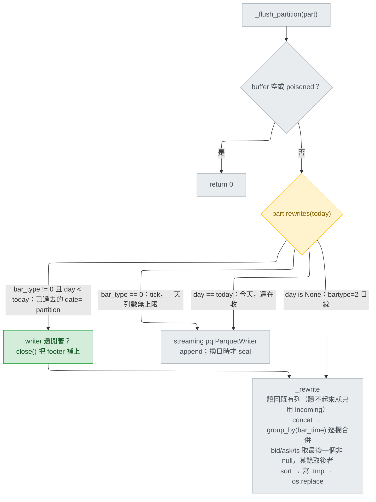

# 過去日的 `date=` partition 改走 merge：一次 chart reload 不該截掉一整段 session

日期：2026-08-15 · 範圍：`bindings/python/src/tradestation_data/storage/bar_writer.py`
基準：`9ff8c47`（`Merge pull request #44 from millerlai/docs/release-conventions`）
來源：[`../2026-08-15-intraday-partition-truncation.md`](../2026-08-15-intraday-partition-truncation.md)（2026-08-15 實測回報）
狀態：設計完成，未實作

---

## Context

實測回報量到的是：**一次 chart reload 會截掉一整段 session，而且截在最舊的那一天。**

一張 `$TICK` 5 分鐘圖，hub 與錄製端都在跑、盤已收。把圖載入的區間往前拉再 Verify，DLL 會
把整段歷史重播一次。結果是想修的那天修好了，代價是更舊的那天被截斷：

| 日期 | republish 前 | republish 後 |
| --- | --- | --- |
| `date=2026-08-03` | 79 列，首根收在 09:40 | 80 列，首根收在 09:35 — **修好了** |
| `date=2026-07-31` | 80 列 | 79 列，首根收在 09:40 — **被截了** |

同一輪在 `$ADD`、`$VOLD`、`$TRIN`、`$PCVA`、`IWM`、`RSP` 上重複，六個 symbol 一致：
08-03/06/07/10 修好，07-31 全部被截。有 pre-market 的兩個 symbol 損失不是一根：

| symbol | 2026-07-30（沒被碰到） | 2026-07-31（republish 後） |
| --- | --- | --- |
| `$ADD` / `$VOLD` / `$TRIN` / `$PCVA` | 09:35，78 列 | 09:40，**77 列** |
| `IWM` | 06:05，168 列 | 09:40，**77 列** |
| `RSP` | 06:50，127 列 | 09:40，**77 列** |

`IWM` 為了補一根，賠掉整段 pre-market 的 91 列。

**第二個症狀是同一個根因的另一面**：同一個 process 內，一個過去日只能匯入 **一次**。
`date=2026-08-03` 在 22:42 寫入、約 60 秒後被 `_seal_elapsed_days()` 封存，之後每一次
republish 都在 `write()` 被 `bar_partition_sealed` 擋掉。DLL 回報 `rc=0`，操作者看到的是一次
成功的發佈，但沒有任何東西到磁碟。要重新匯入那一天，只能重啟整個 run。

**還有第三個症狀，回報書沒點名。** 在 `9ff8c47` 上直接驅動 `BarWriter` 量到的三個數字
（腳本見〈驗證〉的手動那一節）：

| 情境 | 檔案列數 |
| --- | --- |
| run 1 寫入一個過去日的 4 根 | 4 |
| run 2 只 republish 其中 3 根（重啟後的 chart reload） | **3** — 最舊的一根消失 |
| 同一個 run 內把同樣 3 根寫兩次 | **6** — 每一根都重複 |

第三列是新的：如果 republish 在封存之前就到（60 秒安靜期還沒過），streaming writer 是
**append**，同一個 `bar_time` 會落地兩次。所以同一個 run 內的 republish 不是截斷、是重複，
封存之後才變成第二個症狀的靜默丟棄。

第二列同時釐清了截斷發生的位置：**它是跨 run 的**。`pq.ParquetWriter` 只在第一次開檔時截斷，
同一個 run 內它一路 append。磁碟上那份 79/80 列的舊資料，是被新 run 對那個 partition 的第一次
flush 抹掉的。

三個症狀，一個根因，一個修法。

---

## 根因：`rewrites` 問的是版面，不是策略

```python
# storage/bar_writer.py:96-98
@property
def rewrites(self) -> bool:
    return self.day is None
```

`day` 只在 `bar.bar_type == 2` 時是 `None`（`:210`），所以 `rewrites` 實際問的是
「**這是不是日線那種單檔版面**」，而不是「這個 partition 該不該 merge」。
`_flush_partition`（`:273`）就照這個答案分岔：日線走 `_rewrite`（`:318`），每一個 `date=`
partition 走 streaming 的 `pq.ParquetWriter`——**而 `pq.ParquetWriter` 開檔即截斷**。

`_rewrite` 本身早就是這裡想要的行為，它的 docstring 甚至點名了這個情境：

> A repeated `bar_time` keeps the later row — that is a chart reload re-sending days we
> already have, and the fresher copy is the one TradeStation just adjusted.

它之所以只給日線用，是因為 `docs/architecture.md` §7.6 給了日線「一個 symbol 一個檔」的版面
（一天一列，對上一個 closed Parquet 檔無論如何都要付的 ~2.9 KB schema/footer），而一個必須
隨時可讀的單檔沒辦法用 append 的方式長大：`pq.ParquetWriter` 的 footer 只在 `close()` 時寫，
關掉就不能再開。**merge 是那個版面限制的副產品，不是一條決策。**

Intraday 一天一檔，正常情況下寫一次就封存，所以 streaming writer 合身、也從來不需要讀回舊
列。於是「重播一個已經寫過的日子」被當成**可讀性**問題（封存）而不是 **merge** 問題，
`write()` 就以這個理由拒絕已封存的 partition（`:223-226`）：

> Reopening would truncate a finished day. Losing one late bar beats losing the session it
> belongs to.

在「無法 merge」的前提下，這個取捨是對的。前提一旦不成立，它就不必要了。

---

## 設計

五處改動，全部在 `bar_writer.py`。磁碟格式、schema、路徑版面都不動。前三處解掉三個症狀，
後兩處是前三處引進的新狀態轉換必須處理的（一個是合併語意，一個是壞檔的復原）。

### 1. `rewrites` 改成吃 `today` 的方法，並排除 tick

```python
def rewrites(self, today: date) -> bool:
    return self.day is None or (self.bar_type != 0 and self.day < today)
```

呼叫端只有一處（全 repo 唯一），`_flush_partition:273` 改成：

```python
if part.rewrites(self._today_et()):
```

`rewrites` 今天是個裸 property、身上沒有時鐘，但 `BarWriter` 已經握著注入式的 `self._today_et`
（`:182` 建構子參數、`:191` 存下、`_is_finished:390` 與 `_seal_elapsed_days:430` 在用），所以
日期用傳的、不要在 `_Partition` 裡再讀一個時鐘——`:190` 的註解「Nothing else reads a clock
here」是刻意的不變量，別破壞它。

這一步就把第一個症狀解掉：**store 裡有、republish 沒重送的列會被保留下來**，burst 最舊的那天
不再被截斷。

注意這不是「純加法」——重疊的 `bar_time` 會被 republish 的版本取代（`_rewrite` 的
`keep="last"`），而 replay 版本的欄位和 live 版本不一樣。那是第 4 節的題目。

### 2. 走 rewrite 之前，先關掉還開著的 streaming writer

```python
if part.rewrites(today):
    if part.writer is not None:
        # 這個 writer 是這個 partition 還是「今天」時開的。跨過 ET 午夜之後它改走
        # merge，就得先 close() 把 footer 補上：_rewrite 要把整個檔讀回來，而且
        # Windows 的 os.replace 蓋不掉一個還被開著 handle 的檔案。
        part.writer.close()
        part.writer = None
    self._rewrite(path, part.buffer)
```

**這是回報書那一行修法沒有涵蓋、但會直接壞掉的路徑。** 一個跑過 ET 午夜的 process，昨天的
partition 手上還握著一個 streaming writer，而它現在符合「過去日」。`flush()` 第一件事就是
`_seal_elapsed_days()`（`:262`），所以 `_seal` → `_flush_partition` 被呼叫時 buffer 還是滿的。
沒有這兩行的話，兩件事各自獨立會發生：

1. `_rewrite` 的 `pq.ParquetFile(path).read()`（`:335`）讀到一個**沒有 footer** 的檔案，丟例外
   → `except`（`:279-310`）把 partition **poison** 掉、丟掉整個 buffer、該 series 這個 run
   不再寫任何東西；
2. Windows 上 `os.replace(tmp, path)`（`:367`）覆寫不掉一個還被開著的檔案。

現有測試踩不到它：`test_should_flush_reports_a_day_that_is_over`（`test_bar_writer.py:540`）
翻日的時候 buffer 剛好是空的，`_flush_partition` 在 `:268` 就 return 了。

順序上這也和 `_seal`（`:437-444`）相容：writer 已經被關掉並設成 `None`，`_seal` 後面那段
close 就變成 no-op。

### 3. `write()` 的 sealed 拒絕改成條件式

```python
elif part.sealed and not part.rewrites(self._today_et()):
    log.warning("bar_partition_sealed", ...)
    return
```

`bar_partition_sealed`（`:223-235`）存在的唯一理由是「重開 `pq.ParquetWriter` 會截斷一個已
完成的日子」。會 rewrite 的 partition **根本不開 writer**——它把完成的檔案讀回來、merge、
原子換檔——所以這個拒絕只在 streaming path 還適用的地方才成立：`bar_type == 0`，以及還沒過去
的日子（時鐘偏移或跨午夜前一刻送達的 bar，都可能讓一個 `day == today` 的 partition 被
`_seal_earlier_days` 封存；條件式在那裡仍然保守地拒絕）。

`part.sealed` **刻意不清掉**。對一個會 rewrite 的 partition，它只表示「它的 writer（如果有
過）已經關了」；留著 `True` 正好讓 `_is_finished`（`:406`）不會再去封存一個根本不需要封存的
partition——rewrite 每次 flush 都留下一個完整可讀的檔案。

這一步解掉第二個症狀：一個過去日不再是 import-once-per-process，被封存過也能再匯入。

### 4. `_rewrite` 的合併改成逐欄：`bid`/`ask`/`ts` 為 null 時保留舊值

**需求**：*當 replay 版本與 live 版本落在同一個 `bar_time`，`bid`/`ask`/`ts` 若 replay 版本是
null 就保留 store 裡原本的值；其餘欄位一律取 replay 版本。*

理由是 replay 沒有報價。這件事 CLAUDE.md 已經寫死了：EL 的 `InsideBid`/`InsideAsk` 在沒有報價
時回 0（歷史重播、非 live 模式、breadth 指數都是），DLL 把非正值正規化成 JSON `null`；harness
的 `noquote` 模式的描述就是「the history-replay shape」。所以現行的
`unique(subset=["bar_time"], keep="last")` 一旦套到 intraday，會把 live session 錄到的
`bid=222.14 / ask=222.15` 整列換成一根報價是 `null` 的重播版本，`ts`（DLL 接收時鐘）也一併被
換掉。列數不會少，欄位靜靜地變空。

`BAR_SCHEMA` 裡可為 null 的欄位**剛好就是這三個**（`:61`、`:62`、`:66`），其餘全部
`nullable=False`，所以規則可以寫得很小：

```python
# BAR_SCHEMA 裡唯一可為 null 的三欄。歷史重播沒有報價，所以一次 republish
# 撞到 live 錄下的那一根時，這三欄要保留舊值而不是被 null 蓋掉。
_COALESCE_COLUMNS = frozenset({"bid", "ask", "ts"})
_MERGE_COLUMNS = [f.name for f in BAR_SCHEMA if f.name != "bar_time"]

merged = (
    pl.concat(frames, how="vertical")
    .group_by("bar_time", maintain_order=True)
    .agg(
        [
            (pl.col(n).drop_nulls() if n in _COALESCE_COLUMNS else pl.col(n)).last()
            for n in _MERGE_COLUMNS
        ]
    )
    .sort("bar_time")
)
```

這段表達式在 **polars 1.40.1**（本 repo 目前鎖的版本）上實測過：欄位順序輸出為
`bar_time, bar_time_et, open, …, bid, ask, ts`，正好等於 `BAR_SCHEMA`；非 null 相撞時 incoming
勝；replay 為 null 時 live 的值留下。

三件事要注意：

- **欄位順序**：`group_by("bar_time")` 的輸出是 `bar_time` 在前、agg 欄位依給定順序在後。
  `bar_time` 是 `BAR_SCHEMA` 的第一個欄位（`:34`），`_MERGE_COLUMNS` 又照 schema 順序生成，所以
  結果剛好對上 `BAR_SCHEMA`，`:366` 的 `.cast(BAR_SCHEMA)` 不需要改。
- **「後者勝」靠的是 group 內的原始列序**（`frames = [existing, incoming]`）。這和現行
  `unique(keep="last")` 依賴的是同一個性質，不是新假設；但它是隱含的，所以測試要**明確釘住**
  「非 null 相撞時 incoming 勝」，不能只靠推理。
- **這條規則對日線一起生效**，因為 `_rewrite` 只有一份。日線今天有同樣的問題（重播的日線也
  沒有報價），順手一起修好，而且避免 intraday 和日線的合併規則分岔。`test_daily_repeated_bucket_keeps_the_later_bar`
  （`:367`）斷言的是非空欄位 `close`，已確認不受影響。

### 5. `_rewrite` 要分開「檔案讀不起來」和「schema 不合」

**沒有這一步，這個修法會把一個今天會自癒的損毀狀態變成永久的。**

情境：process 在 D 日盤中被硬砍（工作管理員、斷電、OOM——`close()` 沒跑到），
`date=D/bars.parquet` 留在磁碟上**沒有 footer**。`test_flush_leaves_today_open`（`:513`）就是在
證明這個檔案在 session 進行中確實是這個狀態。隔天重啟、圖重播 D 日 → 該 partition 現在是過去
日 → 走 `_rewrite` → `pq.ParquetFile(path).read()`（`:335`）丟例外 → `_flush_partition` 的
`except`（`:279-310`）把它 **poison** 掉、丟棄 buffer。**D 日的重播全部落空，而且那個壞檔從此
沒有任何東西會去修它。** 現行行為在同一情境下是 streaming writer 開檔即截斷、把 D 日重寫乾淨
——**會自癒**。

修法是把三種失敗分開，`try/except/else` 就夠：

```python
if path.exists():
    try:
        existing = pl.from_arrow(pq.ParquetFile(path).read())
    except pa.ArrowInvalid as exc:
        # 只接 ArrowInvalid，不能更寬。它是唯一代表「這些位元組不是一個
        # parquet 檔」的那一族，硬砍留下的無 footer 半截檔就是它。丟掉它、
        # 只寫 buffer，等同現行 streaming writer 開檔即截斷的自癒行為。
        log.warning(
            "bar_partition_unreadable_overwritten",
            extra={"path": str(path), "error": f"{type(exc).__name__}: {exc}"},
        )
    else:
        assert isinstance(existing, pl.DataFrame)
        # schema 不合仍然照舊往上拋：那個沒有正確的欄位對映可言，
        # 靜靜覆寫掉一份舊 store 才是壞事。
        missing = [f.name for f in BAR_SCHEMA if f.name not in existing.columns]
        if missing:
            raise ValueError(...)          # :349-356 不動
        frames = [existing, incoming]
```

**`except` 的寬度是這一節的全部重點，寫寬了會比不改還糟。** 這份計畫的初稿寫的是
`except Exception`，diff review 用實際注入證明那是錯的：一個**完好**的檔案只要這一次開檔失敗
（防毒或備份程式造成的 Windows share violation、`HistoryStore` 併發讀），就會被只有這批 buffer
的內容整個覆蓋掉，4 列變 1 列，而且只留一行 WARNING。更糟的是 `_rewrite` 也是日線的路徑，那個
檔案是原生日線 bar 的**唯一副本**——改動前這種失敗會往上拋、partition 被 poison，**磁碟檔案
原封不動**；寫寬之後就變成直接摧毀資料。

例外分類在 pyarrow 24.0.0 上實測過：

| 磁碟上的狀態 | `pq.ParquetFile(path).read()` 丟出 |
| --- | --- |
| 垃圾內容 / 零位元組 / 截斷無 footer / 只有 header | 一律 `pyarrow.lib.ArrowInvalid` |
| 檔案完好、只是這次讀不到（share violation、併發讀） | `PermissionError` / `OSError`——**不是** `ArrowInvalid` |

所以規則是：**`ArrowInvalid` 代表「內容可以丟」，其餘一律往上拋回原本的 poison 路徑**，那條
路徑不會動磁碟上的檔案。方向要記住：誤判成 poison 只是這個 run 少寫一天，誤判成可丟是永久
資料損失。

`else` 分支同樣是關鍵：schema 檢查的 `ValueError` 不能被上面那個 `except` 吃掉。

`bar_partition_unreadable_overwritten` 是新的 log 事件，命名比照現有的
`bar_partition_sealed` / `bar_partition_unwritable`。

### 分岔後的四條路



| partition | `rewrites` | 路徑 | 相對現況 |
| --- | --- | --- | --- |
| `day is None`（bartype=2 日線） | True | `_rewrite` | 不變 |
| `bar_type != 0` 且 `day < today` | **True** | 先 close writer，再 `_rewrite` | **本次改動** |
| `day == today` | False | streaming writer，換日才 seal | 不變 |
| `bar_type == 0`（tick） | False | streaming writer + `bar_partition_sealed` | 不變 |

今天的 partition 完全不受影響，所以 live path 什麼都沒變。

---

## 為什麼 tick 圖不一起改

回報書主張「限定過去日就能完全避開 quadratic，因為一個過去日只有在 burst 真的重送它時才會
被重寫」。**這個理由不成立，但結論仍然是對的**——只是要靠一個額外的條件撐住。

不成立的地方：啟動時的 history replay 寫的**就是過去日**。一張 1-tick 圖一天有數十萬到數百萬
筆 print，`max_buffered_bars` 預設 1000，於是一天要 flush 數百到數千次；每次 flush 都把整個檔
讀回來再整個寫出去，`_flush_partition` 只在 buffer 為空時才提早 return。所以是**第一次匯入**
就退化成 O(n²)，不是只有 republish。

bar 圖沒有這個問題，而且理由是結構性的：**一天的列數被 session 長度除以 interval 綁死。**
5 分鐘圖一天 78–168 列，1 分鐘圖就算 24 小時 session 也只有 ~1440 列。整檔重寫幾百列，成本和
日線那個 ~2.9 KB 的單檔是同一個量級——這正是 `_rewrite` 當初被接受的理由。

所以條件是 `bar_type != 0`，而不是「過去日」單獨一項。這條線是有原則的：**列數有上界的
partition 才 merge。** tick 圖維持現行的 streaming writer 與 `bar_partition_sealed` 拒絕，
它的 republish 截斷不在本次修法範圍內（見〈明確不做的事〉）。

---

## 變更清單

順序即實作順序。

### 1. `bindings/python/src/tradestation_data/storage/bar_writer.py`

- `_Partition.rewrites`（`:96-98`）— property → 吃 `today: date` 的方法，加上 `bar_type != 0`
- `_Partition.sealed` 欄位註解（`:81-84`）— 「a late bar is refused instead of reopening」現在
  只對 streaming path 成立，註解要縮到那個範圍
- `write()`（`:223-235`）— sealed 拒絕改成條件式
- `_flush_partition`（`:267-278`）— 呼叫端改成 `part.rewrites(self._today_et())`；rewrite 分支
  前先關掉還開著的 writer
- `_rewrite`（`:330-362`）— 讀回既有列改成 `try/except/else`（設計 §5）；`unique(keep="last")`
  換成 `group_by("bar_time")` 逐欄合併（設計 §4）。模組層加 `_COALESCE_COLUMNS` 與
  `_MERGE_COLUMNS` 兩個常數，緊接在 `BAR_SCHEMA`（`:28-68`）之後——它們是從 schema 推出來的，
  放在一起才不會有人改了 schema 忘了改它們
- `_rewrite` 的 docstring（`:319-326`）— 「A repeated `bar_time` keeps the later row」現在只對
  非 null 的欄位成立，要補上三個 coalesce 欄位的例外
- `BarWriter` class docstring（`:113-173`）— 特別是 `:169-172` 那段「Today's partition is never
  sealed by (2) … Rewritten partitions never need sealing at all」。第二句仍然成立，但
  「rewritten」現在包含所有過去的非 tick `date=` partition，要把新的分岔寫進去；`:151-167` 講
  兩個封存訊號的段落也要說明封存對會 rewrite 的 partition 已經只剩「關掉 writer」的意義

`date` 已經在 `:8` import 過，不需要動 import。

### 2. `bindings/python/tests/test_bar_writer.py`

改 2 條、新增 13 條，見下兩節。（原訂 10 條；第 11、12 條是 diff review 兩個發現各自的回歸
測試，第 13 條是實作時補的 schema 不變量。）

### 3. `bindings/python/tests/test_history_store.py`

`:179` 與 `:205` 兩條注入 `today_et`。

### 4. `bindings/python/tests/test_sinks_parquet.py`

`:58` 的註解失真，改掉。

### 5. 文件

- `docs/architecture.md` §7.6（`:627-679`）— 「Sealing a partition (only `date=` partitions)」
  那段要加上新的分岔；`bar_type != 2` 一律 streaming 的敘述已經不對
- `docs/architecture.zh-TW.md` §7.6（`:541-582`）— 同上，兩份必須一起改（實測 §7.6 標題在
  `:541`，封存那段延伸到 `:582`）
- **`CHANGELOG.md`（repo root）的 `[Unreleased]`** — 這條在計畫裡被明確點名，因為 CLAUDE.md
  說得很清楚：計畫沒點名的檔案，不會有任何一道 review 問起它，而這個慣例已經連續漏掉三次。
  **要兩條，不是一條**：`### Fixed` 記截斷與 import-once 的修復；`### Changed` 記
  `bar_partition_sealed` 對過去日不再出現、以及合併規則變成逐欄（日線的行為也跟著變）

### Rollback

五處改動都在單一檔案內，**磁碟格式一個位元都沒變**：merge 出來的檔案和 streaming 寫出來的
檔案 schema 相同、路徑相同。revert 之後舊 store 照讀，只是回到會被截斷的行為。

---

## 受影響的既有測試

已逐條追過，不是推測：

| 測試 | 結果 | 修法 |
| --- | --- | --- |
| `test_bar_writer.py:197` `test_late_bar_for_a_sealed_day_does_not_truncate_it` | **兩個斷言都翻轉**：晚到的 bar 現在會被 merge 進去，檔案變成 2 列且不會有 `bar_partition_sealed` | 改名為 `test_late_bar_for_a_sealed_past_day_is_merged`，注入 `today_et`（現在靠真實時鐘讓 2026-04-18 變成過去，是脆的），斷言 2 列且無 warning。原本要釘的事另開 tick 版本 |
| `test_history_store.py:205` `test_range_reaching_into_the_open_day_answers_with_the_sealed_ones` | **兩個斷言都失敗**：04-19 變成完整可讀，`got.height` 會是 2，`history_partition_unreadable_skipped` 也不會出現 | `BarWriter(root / "bars", today_et=lambda: date(2026, 4, 19))`，讓「還開著的那天」真的是今天 |
| `test_history_store.py:179` `test_sealed_day_is_readable_while_the_writer_holds_today_open` | 仍過，但是靠查詢區間只到 `T0 + 1h`、`bar_time` 過濾把 04-19 濾掉才過的；docstring 說的「04-19 is still open and footerless」已經不成立 | 同上注入 `today_et`，讓它真的釘住它宣稱的事 |
| `test_sinks_parquet.py:58` | 斷言仍過，但註解 `# written, but the footer only lands on close` 對一個過去日的 bar 已經不對——`flush()` 之後檔案就是完整的 | 改註解 |
| `test_bar_writer.py:158` `test_burst_of_bars_becomes_one_row_group` | 仍過，但**停止釘住它宣稱的事**：改走 rewrite 之後 row group 數是 `pq.write_table` 一次寫出來的結果，就算把緩衝整個拿掉它還是會過。和 `:179` 是同一類問題 | 注入 `today_et` 讓那天落在「今天」，維持 streaming path——它原本要釘的就是緩衝 |
| `test_bar_writer.py:367` `test_daily_repeated_bucket_keeps_the_later_bar` | 仍過。斷言的是非空欄位 `close`，逐欄合併對它沒有影響（`.last()` 照舊取後者）；`_daily` 沒有帶 `bid`/`ask`/`ts`，兩邊都是 null，coalesce 結果還是 null | 不動 |
| `test_bar_writer.py` 其餘 seal/replay 測試（`:176`、`:213`、`:488`、`:513`、`:540`、`:558`） | 全部仍過，已逐條推過。`:513` 與 `:540` 用的 `today_et` 讓 partition 落在「今天」，維持 streaming；`:488` 與 `:558` 的過去日改走 rewrite，但可讀性與列數的斷言結果相同 | 不動 |
| `test_bar_writer.py:389`、`:430` legacy-schema 兩條 | 推測仍過：種下的舊 schema 檔是日線，同批的 intraday partition 磁碟上沒有舊檔，撞不到 `_rewrite` 的 schema 檢查。**未實測，實作時要確認** | 視結果 |

---

## 新增測試

都放在 `test_bar_writer.py`，沿用檔內既有的 `_five_min(day, i)` 風格（這個 repo 沒有共用的
bar factory，慣例就是每個測試檔自己開一個小 helper）。

1. **`test_republished_past_day_is_merged_not_truncated`** — 回報書的重現。**截斷是跨 run 的，
   所以要兩個 `BarWriter`**，形狀比照 `:351` 的
   `test_daily_rewrite_keeps_rows_written_by_an_earlier_process`：writer 1（`today_et` 設在
   2026-08-01）寫 07-31 的 i=0..3 後 `close()`；writer 2 只 republish i=1..3 後 `close()`。
   斷言檔案仍是 4 列、最早的 `bar_time` 還是 i=0 的。**現行行為實測是 3 列。**
2. **`test_sealed_past_day_can_be_imported_again`** — 第二個症狀。`max_flush_seconds=0.0` 讓
   `_seal_elapsed_days` 把那天封存，之後再寫該日的 bar；斷言新的 bar 落地、舊的沒少，且
   `caplog` 裡沒有 `bar_partition_sealed`。
3. **`test_day_that_rolls_over_mid_run_keeps_its_streamed_rows`** — 釘住改動 2。`today_et` 先在
   07-31，寫 3 列並 flush（streaming、檔案還沒有 footer），再寫 2 列留在 buffer 裡，把
   `writer._today_et` 撥到 08-01 後呼叫 `flush()`；斷言檔案 5 列且可讀、`caplog` 沒有
   `bar_partition_unwritable`。**少了改動 2 這條會紅。**
4. **`test_tick_partition_keeps_the_streaming_writer`** — `bar_type=0` 的過去日 flush 之後，
   `pq.ParquetFile(path)` 仍應該丟例外（證明它沒走 rewrite 這條）。
5. **`test_late_bar_for_a_sealed_tick_day_is_still_refused`** — tick 版的舊測試：晚到的 bar 仍
   然被丟棄、`bar_partition_sealed` 仍然出現、檔案列數不變。
6. **`test_republishing_a_past_day_in_one_run_does_not_duplicate_rows`** — Context 表格第三列。
   同一個 `BarWriter` 內，把同一批 bar 寫兩次、中間 flush 一次；斷言列數等於**相異**
   `bar_time` 的數量。**現行行為實測是兩倍。**
7. **`test_republish_without_quotes_keeps_the_live_quote`** — 釘住設計 §4。writer 1 寫一根
   `bid`/`ask` 有值的 bar 後 `close()`；writer 2 用同一個 `bar_time`、但 `bid=None, ask=None`
   （replay 的形狀）republish 後 `close()`；斷言 `close` 是新的、`bid`/`ask` 還是舊的。
8. **`test_republish_with_quotes_replaces_the_stored_quote`** — §4 的另一半，也是那個隱含假設
   的明證：兩邊的 `bid`/`ask` 都非 null 時，**incoming 勝**。少了這條，「後者勝」就只是推理。
9. **`test_unreadable_past_partition_is_overwritten_not_poisoned`** — 釘住設計 §5。先在
   partition 路徑上寫一段垃圾位元組（或一個截斷過的 parquet），再讓 writer 寫那一天並 flush；
   斷言檔案變成一份可讀的完整檔、`caplog` 有 `bar_partition_unreadable_overwritten`、
   **沒有** `bar_partition_unwritable`，而且後續的 bar 還寫得進去（partition 沒被 poison）。
10. **`test_legacy_schema_partition_is_still_refused`** — §5 的反面：schema 不合仍然要
    `raise`、仍然要 poison。這條是防止 §5 的 `except` 把 `:349` 的 `ValueError`
    一起吃掉——`try/except/else` 的 `else` 就是為了它存在的。既有的 `:389`/`:430` 已經涵蓋日線，
    這條補 intraday。
11. **`test_a_transient_read_failure_does_not_destroy_the_stored_rows`** — §5 的第三面，
    diff review 之後加的。先寫好一個 4 列的完整過去日檔案，再讓 `pq.ParquetFile` **只在第一次**
    丟 `PermissionError`，然後寫一根新 bar 並 flush；斷言檔案**還是 4 列**。用
    `except Exception` 的版本實測是 1 列——這條就是那個 Blocker 的回歸測試。
12. **`test_republish_without_ts_keeps_the_stored_ts`** — §4 的 `ts` 那一欄，diff review 之後
    加的。檔內每一個 Bar factory 都沒帶 `ts`，兩邊都是 null，所以 coalesce 與不 coalesce 結果
    一樣——實測把 `"ts"` 從 `_COALESCE_COLUMNS` 拿掉，46 條測試**全過**。這條寫 `ts=1754000000.5`
    再用 `ts=None` republish，斷言舊值留著。
13. **`test_the_coalesce_set_is_exactly_the_nullable_columns`** — 計畫原本沒有這條，實作時補的。
    §4 的整個論證是「只有這三欄可能為 null，因為只有這三欄 nullable」。這條把那句話變成斷言：
    `_COALESCE_COLUMNS` 必須等於 `BAR_SCHEMA` 的 nullable 欄位集合，`_MERGE_COLUMNS` 必須等於
    schema 順序去掉 `bar_time`。**把兩個常數放在 `BAR_SCHEMA` 旁邊只是提示，擋不住任何人**——
    日後有人加了第四個 nullable 欄位卻沒決定它要不要 coalesce，其餘測試全部照過。

---

## 驗證

### 自動化（CI）

逐模組跑，不要一次跑整個 suite——卡在哪裡會看不出來。

```powershell
cd bindings\python
uv run pytest tests/test_bar_writer.py
uv run pytest tests/test_history_store.py
uv run pytest tests/test_sinks_parquet.py
uv run pytest tests/test_read_timezone.py      # 用 BarWriter 灌 fixture，過去日會改走 rewrite
uv run pytest                                  # 最後再整套
uv run ruff check . ; uv run ruff format --check .
uv run mypy
```

`pyproject.toml` 的 `filterwarnings = ["error", ...]`：新的 warning 會讓 build 紅，要修成因而
不是放寬 filter。

### 手動（不需要 TradeStation）

直接驅動 `BarWriter`，重現 Context 那張表的三個數字。**截斷是跨 run 的**，所以要兩個
`BarWriter`——這和 `test_bar_writer.py:351` 那條日線的「模擬重啟」測試是同一個形狀。把下面存成
`repro.py`，用 `uv run python repro.py` 跑（`bindings/python/` 底下）：

```python
import shutil
import tempfile
from datetime import UTC, date, datetime, timedelta
from pathlib import Path

import pyarrow.parquet as pq

from tradestation_data.domain.bar import Bar
from tradestation_data.storage import BarWriter


def b(i: int) -> Bar:
    return Bar(
        symbol="SPY",
        bar_time=datetime(2026, 7, 31, 13, 30, tzinfo=UTC) + timedelta(minutes=5 * i),
        open=1.0, high=2.0, low=0.5, close=1.5,
        el_volume=10, el_ticks=27, el_upticks=13, el_downticks=15, el_open_interest=0,
        bar_type=1, bar_interval=5, category=2,
    )


root = Path(tempfile.mkdtemp(prefix="ts2py-repro-"))   # 不要寫進 repo
p = root / "bartype=1" / "interval=5" / "symbol=SPY" / "date=2026-07-31" / "bars.parquet"

# run 1：store 裡已經有這個過去日的四根
w = BarWriter(root, today_et=lambda: date(2026, 8, 1))
for i in range(4):
    w.write(b(i))
w.close()
print("after run 1        :", pq.ParquetFile(p).metadata.num_rows)   # 4

# run 2：chart reload 重送同一天，但少了最舊的一根
w = BarWriter(root, today_et=lambda: date(2026, 8, 1))
for i in (1, 2, 3):
    w.write(b(i))
w.close()
print("after run 2        :", pq.ParquetFile(p).metadata.num_rows)   # 修好前 3，修好後 4

# 同一個 run 內再 republish 一次（封存前）
w = BarWriter(root, today_et=lambda: date(2026, 8, 1))
for i in (1, 2, 3):
    w.write(b(i))
w.flush()
for i in (1, 2, 3):
    w.write(b(i))
w.close()
print("same-run republish :", pq.ParquetFile(p).metadata.num_rows)   # 修好前 6，修好後 4

shutil.rmtree(root, ignore_errors=True)
```

在 `9ff8c47` 上實測輸出是 `4 / 3 / 6`。修好之後三個都應該是 `4`。

### 上線（需要 TradeStation）

照回報書原本的做法：挑一張 intraday 圖，記下 store 裡最舊兩天的列數與首根收盤時間，把圖載入
的區間往前拉、Verify，等 republish 跑完再量一次。必須成立的是：

1. 原本缺料的那一天補齊；
2. **burst 最舊的那一天列數不減**（現行行為會掉到 77 列上下）；
3. 有 pre-market 的 symbol（`IWM`、`RSP`）盤前那一段還在；
4. 同一個 run 內對同一天再 Verify 一次仍然會落地，`bar_partition_sealed` 不再出現。

---

## 明確不做的事（含理由）

- **今天的 partition 的兩個 operator hazard**：Ctrl+C 前那天沒有 footer、以及 session 中途重啟
  會截掉早盤。這兩個是同一個 `pq.ParquetWriter` 性質作用在**今天**的 partition 上，本次的窄修
  法碰不到它們。要處理得換一套機制（見下一項），而且目前沒有任何實測數字支撐它的代價。
- **merge-on-seal / shadow file**：burst 期間 streaming 寫進 `bars.parquet.tmp`，封存時再把
  舊檔與 tmp 合併、原子換檔。它是 O(n)、去重精確，連 tick 圖都能一起解決，而且封存前
  `bars.parquet` 一直保持完整的舊版本（比現在 burst 期間那個沒有 footer 的半截檔還好）。
  不做的理由是它多一套狀態機、多一個 crash 後殘留 `.tmp` 的復原問題、以及改變可讀性的時序，
  而本次要修的問題不需要它。**如果之後要解 tick 圖或今天的 partition，從這裡開始。**
- **一律 rewrite（含今天）**：活著的 session 每 60 秒把整天重寫一次，而且那個 partition 還在
  長。回報書自己就先排除了它。
- **tick 圖（`bar_type == 0`）**：見〈為什麼 tick 圖不一起改〉。**目前沒有 tick 圖在收，所以
  這條線的實際代價是零**——它是預防性的，擋的是「哪天開始收 tick 圖，第一次匯入就 O(n²)」。
  一旦真的開始收，這條線就有代價了，那時候要回頭看 merge-on-seal。
- **`contract/`**：這整件事是 binding 內部的 Parquet 儲存行為，wire 上沒有任何東西描述它，
  第二個 binding 不需要知道也不會猜錯。所以 `contract/semantics.md` 不動。

---

## 已知代價，寫出來而不是藏著

- **過去日的 partition 每次 flush 都整檔重讀重寫。** bar 圖單次成本可忽略（見〈為什麼 tick 圖
  不一起改〉），但一次跨很多 symbol × 很多天的 replay，I/O 次數會比現在高。上界是
  「該天列數 × 該天被 flush 到的次數」，而列數有上界正是這條線畫在 `bar_type != 0` 的理由。
- **舊 schema 的 intraday 檔案，行為改變了。** 現在它會被 streaming writer 靜靜覆寫掉；改完
  之後它會撞上 `_rewrite` 的 schema 檢查（`:347-356`），噴一次 `bar_partition_unwritable`
  並把**那一天的 partition**這個 run 停寫。方向是對的——無聲毀損換成有聲拒絕，而且錯誤訊息
  已經寫好了要怎麼辦——但它是行為改變，不是純粹的修復。

  （blast radius 講精確一點：poison 是 per-`_Partition`，也就是
  per（bar_type, interval, symbol, **day**）。`:290` 的原始碼註解寫 "this series"，那對日線是
  對的——日線沒有 `date=` 層，一個 partition 就是整個 series——但對 intraday 只是一天。）
- **重疊的 `bar_time` 是取代，不是相加。** 缺的列補上，重疊的列以 republish 版本為準，只有
  `bid`/`ask`/`ts` 三欄在 replay 為 null 時保留舊值（設計 §4）。所以一次 republish 之後，
  重疊那幾根的 OHLC 和五個 `el_*` 都是重播版本的數字，不是 live 當下錄到的。這是刻意的——
  `_rewrite` 的 docstring 早就講了理由（TradeStation 可能調整過那根）——但它不是「什麼都不會
  變」。
- **`date=` 目錄裡現在可能出現 `bars.parquet.tmp`**（crash 打斷 `_rewrite` 時殘留）。已經查
  過沒有讀者會撿到它：`history_store.py:272` 用的是精確檔名 `bars.parquet`，
  `scripts/dedupe_bars.py:87` 用 `rglob("*.parquet")`，兩者都不匹配 `.tmp`。下一次 rewrite 會
  直接覆蓋它。
- **合併成功時沒有任何 log。** 改完之後，操作者確認「republish 真的被合併了」的唯一訊號是
  「`bar_partition_sealed` 沒有出現」——用不存在的東西當證據。這裡刻意不加 log（每次 flush 都
  發一筆會淹掉），但〈上線〉第 4 點的驗收因此只能靠列數反推，這件事要知道。
- **`sealed` 這個字對兩種 partition 意思不同了。** 對 tick 與今天的 partition 它仍然是「拒收
  晚到的 bar」；對會 rewrite 的 partition 它退化成「它的 writer（如果有過）已經關了」。
  這是刻意的——清掉它反而會讓 `_is_finished` 一再去封存一個不需要封存的 partition——但欄位
  註解必須把這件事寫清楚，否則下一個讀到 `part.sealed` 的人會做錯假設。
