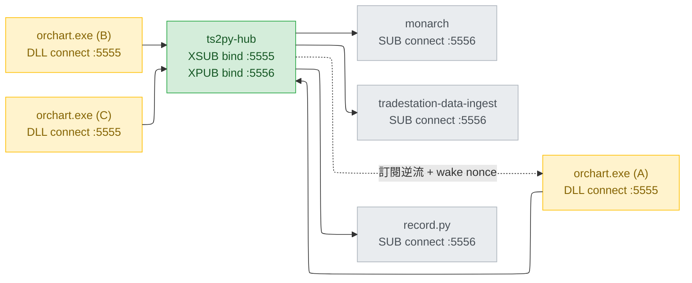

# 引入 ts2py-hub：把 XSUB/XPUB proxy 放進 transport

日期：2026-08-15 · 範圍：`contract/` · `cpp/` · `bindings/python/`
基準：`323847c`（`Merge pull request #41 from millerlai/feat/partial-bar-callback`）
取代：[`transport-invert-2026-08-15.md`](transport-invert-2026-08-15.md)（前提實測不成立）
狀態：設計已完整實測（9 情境 / 14 項斷言全過），未實作

---

## Context

2026-08-14 實測：設定裡 25 個 symbol 只有 6 張圖在發資料，`$ADD` / `$VOLD` / `$TICK` /
`$TRIN` / `$PCVA` 四條核心 breadth 全暗，EL Print Log 出現 `rc=-3`，而且一旦出現，
新掛任何 symbol 都一樣失敗到 TradeStation 重開為止。

根因已逐條對照原始碼確認：

- TradeStation 10 用 `-multiexe` 把圖分散到多個 `orchart.exe` 程序，這是 TS 自己的決定。
  使用者回報：**每開一張 chart 就是一個新的程序**。
- DLL 的狀態**每個程序各一份** —— `g_ctx` / `g_sock` / `g_endpoint` / `g_charts` 都是
  `cpp/src/ts2python.cpp` 匿名 namespace 內的普通全域（`:49-168`），沒有共享節區。
- `EL_InitChart` 只在 `if (!g_sock)` 時 `bind()`（`:536-572`）。**`bind()` 天生獨佔**，
  第二個程序必定丟 `zmq::error_t`，被 `:630` 轉成 `-3`。
- 「一次之後永久壞掉」不是 DLL 有記憶：init 是嚴格 RAII，`g_sock` 維持 nullptr、每根 bar
  重試，但佔用者是同一個 TS session 的兄弟程序，活到 TradeStation 關掉為止。
- `kMaxCharts = 24`（`:157`）與此無關，驅逐只影響 `-10` 的回報頻率（`:793-797`）。

真正的不對稱是 **bind 獨佔而 connect 不獨佔**，不是「port 是固定的」。

順帶查到兩件回報沒提到、但屬於同一組的事：

1. `EL/TS2Python_Exporter.el:200` 印的是 `EL_Init FAILED`，但呼叫的是 `EL_InitChart`（`:182`）。
   `EL_Init` 在契約裡是回 `-6` 的墓碑，operator 照這行字去查 `contract/error_codes.md`
   會查到完全無關的那一列。
2. **這個 repo 自己的 binding 也會中同一槍**：`wire/el_subscriber.py:113` 的
   `_SequenceTracker.sid` 是單一純量，`:125-134` 每次 `sid` 不同就清空 `_expected`。
   多個 publisher 程序扇入時，每根 bar 記一次 `publisher_session_changed`，gap detection
   永久失效。

另外，09:34:59 那批 `series_attached` **不是 bug**：那是下游從「第一根收盤 bar」推論的，
breadth 指數盤前本來就沒有資料；而 `-7` 的重試節奏受制於 **EasyLanguage indicator 只在
有 bar 時求值** —— 一個盤前不跳動的 symbol，「下一根 bar」可能是隔天開盤。

---

## 為什麼不是「把方向反過來」

第一版計畫要讓 DLL `connect`、consumer `bind`。前提是「ZMQ 的訂閱傳播與誰 bind 無關」。
**實測推翻了它**，而且推翻的方式指向本設計的全部理由，所以留在這裡。

在 bind 側，訂閱只會送給「送出那一瞬間已經連上的」publisher；之後才連上的一律收不到，
而且 bind 側的 subscriber **沒有任何辦法**知道有新 publisher 接上（`SUB` / `XSUB` 都
沒有那個事件）。`orchart.exe` 是一張圖一個程序、陸續啟動的 —— 反轉之後每一張圖都是
「晚加入者」，會全部卡在 `-7`。同一個 bug 換了個形狀。

hub 之所以能成立，關鍵不在它是中介，而在**它的 XSUB 是 bind 側、可以掛 socket monitor**，
因此知道「有新 publisher 接上了」——那是這條路上唯一能取得該事件的位置。

---

## 目標架構



publisher 全部改成 `connect`（不獨佔，開幾個程序都行），consumer 維持 `connect`。
**兩邊都不 bind，bind 的是 hub。**

### port 配置與升級路徑

| | 誰 bind | 誰 connect | 變動 |
|---|---|---|---|
| `tcp://127.0.0.1:5555` | hub 的 **XSUB** | DLL | **DLL 的 endpoint 不變** |
| `tcp://127.0.0.1:5556` | hub 的 **XPUB** | 每一個 consumer | consumer 換一個 port |

刻意讓 publisher 留在 5555：`ZMQEndpoint` 是 indicator 的 **input**，改預設值意味著
工作區裡每一張圖都要重加、重 Verify。留在 5555 就完全不用碰圖 —— 只換 DLL 檔案。

`EL_DllVersion` 維持 4：這個號碼描述的是 **C ABI**（匯出名與簽章），transport 拓樸不是
C ABI。同理 `proto` 維持 2 —— point frame 一個 byte 都沒變，所有已錄製的 fixture 全部
繼續有效，conformance 測試一行不改。

---

## libzmq 的四個行為，以及設計怎麼繞開它們

**這一節是本設計最重要的部分。** 這四件事沒有出現在 zguide、`zmq_proxy(3)` 或任何
文件裡，全部是這次讀原始碼加實測挖出來的。少繞任何一條，某個保證就會靜默失效 ——
而且是那種「資料照收、數字照跑、只有偵測死了」的失效。

環境：pyzmq 27.1.0 / libzmq 4.3.5 / Windows 11。

### L1. 全新 pipe 的第一次寫入會擱淺，直到下一次寫入才被喚醒

`xsub_t::xattach_pipe`（`src/xsub.cpp`，v4.3.5 與 master 相同）**已經**會把快取的訂閱
寫進每一條新接上的 pipe：

```cpp
//  Send all the cached subscriptions to the new upstream peer.
_subscriptions.apply (send_subscription, pipe_);   // -> pipe->write(&msg)
pipe_->flush ();
```

但 `pipe_t::flush()` 只在 `_out_pipe->flush()` 回 `false`（reader 睡著）時才送
`send_activate_read(_peer)`。而 `ypipe_t::flush()` 在一條**全新**的 pipe 上，`_c`
初始化成 `&_queue.back()` 正好等於 `_w`，CAS 成功 → 回 `true` → **喚醒命令不發**。
XPUB 讀訂閱只有 `process_activate_read` → `xread_activated` 這一條路，於是那些訂閱
就躺在 pipe 裡沒人讀。

實測（`spike15`）：XSUB bind 先訂閱、publisher 後 connect，等 10 秒 publisher 收到 `[]`；
把 XSUB **關閉**（termination 強制排空）之後，那些訂閱才突然出現。

**繞法**：擱淺的訊息沒有遺失，**任何一次後續寫入都會把它們一起釋出**。實測
（`spike16`）在 attach 後 0.2 秒補送一次，0.22 秒就收到 4 筆（擱淺的 2 筆 + 新的 2 筆）。
所以 hub 在每次 publisher attach 之後排定幾次「喚醒」。

**不要用「重送真實訂閱」當喚醒** —— 那會踩到 L2。

**但書（實作後補測到的）**：上面的擱淺是在一個**不做 poll** 的 XSUB 上量到的。一個
**持續 `poll()`** 的 XSUB 會自己把擱淺的寫入釋出（實測：不再送任何東西、只持續 poll，
訂閱 10 秒內送達）。hub 本來就是 poll 迴圈，所以 wake 在這個形狀下是雙保險，而且
**沒有任何測試能證明它必要** —— 拿掉 wake，`test_hub.py` 照樣全綠。

保留它，但要知道保留的理由是「不賭一個未文件化的副作用」，不是「測試守著它」。
這是**已知且刻意的測試缺口**，寫進 `contract/wire.md` 的〈L1 的但書〉，免得下一個人
把它當死碼刪掉、或以為測試涵蓋了它。L2 / L3 / L4 沒有這個問題：三者的機制一移除就有測試轉紅。

### L2. XSUB 的訂閱是引用計數的，重送會讓取消訂閱永遠送不出去

`xsub_t::xsend` 的訂閱分支做 `_subscriptions.add()`，取消訂閱分支：

```cpp
const bool rm_result = _subscriptions.rm (data, size);
if (rm_result || _verbose_unsubs)
    return _dist.send_to_all (msg_);      // rm 回 false 就不轉發
```

所以每重送一次 `\x01SPY`，計數就 +1；之後一次 `\x00SPY` 只 -1，`rm` 回 false，
**取消訂閱不往上送**。publisher 永遠以為有人在聽，`-10` 靜默死亡。

實測（`spike17` v2）：hub log 確實收到並轉發了 `\x00SPY` / `\x00IWM` / `\x00__ts2py__`，
publisher 一個都沒收到。

**繞法**：真實訂閱**原樣轉發，一次就好，永不重送**；喚醒改用一個沒有任何 chart 會
匹配的 nonce topic（`__ts2py_wake__`）的 訂閱/取消訂閱 對。它不影響真實 topic 的計數。

> nonce 的名字要同時滿足兩件事：不是 `__ts2py__` 的前綴，也不被 `__ts2py__` 前綴。
> `__ts2py_wake__` 的第 8 個字元是 `w` 而控制 topic 是 `_`，兩邊互不覆蓋 ——
> 所以它不會誤觸 DLL 的 hello 重播，也不會被當成控制 topic 的訂閱。

### L3. `XPUB_VERBOSE` 回報每一次訂閱，但只回報最後一次取消訂閱

於是 N 個 consumer 訂同一個 topic（例如每個 consumer 都必訂的 `__ts2py__`）時，hub 會
往上轉發 N 次 `\x01`，卻只會收到 1 次 `\x00`。配上 L2 的計數，上游計數永遠停在 N-1，
控制 topic 的取消訂閱**永遠送不出去** —— 所有 consumer 離線後 publisher 仍以為有人在聽，
`-7` 失準。

標準修法 `ZMQ_XSUB_VERBOSE_UNSUBSCRIBE` 在 pyzmq 27 有常數（=115），但
**打包的 libzmq 4.3.5 不認得，`setsockopt` 直接回 `EINVAL`**（實測）。

**繞法**：hub 是這條 XSUB 唯一的寫入者，所以它可以**精確鏡射計數** —— 記住每個 topic
轉發過幾次 `\x01`，在取消訂閱時送出同樣次數的 `\x00`。`xsend` 只會轉發把計數歸零的
那一次，所以 publisher 收到的仍然是恰好一次取消訂閱。

### L4. connect 側的 pipe 跨重連保留，所以對端死亡不產生取消訂閱

libzmq 在 connect 側為了讓重連透明，pipe 是 `connect()` 當下就建立、**跨重連保留**的
（`ZMQ_IMMEDIATE=0`，預設）。對端消失時 pipe 不被銷毀，於是 `xpub_t::xpipe_terminated`
不會跑，**不產生任何取消訂閱**。

後果（實測 `spike13`）：hub 死掉時 DLL 的 `g_sub_topics` 永不清空 →
`symbol_subscribed()` 恆真 → `EL_Publish` 對每一根 bar 回 **0**，而每一根都進虛空。
`send()` **20 萬次都沒有一次失敗**（XPUB 過了 SNDHWM 是靜默丟棄，不回錯誤），
indicator 只在 `rc < 0` 才印，所以 Print Log 一行都不會有。hub 重開後那些 frame 也
**一筆都補不回來**。

`ZMQ_IMMEDIATE=1` 會讓取消訂閱出現，但同時讓 hub 重啟後資料**完全不再流動** ——
把暫時失效換成永久失效，更糟（實測 `spike11`）。

**繞法**：DLL 端掛 socket monitor，`EVENT_DISCONNECTED` 時清空 `g_sub_topics`。
見〈DLL 的 socket monitor〉。

### 這四條的共同性質

它們全部只在「**subscriber 在 bind 側、publisher 在 connect 側**」這個組合上顯現。
今天的方向（publisher bind）一條都踩不到。所以**這一節就是採用 hub 的全部代價**，
而它是可控的：每一條都有明確的繞法，四條都已實測。

上游相關 issue：[libzmq #3214](https://github.com/zeromq/libzmq/issues/3214) 描述的正是
L1 的症狀（publisher 晚 connect 到 XSUB，`send()` 不報錯但訊息到不了），**沒有結論**。

---

## hub 的規格（新的契約元件）

行為規格是**規範性的**，寫進 `contract/wire.md`；下面每一條少做一條，就會有一個保證
靜默失效。非 Python 的部署必須自行重寫一份 —— 那正是規格不能只活在程式註解裡的理由。

1. `XSUB` **bind** 前台（預設 `tcp://127.0.0.1:5555`），面向 publisher。
2. `XPUB` **bind** 後台（預設 `tcp://127.0.0.1:5556`），面向 consumer，且**必須**設
   `ZMQ_XPUB_VERBOSE` —— 理由與 DLL 設它的理由相同（`ts2python.cpp:559-564`）：
   consumer 重啟時新舊訂閱者可能重疊幾毫秒，非 verbose 的 XPUB 會把後來那個當成重複
   訂閱吃掉，重連的 consumer 就一個 hello 都收不到。
3. 前台收到的訊息**原封不動**轉發到後台。hub **絕不解析 payload** —— 它是 transport，
   不是 binding。一個看得懂 JSON 的 hub 遲早會有人在裡面加過濾。
4. 後台收到 `\x01topic` → **原樣轉發到前台一次**，並把該 topic 的轉發次數 +1。
5. 後台收到 `\x00topic` → 往前台送出**與轉發次數相同數量**的 `\x00topic`，並清除計數。
   （L2 + L3；少了這條，`-7` 與 `-10` 會在多 consumer 下失效。）
6. 前台掛 socket monitor（`EVENT_ACCEPTED | EVENT_HANDSHAKE_SUCCEEDED`）。每次事件、
   以及每次訂閱集合變動，都排定數次 **wake**：往前台送
   `\x01__ts2py_wake__` 緊接 `\x00__ts2py_wake__`。實測 `(0.05s, 0.3s, 1.0s)` 三次足夠。
   （L1；少了這條，晚啟動的圖全部卡在 `-7`。）
7. **真實訂閱永不重送。** 喚醒只用 nonce。（L2）
8. `LINGER = 0`；前台 `RCVHWM` 1M、後台 `SNDHWM` 100k，比照現況量級。
9. 兩個 hub 同時啟動 → 第二個的 `bind` 拿到 `EADDRINUSE` 並以可讀訊息結束，不得靜默退場。

不變式：**轉發計數是 hub 對上游 XSUB trie 的鏡射，而 hub 是該 socket 唯一的寫入者。**
任何繞過計數的寫入都會讓鏡射失真，取消訂閱就送不出去。

hub 重啟是安全的（實測，情境 9）：publisher 自動重連並觸發 monitor；consumer 是 connect
側的 `SUB`，重連時 libzmq 自動重放它快取的訂閱，hub 因此重新學到訂閱集合，wake 把
擱淺的部分釋出。空窗期 publisher 回 `-10`（靠下面的 monitor），指標下一根 bar 再試。

---

## DLL 的 socket monitor（新機制）

`EL_InitChart` 建立 socket 之後，額外做兩件事：

```cpp
zmq_socket_monitor(static_cast<void*>(*sock), "inproc://ts2py.monitor",
                   ZMQ_EVENT_DISCONNECTED);
// PAIR socket connect 到同一個 inproc endpoint，存成 g_monitor
```

`drain_subscriptions()` 在既有的訂閱佇列迴圈之外，**再排空一次 monitor 佇列**；讀到
`ZMQ_EVENT_DISCONNECTED` 就：

- `g_sub_topics.clear()` —— 於是 `symbol_subscribed()` 轉為 false，`EL_Publish` 開始回
  `-10`，indicator 每張圖印一次；
- 把所有 chart 的 `announced` 設回 false —— hub 回來、訂閱重新到達時會重播 hello。

規則與既有設計一致：**monitor 讀取失敗不得讓 publish 失敗**（比照 `drain_subscriptions`
對 `EL_Publish` 的處理），因為手上已經有一筆真實資料，而 EL 不重送失敗的 publish。

一個程序只有一個 socket，所以 monitor 的 inproc endpoint 用固定名字即可。

---

## 對 consumer 端的影響（遷移清單）

先講不變的，因為那才是這個方案的重點 —— **對「解析資料」那一層是零影響**：

frame 格式（byte-for-byte 相同，`proto` 仍是 2）、topic 規則、socket 型別與方向
（仍是 `SUB` + `connect`）、訂閱寫法（仍是 `setsockopt(SUBSCRIBE, ...)`，不必碰 XSUB）、
錯誤碼語意、已錄製的 fixture、Parquet 分區與 schema、`.ELD` —— **全部不動**。

必須改的只有三件：

| # | 改什麼 | 規模 |
|---|---|---|
| 1 | endpoint `5555` → `5556` | 一行設定 |
| 2 | `sid` 簿記改成以 `(sid, topic)` 為鍵 | 約 20–30 行 |
| 3 | 多開一個常駐程序（hub） | 不用改程式 |

第 2 項的形狀：

```python
# 之前：單一純量，任何 sid 變動都全域重置
self._publisher_sid = None
if sid != self._publisher_sid:
    self._publisher_sid = sid
    self._expected.clear()

# 之後：每條 topic 各自記自己的 sid，期望值以 (sid, topic) 為鍵
self._sid_by_topic: dict[str, int] = {}
self._expected: dict[tuple[int, str], int] = {}
prev = self._sid_by_topic.get(topic)
if prev is not None and prev != sid:
    log.info("publisher_session_changed", extra={"topic": topic, "old": prev, "new": sid})
    self._expected.pop((prev, topic), None)
self._sid_by_topic[topic] = sid
```

**這件事不是 hub 造成的，是「修好了」造成的。** 今天只看得到一個 `sid`，正是因為只有
一個 `orchart.exe` 發得出資料；25 個程序全部開始發之後就有 25 個 `sid` 同時在線。

沒做的後果：

| 沒做 | 後果 | 看不看得出來 |
|---|---|---|
| 沒換 port | socket 型別不相容，一筆都收不到 | 明顯（`wire_silent` 會講） |
| 沒開 hub | DLL 回 `-7`，Print Log 印「waiting for a subscriber」 | 明顯，且那是既有的正常啟動訊息 |
| **沒改 `sid` 簿記** | gap detection 永久失效，`messages_lost` 恆讀 0 | ⚠️ **靜默** —— 資料照收照存都正確，只有偵測死了 |

---

## 實測佐證

腳本模擬「一張圖一個程序」的真實時序，publisher 端以與 `ts2python.cpp` 相同的邏輯
（`g_sub_topics` + `drain_subscriptions` + 提案中的 monitor）建模。**9 情境 / 14 項斷言
全過，零殘留。**

| # | 情境 | 斷言 |
|---|---|---|
| 1 | publisher 先連上，還沒有任何 consumer | 無訂閱 → `-7` ✅ |
| 2 | consumer 連上並訂閱 | publisher 學到 `SPY` / `__ts2py__` ✅ |
| 3 | **第二個 publisher 晚 4 秒才連上** | 一樣學到完整訂閱 ✅ ←反轉方案掛掉的那一項 |
| 4 | 兩個 publisher 同時發布 | 兩邊 `EL_Publish` → 0；未訂閱的 symbol → `-10` ✅ |
| 5 | 第二個 consumer 加入 | 兩個 publisher 都看到新 symbol（hello 重播觸發）✅ |
| 6 | consumer 重啟 | publisher 重新學到訂閱 ✅ |
| 7 | **所有 consumer 離線** | publisher 訂閱集合**清空**、`EL_Publish` → `-10` ✅ |
| 8 | **hub 被 kill** | monitor 回報 `DISCONNECTED`、集合清空、`EL_Publish` → `-10` ✅ |
| 9 | **hub 重啟** | 兩個 publisher 都自行恢復、`EL_Publish` → 0 ✅ |

情境 7 在鏡射計數（規格第 5 條）加入前是 FAIL，8 / 9 在 monitor 與 wake 加入前是 FAIL ——
三個機制各自都是必要的，不是保險。

---

## 變更清單

順序即實作順序，理由見〈落地順序〉。

### 1. Python binding —— 先落地，與 transport 無關

- **`wire/el_subscriber.py`**
  - `_SequenceTracker`（`:95-170`）：`self.sid` 純量 → 以 `(sid, topic)` 為鍵。
    `publisher_session_changed` 只在**同一個 topic 換了 sid** 時才記；新 sid 第一次出現
    走 §6.2 的建立基準路徑，不報遺漏。`messages_lost` / `gap_detection_available` 的
    對外語意不變。
  - `_handle_hello`（`:402-`）與 `announced_charts`（`:235`、`:237-246`）：
    **鍵維持 `(symbol, bar_type, bar_interval)` 不變** —— 這個 property 的語意是「什麼圖
    掛在上面」，chart identity 本來就不含 `sid`，加進去會為了零使用者價值破壞公開 API。
    改為內部另記每張圖被哪些 `sid` 宣告過，同一張圖出現在第二個 `sid` 下時記 WARNING
    （代表兩個程序開了同一張圖，該 topic 每一筆都是雙份）。
  - 新增 `frames_received` 計數（目前只有 `_frames_refused`）。
  - `connect()`（`:293-310`）**不用改** —— consumer 仍是 connect 側的 `SUB`。
- **`runtime/ingestion.py`**：在 `_emit_heartbeat`（`:504-532`）旁加一個**只說一次**的
  檢查 —— `frames_received == 0` → WARNING `wire_silent`，附 endpoint、已訂閱 symbol 數，
  hint「hub 是否在跑？若剛換過 DLL，確認 consumer 連的是 hub 的 XPUB port」。

  > 原計畫還有一條 `charts_announced_but_no_points`，**已刪除**：ingest 在盤前啟動時
  > hello 已到、point 未到是常態，那條每天都會誤報一次；而「圖開著但 symbol 清單對不上」
  > `wire.md` 的 binding 義務 #3 已經在 `_handle_hello` 涵蓋了。

### 2. `contract/` —— 契約，source of truth

- **`contract/wire.md`**
  - Transport 表改成三列：publisher `connect` 5555 / hub `bind` 兩個 port /
    consumer `connect` 5556。
  - 新增〈為什麼需要 hub〉：照 XPUB 那一節的寫法給**理由**而不是宣告事實。
  - 新增〈hub 的義務〉：規格那九條，逐條寫成規範，**並附上 L1–L4 的理由**。這是新
    binding 作者最可能整段漏掉、而漏掉會靜默失效的東西。
  - 版本歪斜表：舊 DLL + hub 搶 5555 → 誰先起誰贏，另一邊拿到可讀的 `EADDRINUSE`/`-3`；
    新 DLL + 沒開 hub → `-7`；舊 consumer 連 5555 → 撞到 XSUB，socket 型別不相容，靜默，
    由 `wire_silent` 攔下。
- **`contract/error_codes.md`**
  - `-3`：改寫成「socket 建立或 `connect()` 失敗」。**刪掉**「檢查 `netstat`、結束佔用者」
    這段處置 —— 它原本就沒設想過佔用者是本 session 的兄弟程序（殺掉會連帶弄死裡面正常
    運作的圖）。
  - `-7`：補上重試節奏（indicator 只在有 bar 時求值），並補一句「hub 沒開的表現就是 `-7`」。
  - `-10`：補上「hub 斷線也會觸發」，說明依據是 DLL 的 socket monitor 而非取消訂閱訊息。
  - `-8`：文字從「只有第一張圖 bind」改成「只有第一張圖建立 socket」。
- **`contract/semantics.md` §6.3**：`sid` 的鍵改成 `(sid, topic)`，並寫清楚**漏做是靜默的**：
  單一純量之下每根 bar 都會清空期望值，於是每一筆都在建立基準，永遠不會報 gap，
  `messages_lost` 恆讀 0。同時補「同一張圖出現在兩個 `sid` 下 → 雙份，必須警告」。

### 3. hub 實作

放在 **`bindings/python/src/tradestation_data/hub.py`**，`[project.scripts]` 加
`tradestation-data-hub`。

> 原計畫放 `contract/tools/hub.py`。**改掉的理由**：CLAUDE.md 的 packaging 一節明列
> sdist 內容，`contract/` **不在裡面**，wheel 也只打包 `src/tradestation_data` ——
> 一個 `pip install` 的使用者會拿不到現在已是必要元件的 hub。放進套件才有辦法送到
> 使用者手上，關係與 binding 對契約的關係相同：**規格在 `contract/wire.md`，這裡是
> 參考實作**。

CLI：`--frontend` / `--backend` / `--log-level`。結構化 log 沿用既有慣例
（事件名固定、可 grep，變動資料全放 `extra`）：`publisher_attached`、
`subscription_forwarded`、`subscription_withdrawn`、`wake_sent`，以及定期的
`hub_heartbeat`。

`hub_heartbeat` 帶**六個**欄位。它是 operator 判斷「到底哪一張圖沒進來」的唯一視窗，
所以原本規劃的三個計數不夠用：

| 欄位 | 讀它是為了回答 |
|---|---|
| `frames_forwarded` | 資料到底有沒有在流動 |
| `live_topics` | 目前有幾條 topic 被訂閱著 |
| `publisher_handshakes_total` | 有幾個 chart 程序接上過 —— 對照工作區的圖數就知道少了誰 |
| `subscriptions_forwarded` | 訂閱有沒有真的往上游送出去 |
| `subscriptions_withdrawn` | consumer 掉線的次數；`-10` 開始出現時第一個要看的 |
| `wakes_sent` | wake 機制在動。見〈L1 的但書〉—— 它沒有測試守著，這是唯一的運行期證據 |

**增減欄位時要同步更新這張表。** 這是這個 repo 唯一寫下「heartbeat 有什麼」的地方。

送出一律非阻塞語意：XPUB 過 HWM 是靜默丟棄（不阻塞），XSUB 上的訂閱訊息極小且罕見；
**hub 的 poll 迴圈不得因為任何一次 send 而停住**。

### 4. `cpp/` —— DLL

- **`ts2python.cpp:572`**：`sock->bind()` → `sock->connect()`。`:536-593` 整段註解重寫
  （目前通篇在講 bind 獨佔、`-3` 是常態、以及重試洩漏級聯）。`g_endpoint` 的角色與 `-8`
  的檢查都不變。
- **新增 socket monitor**：見〈DLL 的 socket monitor〉。`EL_Shutdown` 要一併關閉 monitor
  socket。
- **`:630-634`** catch 註解更新：`-3` 現在只剩 socket 建立失敗與 endpoint 字串無效。
- **`test_harness.cpp`**：`:12-14`、`:406-414` 的「SUBSCRIBER MUST BE RUNNING FIRST」改成
  「**HUB** MUST BE RUNNING FIRST」；`:456-470` 的 `-8` 註解「Only the first chart binds」改字。
- **`ts2python.h`** 的錯誤碼註解區塊必須與 `error_codes.md` 在**同一個 commit** 更新
  （`error_codes.md:145` 的規範）。
- **`bindings/python/src/tradestation_data/runtime/main.py:174-176`**：`--endpoint` 預設
  `5555` → `5556`，help 字串說明那是 hub 的 XPUB port。**這一項刻意留到這一步**，不跟
  §1 一起落地 —— §1 的前提是「對現況零影響」，而改預設 endpoint 會讓還沒切換的部署
  當場收不到資料。

### 5. `EL/TS2Python_Exporter.el`

- `:200` 的 `EL_Init FAILED` → `EL_InitChart FAILED`；同檔 `:25`、`:166`、`:216`、`:284`
  幾處註解與 Print 沿用舊名，一併對齊。
- `ZMQEndpoint` 預設值**不動**，既有圖表不需要重加。純訊息字串修正，舊 `.ELD` 配新 DLL
  依然正常運作。

### 6. 測試

- `tests/conftest.py:53-61` 的 `zmq_inproc_bus` **不用改**（PUB bind / SUB connect 方向沒變）。
- **`tests/test_hub.py`（新）—— 把上面九個情境自動化。** hub 現在住在套件裡，所以測試
  可以直接 import 它、在執行緒裡起一個、用 `tcp://127.0.0.1:<高位 port>` 驅動兩個 XPUB
  與兩個 SUB。**不要用 `zmq_inproc_bus`** —— `inproc://` 要求兩端共用同一個 `zmq.Context`，
  而 publisher 與 consumer 在真實部署裡是不同程序（CLAUDE.md 已記這個坑）。
  情境 3（晚加入的 publisher）與情境 7（全部離線後取消訂閱）是**必須有**的兩條，
  它們各自對應一個實測過會失效的機制。
- `_SequenceTracker` 兩個 sid 交錯 → 兩條獨立 seq、零 `messages_lost`、不記
  `publisher_session_changed`。
- 同一 `(symbol, bar_type, bar_interval)` 在兩個 sid 下宣告 → 記 WARNING。
- `tests/conformance/` 與 `contract/fixtures/` **都不用動** —— frame bytes 沒變。但
  `contract/fixtures/README.md` 的錄製指令要加上「先開 hub」。

### 7. 文件收尾

`README.md` / `README.zh-TW.md`、`bindings/python/README*.md`、`cpp/README*.md`、
`EL/README*.md`、`docs/architecture*.md`、`CLAUDE.md` —— 把「DLL bind / consumer connect」
的敘述換成三段式，並在 CLAUDE.md 的〈Live ingest data-flow〉圖裡加上 hub 與扇入。
另外補 **Windows 開機自動啟動 hub** 的做法（工作排程器，設定失敗時重啟）。
`git ls-files | xargs grep -l "127.0.0.1:5555\|ZMQEndpoint\|--endpoint"` 確認範圍是 23 個檔案。

---

## 落地順序

**binding 先，DLL 後** —— 這是 repo 既有的文件化順序（`frames_refused` docstring）。
理由在這次特別重要：若先換 DLL，中間窗口會有 N 個 publisher 扇入而 consumer 仍是純量
`sid`，gap detection 靜默失效且 `messages_lost` 讀 0。

1. §1 Python binding（`(sid, topic)` + `wire_silent`）—— 今天就能合，對現況零影響。
2. §2 contract 文件。
3. §3 hub + §6 的 `test_hub.py`（**測試與 hub 同一個 PR**）。
4. §4 DLL（connect + monitor）+ §5 EL 訊息。
5. §7 文件收尾。

第 4 步之前，hub 已經可以先跑起來（沒有 publisher 連它而已），consumer 也可以先切到
5556 —— 切換窗口因此可以壓到只有「換 DLL 檔案 + 重開 TradeStation」那一段。

**Rollback**：把 DLL 換回舊版、consumer 的 endpoint 改回 5555、停掉 hub。三步都不涉及
資料格式，磁碟上的 Parquet 不受影響。

---

## 驗證

### 自動化（CI）

```powershell
cd bindings/python
uv run pytest tests/test_hub.py            # 九個情境
uv run pytest tests/test_el_subscriber.py
uv run pytest tests/test_ingestion_runtime.py
uv run pytest tests/conformance            # 必須維持全綠且未修改
uv run ruff check . ; uv run mypy
```

### 手動（不需要 TradeStation）

兩個 harness 程序就是兩個 publisher 程序。

```powershell
cd cpp; .\build.bat            # Release x86 + x64

# 視窗 1：hub
tradestation-data-hub --frontend tcp://127.0.0.1:5599 --backend tcp://127.0.0.1:5600

# 視窗 2：consumer
python contract/tools/record.py --endpoint tcp://127.0.0.1:5600

# 視窗 3 與 4：兩個 publisher 程序
cpp/Release/TS2Python_TestHarness.exe --mode smoke   --endpoint tcp://127.0.0.1:5599
cpp/Release/TS2Python_TestHarness.exe --mode session --endpoint tcp://127.0.0.1:5599
```

必須成立（前四項是本 issue 的核心，後三項是 C++ 端 monitor 的驗證 —— 自動化測試只覆蓋
了 Python 建模版）：

1. 兩個 harness 都拿到 `EL_InitChart rc=0`，沒有任何一個回 `-3`。
2. 第二個 harness **晚 30 秒**才起，一樣拿到 rc=0。
3. record.py 收到**兩個不同的 `sid`**，兩邊的 hello 與 point 都在。
4. 餵進 binding 後 `messages_lost == 0`，且沒有 `publisher_session_changed` 洗版。
5. 關掉所有 consumer → harness 的 `EL_Publish` 回 `-10`（每張圖一次）。
6. **關掉 hub → harness 回 `-10`**（monitor 生效）；hub 重開 → 自動恢復，不需重啟 harness。
7. 先跑 harness、後跑 hub：harness 停在 `-7`，hub 一起來就開始收。

### 上線（需要 TradeStation）

開 hub → 開 consumer → 開滿 25 個 symbol 的工作區。確認 Print Log 零筆 `rc=-3`，
`$ADD` / `$VOLD` / `$TICK` / `$TRIN` / `$PCVA` 都有 hello 與資料，且
`netstat -ano | findstr :5555` 顯示 N 條 ESTABLISHED（N = chart 程序數）而不是一條。

---

## 已知代價，寫出來而不是藏著

- **hub 必須常駐。** 它是新的單點。死掉時 DLL 會回 `-10`（每張圖一次）、consumer 會停
  收資料 —— 兩端都會出聲，但那些 bar **確實遺失且不會補回**（`send()` 不失敗、queue 住的
  frame 在 hub 重啟時會被空的訂閱集合過濾掉，實測 0/5 補回）。所以開機自動啟動與失敗
  重啟的設定是**必要的**，不是選配。
- **設計壓在四個 libzmq 未文件化的行為上。** 全部寫在〈libzmq 的四個行為〉並附原始碼位置。
  升級 libzmq 時**必須**重跑 `tests/test_hub.py` —— 它是 L2 / L3 / L4 的回歸測試，
  也是這些行為存在的唯一書面證據。**L1 例外：它在 poll 迴圈裡被遮蔽，沒有測試涵蓋**
  （見 L1 的但書），所以升級後要靠人重讀那一節，而不是靠測試。
- **多一次 process hop，而且 hub 是新的 HWM 丟包點。** consumer 卡住時，丟包會發生在
  hub 的後台 XPUB 而不是 DLL —— `seq` 仍是唯一的偵測手段，語意不變，位置變了。
- **hub 是新的失序來源。** 它按到達順序轉發；不同 publisher 之間本來就沒有全域順序
  （各自 `seq`），所以 `(sid, topic)` 的簿記在這裡是必要而非保險。

## 已確認的需求決定

review 找出四項「做了但計畫沒要求」的東西。以下三項已確認採納，**它們現在是需求，不是
實作自由** —— 記在這裡是為了下次不必重新討論一遍：

1. **`SubscriptionMirror` 的取消訂閱下限。** 未追蹤的 topic 仍至少送出一筆 `\x00`。
   理由與規範文字已寫進 `contract/wire.md` 的 hub 義務第 5 條：多送無害，少送會讓
   `-10` 靜默消失。
2. **`TradeStationELProvider.endpoint` 是公開 API。** 它是唯讀 property，`wire_silent`
   需要它才不必碰私有屬性；既然公開，就比照 `frames_refused` / `messages_lost` 的
   對待方式，不得隨意更名或移除。
3. **`hub_heartbeat` 保留六個欄位**（不是原本規劃的三個），欄位表見〈§3 hub 實作〉。
4. **log formatter 抽成共用模組，不留兩份副本。** `hub.py` 原本自己抄了一份
   `_ExtraDumpFilter`，理由是「只依賴 pyzmq」。那個理由只成立一半：不能 import
   `runtime/main.py` 是對的（它會把 polars / pyarrow / sink registry 全拖進來），但
   抽一個**只 import 標準庫**的 `tradestation_data/_logging.py` 兩者都不違反 ——
   C++ 重寫 hub 的人仍然只需要讀 `contract/wire.md`。

   換掉的是一個真實的走鐘來源：那段程式碼負責把 `extra` 攤平成可讀文字，而 hub 的 log
   正是 operator 唯一能看見「哪張圖沒進來」的地方；兩份各自演化的話，修好的那一份不會
   自動惠及另一份。`hub.py` 的 module docstring 已同步改寫，不再宣稱零 intra-package
   import。

## 待辦但不阻塞

- hub 目前是 Python。若出現非 Python 的部署，它應改寫成 C++ 跟 DLL 一起發布
  （`cpp/` 已在建 test harness exe）。規格寫在 `contract/wire.md` 就是為了讓那次改寫
  不需要讀 Python。
- L3 的標準修法 `ZMQ_XSUB_VERBOSE_UNSUBSCRIBE` 在 libzmq 4.3.5 上是 `EINVAL`。若日後
  升級到支援的版本，規格第 5 條的計數鏡射可以換成那一個 socket option —— 但**換之前要
  先跑情境 7**。
- 09:35:03 那行 `history_partition_unreadable_skipped`（今日 SPY 5m 分區）是**預期行為**，
  不在本計畫內：`ParquetWriter` 沒 close 就沒有 footer，當天分區在封存前對讀者都不可讀。
