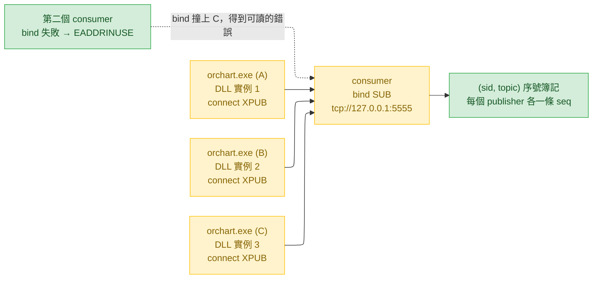

# 反轉 transport 方向：consumer bind，DLL connect

> **作廢（2026-08-15，實作前）。取代者：[`transport-hub-2026-08-15.md`](transport-hub-2026-08-15.md)。**
>
> 本計畫壓在一個前提上：「ZMQ 的訂閱傳播與誰 bind 無關」。**實測推翻了它。**
> 在 bind 側，訂閱只會送給「送出那一瞬間已經連上的」publisher，之後才連上的一律收不到
> （`SUB` 在 bind 側更徹底，連現場送都不送）。而 `orchart.exe` 是陸續啟動的，一張圖一個
> 程序 —— 反轉之後每一張圖都是「晚加入者」，會全部卡在 `-7`。**同一個 bug 換了個形狀。**
>
> 完整的量測表與替代方案見取代者。本文保留是因為「把方向反過來」是一個看起來顯然
> 正確、而且一定會有人再提一次的想法 —— 這裡記著它為什麼不行。
>
> 下面〈Context〉一節對根因的分析仍然成立，並已原樣搬進取代者。

---

日期：2026-08-15 · 範圍：`contract/` · `cpp/` · `EL/` · `bindings/python/`
基準：`323847c`（`Merge pull request #41 from millerlai/feat/partial-bar-callback`）

---

## Context

2026-08-14 實測：TradeStation 設定中的 25 個 symbol 只有 6 張圖在發資料，
`$ADD` / `$VOLD` / `$TICK` / `$TRIN` / `$PCVA` 等四條核心 breadth 全暗，
EL Print Log 出現 `rc=-3`，而且一旦出現，新掛任何 symbol 都一樣失敗到 TradeStation 重開為止。

根因已對照原始碼確認：

- TradeStation 10 用 `-multiexe` 把圖分散到多個 `orchart.exe`，這是 TS 自己的決定。
- DLL 的狀態是**每個程序各一份** —— `g_ctx` / `g_sock` / `g_endpoint` / `g_charts`
  都是 `cpp/src/ts2python.cpp` 匿名 namespace 內的普通全域（`:49-168`），沒有共享節區。
- `EL_InitChart` 只在 `if (!g_sock)` 時 `bind()`（`:536-572`）。**`bind()` 天生獨佔**，
  第二個程序必定丟 `zmq::error_t`，被 `:630` 轉成 `-3`。
- 永久壞掉不是 DLL 有記憶：init 是嚴格 RAII，`g_sock` 維持 nullptr、每根 bar 重試，
  但佔用者是同一個 TS session 的兄弟程序，活到 TradeStation 關掉為止。
- `kMaxCharts = 24`（`:157`）與此無關，驅逐只影響 `-10` 的回報頻率（`:793-797`），不影響發送。

真正的不對稱是 **bind 獨佔而 connect 不獨佔**，不是「port 是固定的」。改成動態 port 只會
把「綁不到」換成「找不到」。所以方向要反過來。

順帶查到兩件回報沒提到、但屬於同一組的事：

1. `EL/TS2Python_Exporter.el:200` 印的是 `EL_Init FAILED`，但呼叫的是 `EL_InitChart`（`:182`）。
   `EL_Init` 在契約裡是回 `-6` 的墓碑，operator 拿這行字去查 `contract/error_codes.md`
   會查到完全無關的那一列。
2. **這個 repo 自己的 binding 也中同一槍**：`wire/el_subscriber.py:113` 的
   `_SequenceTracker.sid` 是單一純量，`:125-134` 每次 `sid` 不同就清空 `_expected`。
   多 publisher 扇入時每根 bar 記一次 `publisher_session_changed`，gap detection 永久失效。
   不是只有 monarch 要改，這是契約層級的規則（`contract/semantics.md` §6.3）。

另外，09:34:59 那批 `series_attached` **不是 bug**。那是 monarch 從「第一根收盤 bar」推論的，
breadth 指數盤前本來就沒有資料；而 `-7` 的重試節奏受制於 **EasyLanguage indicator 只在有 bar
時求值** —— 一個盤前不跳動的 symbol，「下一根 bar」可能是隔天開盤。`error_codes.md` 的 `-7`
一節沒寫這件事。

## 目標狀態



## 明確不做的事（含理由）

- **不新增 `-11` 錯誤碼。** 反轉之後 `connect()` 不會因為「已被佔用」失敗，
  EADDRINUSE 這個失敗模式在 DLL 端消失了。為一個不可能發生的狀態加錯誤碼，
  違反 `error_codes.md` 自己的「新增碼」規範。`-3` 留下來當 socket 建立 / endpoint
  字串無效的兜底。
- **不動 `proto`。** point frame 一個 byte 都沒變，所有已錄製 fixture 繼續有效。
  這正是 `wire.md` 當初把 ABI 與 wire 分成兩個號碼的理由。
- **不動 `EL_DllVersion`（維持 4）。** 這個號碼描述的是 C ABI —— 匯出名與簽章。
  transport 方向不是 C ABI，而 indicator 對 `DllVer <> 4` 是**latch 停止發布**，
  升到 5 會逼工作區裡每一張圖重新 import `.ELD`，換來零資訊。
- **不做 XSUB/XPUB hub。** 多 consumer 實務上沒在用；真的需要時再補，屆時兩端都
  改成 connect 即可，是加法不是改法。

## 版本歪斜怎麼被發現

兩個方向都會出聲，這是不 bump 版本號可以成立的前提，必須寫進 `wire.md`：

| 組合 | 症狀 |
| --- | --- |
| 舊 DLL（bind）+ 新 consumer（bind） | consumer 的 `bind()` 拿到 EADDRINUSE，啟動就失敗並指名原因 |
| 新 DLL（connect）+ 舊 consumer（connect） | 兩端都 connect，完全靜默 —— 由新增的 consumer 啟動診斷攔下 |

## 變更清單（依「最可能被改的東西優先」排序）

### 0. 先花十分鐘證實承載整個計畫的那個假設

整份計畫壓在一句話上：**ZMQ 的訂閱傳播與誰 bind 無關** —— `SUB` 就算是 bind 側，
訂閱訊息仍然會送到 connect 側的 `XPUB`，所以 `-7`（有沒有人在聽）與 `-10`（這個 symbol
有沒有人訂）在反轉後仍然成立。這是標準行為，但它是本計畫唯一不可退讓的前提，
先用一支拋棄式 pyzmq 腳本量出來再動任何一行正式碼：

- 一個 `SUB` bind、兩個 `XPUB` connect；
- 兩個 XPUB 都必須從 `recv()` 讀到 `0x01 + topic` 的訂閱訊息；
- 兩邊送出的 frame 都必須被那個 SUB 收到（扇入）；
- SUB 關掉再開，兩個 XPUB 都必須重新讀到訂閱訊息（這是 hello 重播的依據）。

四條有任何一條不成立，就回頭重談方案，不要繼續往下改。

### 1. `contract/` —— 契約先改，這是 source of truth

- **`contract/wire.md`** Transport 表：`Publisher | DLL 端 connect` / `Subscriber | bind 同一 endpoint`。
  新增一節說明**為什麼是 consumer bind**（照 XPUB 那一節的寫法給理由，不要只宣告事實）：
  bind 獨佔、connect 不獨佔；TradeStation 的 `-multiexe` 強加多 publisher 程序，躲不掉；
  多 consumer 是可選的，換掉了。並加上上面那張「版本歪斜」表。
- **`contract/error_codes.md`**
  - `-3`：改寫成「socket 建立或 `connect()` 失敗」。刪掉「檢查 `netstat`、結束佔用者」
    這段處置 —— 反轉後它已經是錯的建議，而且原本就沒設想過佔用者是本 session 的兄弟程序
    （殺掉它會連帶弄死裡面正常運作的圖）。
  - `-7`：補上重試節奏的事實 —— indicator 只在有 bar 時求值，所以「下一根 bar」對一個
    盤前不跳動的 symbol 可能是隔天開盤。這就是 09:34:59 那批的解釋。
  - `-8`：文字調整，「只有第一張圖 bind」→「只有第一張圖 connect」，一個程序一個 endpoint 的
    規則不變。
- **`contract/semantics.md` §6.3**：`sid` 的鍵改成 **`(sid, topic)`**，並寫清楚為什麼 ——
  多個 publisher 程序同時扇入時，單一純量 `sid` 會每根 bar 誤判成 publisher 重啟。
  同時補一條新的觀察面：**同一個 `(symbol, bar_type, bar_interval)` 出現在兩個不同的 `sid` 下**，
  代表兩個程序各有一張同樣的圖，該 topic 的每一筆都是雙份 —— binding 必須警告。

### 2. `cpp/` —— DLL

- **`cpp/src/ts2python.cpp:572`**：`sock->bind()` → `sock->connect()`。
  `:536-593` 整段註解重寫（目前通篇在講 bind 獨佔與 `-3` 是常態）。
  `g_endpoint` 的角色不變，`-8` 的檢查不變。
- **`:630-634`** 的 catch 註解更新：`-3` 現在罕見。
- **`cpp/src/test_harness.cpp:456-470`**：`-8` 那段註解「Only the first chart binds」改字，
  斷言與回傳碼不變。`:12-14`、`:406-414` 的「SUBSCRIBER MUST BE RUNNING FIRST」保留 ——
  理由從「PUB 丟棄」變成「`-7` 閘門」，但結論相同。
- **`cpp/include/ts2python.h`** 的錯誤碼註解區塊要與 `error_codes.md` 同一個 commit 更新
  （`error_codes.md:145` 的規範）。

### 3. `EL/TS2Python_Exporter.el`

- `:200` 的 `EL_Init FAILED` → `EL_InitChart FAILED`。同檔還有幾處註解與 Print 沿用舊名
  （`:25`、`:166`、`:216`、`:284`），一併對齊。
- 這**不需要**重新 import `.ELD` 才能運作（純訊息字串），但 DLL 與 `.ELD` 仍是同一個單位，
  照 `cpp/install-to-tradestation.bat` 的既有提醒一起裝。

### 4. Python binding —— 介面與使用者可見的部分

- **`wire/el_subscriber.py`**
  - `connect()`（`:293-310`）：`self._socket.connect()` → `.bind()`。
    方法名沿用 `connect()`，因為它是 `wire/base.py:43` 的 Provider 協定成員，
    語意是「把線接起來」；docstring 與 log 訊息改成 bind。
  - bind 失敗（`zmq.error.ZMQError`）包成一個指名原因的例外：另一個 consumer 佔著，
    或是一顆反轉之前的 `TS2Python.dll`（它會 bind）。
  - `_SequenceTracker`（`:95-170`）：`self.sid` 純量 → 以 `(sid, topic)` 為鍵。
    `publisher_session_changed` 只在**同一個 topic 換了 sid** 時才記；
    新 sid 第一次出現走 §6.2 的建立基準路徑，不報遺漏。
    `messages_lost` / `gap_detection_available` 的對外語意不變。
  - `_handle_hello`（`:402-`）與 `announced_charts`（`:235`、`:237-246`）：
    鍵加入 `sid`；同一個 `(symbol, bar_type, bar_interval)` 出現在第二個 `sid` 下時
    記 WARNING，說明該 topic 會收到雙份。
  - 新增 `frames_received` 計數（目前只有 `_frames_refused`），供下面的診斷用。
- **`runtime/ingestion.py`** —— 啟動診斷：
  在 `_emit_heartbeat`（`:504-532`）旁加一個**只說一次**的檢查（沿用 `-7`「說一次」的慣例）：
  - `frames_received == 0` → WARNING `wire_silent`，附 endpoint、已訂閱 symbol 數、
    hint「publisher 尚未連上；若剛換過 DLL，確認兩端的 bind/connect 方向」。
  - 有 hello 但零個 point → WARNING `charts_announced_but_no_points`，附已宣告的圖，
    這是「圖開著但 symbol 清單對不上」或「休市」，與上一條是不同的診斷。
- **`runtime/main.py:174-176`**：`--endpoint` 的 help 字串 `connect to` → `bind`。

### 5. 工具與測試

- **`contract/tools/record.py:88`**：`sock.connect()` → `sock.bind()`（`:16`、`:97` 的字串一併改）。
  這支工具刻意不 import 任何 binding，改動維持在 pyzmq 層。
- **`bindings/python/tests/conftest.py:53-61`**：`zmq_inproc_bus` 的 PUB `bind` → `connect`，
  provider 側改成先 bind。libzmq 4.2+ 支援 inproc connect-before-bind，順序不再是硬限制，
  但 fixture 仍應先 bind 再 connect 以免依賴該行為。
- `tests/test_el_subscriber.py`、`tests/test_tradestation_el_provider.py`、
  `tests/test_ingestion_runtime.py`、`tests/scripts/test_run_ingestion_script.py`
  跟著 fixture 調整。
- **新增測試**：
  - `_SequenceTracker` 兩個 sid 交錯 → 兩條獨立 seq、零 `messages_lost`、
    不記 `publisher_session_changed`。
  - 同一 `(symbol, bar_type, bar_interval)` 在兩個 sid 下宣告 → 記 WARNING。
  - bind 失敗 → 例外訊息含「另一個 consumer / 舊 DLL」字樣。
- `tests/conformance/` **不需要改**，fixture 也不需要重錄 —— frame bytes 沒變。
  但 `contract/fixtures/README.md` 裡的錄製指令要更新（record.py 現在是 bind 側）。

### 6. 文件收尾

`README.md` / `README.zh-TW.md`、`bindings/python/README*.md`、`cpp/README*.md`、
`EL/README*.md`、`docs/architecture*.md`、`CLAUDE.md` —— 全部把「DLL bind / consumer connect」
的敘述反過來，並在 CLAUDE.md 的〈Live ingest data-flow〉圖上標出扇入。
`git ls-files | xargs grep -l "127.0.0.1:5555\|ZMQEndpoint\|--endpoint"` 已確認範圍是
23 個檔案，沒有漏網的第三方。

## 驗證

**這個 issue 的回歸測試可以完全不用 TradeStation 就跑完** —— 兩個 harness 程序就是兩個
publisher 程序。

```powershell
cd cpp; .\build.bat            # Release x86 + x64

# 視窗 1：subscriber 現在是 bind 側
python contract/tools/record.py --endpoint tcp://127.0.0.1:5599

# 視窗 2 與 視窗 3：兩個 publisher 程序同時打同一個 endpoint
cpp/Release/TS2Python_TestHarness.exe --mode smoke   --endpoint tcp://127.0.0.1:5599
cpp/Release/TS2Python_TestHarness.exe --mode session --endpoint tcp://127.0.0.1:5599
```

必須成立：

1. **兩個 harness 都拿到 `EL_InitChart rc=0`**，沒有任何一個回 `-3`。這是本 issue 的核心。
2. record.py 收到**兩個不同的 `sid`**，兩邊的 hello 與 point 都在。
3. 把 record 的輸出餵進 binding，`messages_lost == 0` 且沒有 `publisher_session_changed` 洗版。
4. 先跑 harness、後跑 record.py（顛倒順序）：harness 停在 `-7`，record.py 一起來就開始收 ——
   `-7` 閘門在反轉後仍然成立。
5. 第二個 consumer 對同一 endpoint bind → 拿到指名原因的錯誤，不是靜默。

Python 端（照慣例**逐模組**跑，不要一次整包）：

```powershell
cd bindings/python
uv run pytest tests/test_el_subscriber.py
uv run pytest tests/test_tradestation_el_provider.py
uv run pytest tests/test_ingestion_runtime.py
uv run pytest tests/conformance          # 必須維持全綠且未修改
uv run ruff check . ; uv run mypy
```

**上線驗證**（需要 TradeStation）：裝上新 DLL，開滿 25 個 symbol 的工作區，確認
Print Log 零筆 `rc=-3`，且 `$ADD` / `$VOLD` / `$TICK` / `$TRIN` / `$PCVA` 都有 hello 與資料。

## 待確認事項（不阻塞，但值得先問一句）

- TradeStation 10 是否有「所有圖跑在同一個程序」的設定？若有，它是這次的止血手段，
  但**不改變本計畫** —— 契約不該在 `-multiexe` 下壞掉，而那是一個使用者可以隨手改掉的設定。
- 09:35:03 那行 `history_partition_unreadable_skipped`（今日 SPY 5m 分區）是**預期行為**，
  不在本計畫內：`ParquetWriter` 沒 close 就沒有 footer，當天分區在收盤封存前對讀者都不可讀。
  這是 `ParquetBarSink` 既有的設計（CLAUDE.md 有記），若要在盤中讀當日資料，那是另一件事。
