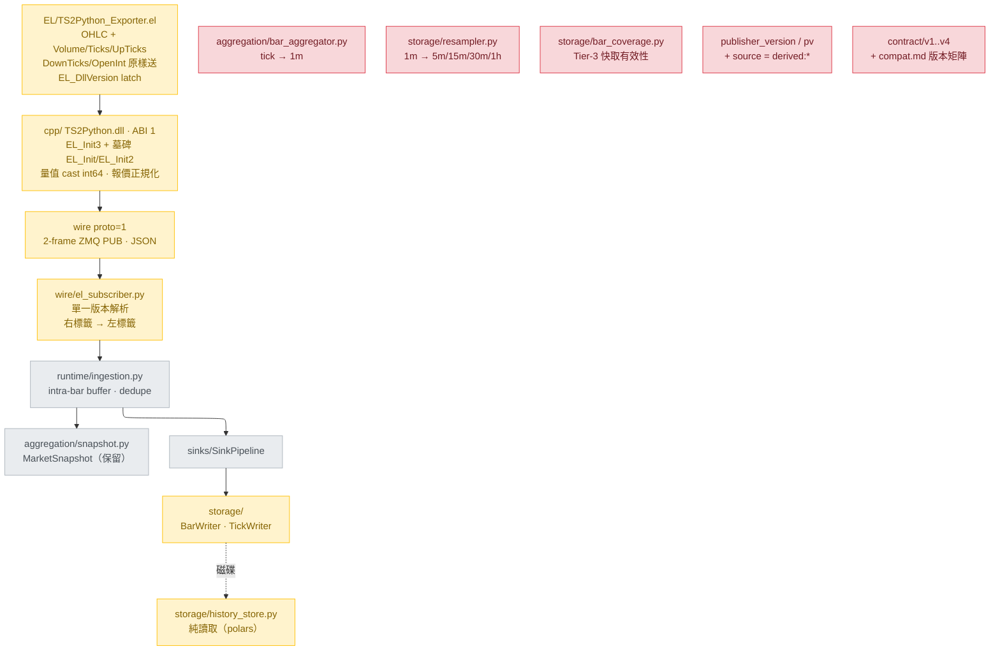

# Refactor：把 dp 收回「TradeStation 原始資料的完整接收器」

> **v2 — 經架構 review 修訂。** 第一版有兩個 P0（新 `.ELD` 配舊 DLL 會讓 TradeStation
> 堆疊損毀；wire「重設為 v1」與真正的舊 v1 版本號碰撞）與三個 P1。修訂內容見文末
> 「Review 修訂紀錄」。

---

## 執行進度

分支 `refactor/proto-1-raw-el-fields`，從 `fix/tc-count-and-doc-consistency`（`79d4845`）開出。

| Phase | 狀態 | 備註 |
| --- | --- | --- |
| 0 準備 | 🔄 進行中 | |
| 1 Contract | ⬜ | |
| 2 EL indicator | ⬜ | |
| 3 C++ DLL | ⬜ | |
| 4 重錄 fixtures | ⬜ | 需關閉 TradeStation 釋放 5555 |
| 5 domain + wire | ⬜ | |
| 6 storage | ⬜ | |
| 7 runtime | ⬜ | |
| 8 scripts/examples | ⬜ | |
| 9 測試 | ⬜ | **第一個該全綠的檢查點** |
| 10 文件 | ⬜ | |

### 執行中的計畫偏離

依 workflow 規則記錄：計畫沒預期到、實作時改採保守做法的地方。

| # | 偏離 | 原因 |
| --- | --- | --- |
| D-1 | T-0.3 一併移除 `structlog` 相依（計畫只列 `duckdb` / `pydantic`） | grep 確認 `src` / `tests` / `scripts` / `examples` 零使用；CLAUDE.md 明訂 logging 一律走 stdlib `logging`。與另兩個同屬「宣告了但沒人用」 |
| D-2 | `uv.lock` 重產從 Phase 0 延到 Phase 6 之後 | 現在 `uv sync` 會把 duckdb 移出環境，但 `history_store.py` / `resampler.py` 仍 import 它 → Phase 5 的 domain/wire 改動將完全無法驗證。`pyproject.toml` 的宣告先改，環境後動 |

---

## Context

### 為什麼改

專案的定位是**把 TradeStation 上 EasyLanguage 看到的 Bar 原封不動接下來**，交給使用者自行處理商業邏輯。但目前的實作累積了三層與這個定位衝突的東西：

1. **Publisher 端做了語意加工。** `EL/TS2Python_Exporter.el:241-247` 依 `BarType` 在 EL 的 `Volume` 與 `Ticks` 之間**交換**欄位，好讓 wire 的 `vol` 在每個 timeframe 都是「總成交股數」。這個交換是 `pv` / `publisher_version` 存在的**唯一原因**——因為交換發生在 wire 之外，數字看起來一律合理，只有靠一個版本宣告才分得出來。
2. **Binding 端做了大量預先計算。** `BarAggregator`（tick→1m）、`Resampler`（tick→bar、1m→5m/15m/30m/1h）、`bar_coverage`（Tier-3 快取有效性）、`aggregate_parquet.py`、`imputation_parquet.py`，加上為了區分「算出來的」與「收到的」而生的 `source = derived:*` provenance 機制與 `partition_holds_native` 守衛。這些全都是使用者要自己做的事。
3. **相容性包袱。** wire v1/v2/v3/v4 四個版本、10 份 fixture、`compat.md` 的版本矩陣、`EL_Init` + `EL_Init2` 兩個匯出、`EL_PublishTickEx` legacy 路徑。

### 改成什麼

**Publisher 不做任何選擇，wire 欄位名就是 EasyLanguage 的 reserved word。** `Volume`、`Ticks`、`UpTicks`、`DownTicks`、`OpenInt` 各佔一欄原樣送出，欄位名一律加 `el_` 前綴——看到 `el_volume` 的人會去查 EasyLanguage 的定義，看到 `volume` 的人不會。intraday 與 daily 的語意反轉是 TradeStation 的既有事實，文件記錄、consumer 判讀；publisher 無從也不該代為決定。`pv` 因此失去存在理由。

**Binding 只做三件事**：解析 wire、把右標籤時間轉成左標籤 `bucket_start`、寫進 Parquet。不推算、不補值、不快取、不衍生。

**協定重新開始**，但用 `proto` 這個新欄位名承載版本，而不是沿用 `v`——舊 payload 沒有 `proto`，所以「新 binding 誤讀舊 DLL 的資料」在結構上不可能發生。

### 已確認的決策

| 項目 | 決定 |
| --- | --- |
| 協定版本欄位 | **`"proto":1`**，不用 `"v"`。舊 payload 無此欄 → 明確拒收，不可能誤讀 |
| DLL ABI | `EL_DllVersion()` 回 **1** |
| init 匯出 | **`EL_Init3`**（新）；`EL_Init` / `EL_Init2` 保留為**墓碑**，一律回 `-6` |
| publish 匯出 | `EL_PublishTick` / `EL_PublishBar` **名字不改**，簽章改（安全性由 init 墓碑保證，見下） |
| volume 語意 | 送 EL 原始欄位，publisher 不交換 |
| 欄位命名 | `el_volume` · `el_ticks` · `el_upticks` · `el_downticks` · `el_open_interest` |
| `OpenInt` | **帶上**，追求 EL Bar 欄位完整性 |
| Bar 的 bid/ask | **移除**——InsideBid/InsideAsk 是 live quote，不是 Bar 欄位。已確認 `_parse_bar` 從未讀取它們（`el_subscriber.py` 中 `bid` 只出現在 `:452` 的 `_parse_tick`），所以這個移除對 binding 是零改動，只動 EL 與 C++ |
| `ts` | **維持 float 秒不變**（原本計畫要改 int64 微秒，那是計畫自己發明的，不在需求內） |
| `ts_utc` | 刪除。**這是取捨不是冗餘移除**——見「規格 §1 註」 |
| Bar 時間戳 | **保留**右標籤→左標籤轉換，磁碟上仍是 `bucket_start` |
| 數值型別 | OHLC = Float64；五個 `el_*` 量值 = **Int64** |
| Tick 路徑 | 保留接收與儲存，但**不再**由 tick 推算 bar |
| 讀取端 | 只留純讀取；刪掉 Resampler / bar cache / 所有衍生運算 |
| 讀取引擎 | **移除 duckdb**，改用 polars 原生 `scan_parquet(hive_partitioning=True)` |
| session / MarketSnapshot | **保留現狀** |
| contract/ | 保留但瘦身成單一版本，`semantics.md` 大幅刪減 |
| 保留的 scripts | `verify_parquet.py` · `dump_parquet.py` · `dedupe_bars.py` · `imputation_parquet.py` |
| 刪除的 scripts | `aggregate_parquet.py` · `audit_bar_cache.py` · `clear_bar_cache.py` |
| imputation 輸出 | **獨立 schema**（多一欄 `imputed`）寫到另一個 root，不就地改寫 |

---

## 為什麼 publish 函式不改名也是安全的

這是 review 揪出的 P0，值得單獨說明，因為它反直覺。

`EL_PublishTick` 從 7 參數改成 10、`EL_PublishBar` 從 12 改成 13，名字不變。這兩個是 `__stdcall`（callee 清堆疊），所以**簽章不符的呼叫會損毀堆疊**——不是回傳錯誤，是 TradeStation 崩潰或隨機行為。`cpp/include/ts2python.h:57-59` 記載了這個危險，`EL_Init2` 這個匯出的存在就是為了避開它。

但 `EL/TS2Python_Exporter.el:102-119` 顯示：**所有 publish 呼叫都由 `InitDone` 守衛**（`:133`、`:259`、`:287`），而 `InitRC < 0` 時 `InitDone` 永遠是 False。**init 是唯一的攔截點**——只要 init 攔得住，改過簽章的 publish 函式就一次都碰不到。

於是兩個方向都封死了，代價只有一個函式名：

| 情境 | 攔截點 | 結果 |
| --- | --- | --- |
| 新 `.ELD` + 舊 DLL | 舊 DLL 沒有 `EL_Init3` 匯出 | `DefineDLLFunc` 解析失敗，TradeStation verify 階段明確報錯 |
| 新 `.ELD` + 未來某個有 `EL_Init3` 但版本不同的 DLL | 新 `.el` 的 `EL_DllVersion()` latch | `EL_DllVersion` 是 0 參數，簽章永不變，呼叫絕對安全。回值 `<> 1` 就 latch 停止發布 |
| 舊 `.ELD`（ABI 6/7/8）+ 新 DLL | 墓碑 `EL_Init` 回 `-6` | `InitDone` 保持 False，永不 publish。舊 `.el` 會印 `EL_Init FAILED rc=-6` |
| 舊 `.ELD`（ABI 9）+ 新 DLL | 墓碑 `EL_Init2` 回 `-6` | 同上，印 `EL_Init2 FAILED rc=-6` |

墓碑實作就是三行，且**必須保留在 `.def` 裡**——把匯出刪掉會讓舊 `.ELD` 在解析階段失敗，那也可以，但回 `-6` 能給 operator 一句看得懂的話。

---

## 新的架構



黃色大幅改寫；紅色全部刪除；灰色維持不動。

---

## 規格

### 1. Wire proto=1（全新，取代 v1–v4）

Transport 不變：ZeroMQ PUB/SUB、2 frame（topic + UTF-8 JSON）、預設 `tcp://127.0.0.1:5555`。

**Tick payload**（`EL_PublishTick`，`BarType = 0`）

```json
{"proto":1,"kind":"tick","seq":1,"sid":1784998823554057,
 "ts":1784998835.554057,"ts_str":"2026-04/18-13:31:00",
 "px":450.400000,
 "el_volume":300,"el_ticks":812,"el_upticks":300,"el_downticks":512,
 "el_open_interest":0,
 "bid":450.390000,"ask":450.410000}
```

**Bar payload**（`EL_PublishBar`，`BarType <> 0`）

```json
{"proto":1,"kind":"bar","tf":"1m","seq":3,"sid":1784998804189929,
 "ts":1784998816.189929,"ts_str":"2026-04/18-13:30:45",
 "o":450.100000,"h":450.750000,"l":449.800000,"c":450.400000,
 "el_volume":6100,"el_ticks":12000,"el_upticks":6100,"el_downticks":5900,
 "el_open_interest":0}
```

| 欄位 | 型別 | 說明 | 與 v4 的差異 |
| --- | --- | --- | --- |
| `proto` | int | 固定 `1` | **取代 `v`**。改名是為了讓舊 payload 在結構上就不可能被誤讀 |
| `v` `pv` | — | — | **刪除** |
| `kind` | string | `tick` / `bar` | 不變 |
| `tf` | string | 僅 `bar`：`1m` `5m` `15m` `30m` `1h` `1d` | 不變 |
| `seq` | uint64 | per-symbol 遞增，tick 與 bar 共用 | 不變 |
| `sid` | uint64 | publisher session id（init 當下 UTC epoch 微秒） | 不變 |
| `ts` | float | DLL 收訊 wall clock，UTC epoch **秒**。僅供延遲量測 | **不變** |
| `ts_utc` | — | — | **刪除**（見下方註） |
| `ts_str` | string | EL 原始 `yyyy-MM/dd-HH:mm:ss`，逐字透傳。bar bucket 的權威來源，**右標籤** | 不變 |
| `px` | double | 成交價（僅 `tick`） | 不變 |
| `o` `h` `l` `c` | double | OHLC（僅 `bar`） | 不變 |
| `el_volume` | **int64** | EL 的 `Volume`，原樣 | 取代 `vol`；不再交換、不再是 double |
| `el_ticks` | **int64** | EL 的 `Ticks`，原樣 | 取代 `tc` |
| `el_upticks` | **int64** | EL 的 `UpTicks` | 新增 |
| `el_downticks` | **int64** | EL 的 `DownTicks` | 新增 |
| `el_open_interest` | **int64** | EL 的 `OpenInt` | 新增 |
| `bid` `ask` | double \| null | **僅 `tick`**。無報價為 `null` | bar 上移除 |

**EL 的量值反轉是文件事實，不是 publisher 的責任**（寫進 `contract/semantics.md`）：

| EL reserved word | intraday（分鐘 / tick 圖） | daily 以上 |
| --- | --- | --- |
| `Volume` | 上漲 tick 的成交股數 | 總成交股數 |
| `Ticks` | 總成交股數 | 成交筆數 |
| `UpTicks` | 上漲 tick 的成交股數 | 總成交股數 |
| `DownTicks` | 下跌 tick 的成交股數 | 0 |

> **註：刪 `ts_utc` 是取捨，不是移除冗餘。** `ts_utc` 是 C++ `zoned_time` 解析 `ts_str`
> 的結果，而 binding 用 Python `ZoneInfo` 解析同一個字串。DST 模糊時刻兩者的 fold
> 選擇可能不同——那條「>5s drift 就 log」是唯一能發現「兩端時區資料庫不一致」的訊號。
> 刪掉不會產生 bug，但失去這個偵測面。**另外**，DLL 從此不再驗證 `ts_str` 可解析，
> 無效時間字串會原樣送出、由 binding 發現——錯誤發現點往後移了一層。
> 這兩件事都要明寫進 `contract/wire.md`，不能靜靜拿掉。

> **EL 無法傳 int64。** `DefineDLLFunc` 沒有 64 位元整數型別，所以 EL→DLL 的量值參數仍是
> `double`；DLL 端 `static_cast<long long>` 後以 `%lld` 寫進 JSON。double 的 53-bit 尾數
> 可精確表示到 9×10¹⁵ 股，遠超任何實際成交量。**不可改用 EL 的 `int`**——那是 32-bit，
> 日成交量超過 21.4 億股的個股會溢位。

### 2. Parquet schema

`bindings/python/src/tradestation_data/storage/bar_writer.py:19-45`

```python
BAR_SCHEMA = pa.schema([
    pa.field("bucket_start",    pa.timestamp("us", tz="UTC"),              nullable=False),
    pa.field("bucket_start_et", pa.timestamp("us", tz="America/New_York"), nullable=False),
    pa.field("open",  pa.float64(), nullable=False),
    pa.field("high",  pa.float64(), nullable=False),
    pa.field("low",   pa.float64(), nullable=False),
    pa.field("close", pa.float64(), nullable=False),
    pa.field("el_volume",        pa.int64(), nullable=False),
    pa.field("el_ticks",         pa.int64(), nullable=False),
    pa.field("el_upticks",       pa.int64(), nullable=False),
    pa.field("el_downticks",     pa.int64(), nullable=False),
    pa.field("el_open_interest", pa.int64(), nullable=False),
])
```

`storage/tick_writer.py:16-41`

```python
TICK_SCHEMA = pa.schema([
    pa.field("timestamp",    pa.timestamp("us", tz="UTC"),              nullable=False),
    pa.field("timestamp_et", pa.timestamp("us", tz="America/New_York"), nullable=False),
    pa.field("price", pa.float64(), nullable=False),
    pa.field("el_volume",        pa.int64(), nullable=False),
    pa.field("el_ticks",         pa.int64(), nullable=False),
    pa.field("el_upticks",       pa.int64(), nullable=False),
    pa.field("el_downticks",     pa.int64(), nullable=False),
    pa.field("el_open_interest", pa.int64(), nullable=False),
    pa.field("bid", pa.float64(), nullable=True),
    pa.field("ask", pa.float64(), nullable=True),
])
```

**移除**：`tick_count`、`source`、`publisher_version`。`union_by_name` / `with_publisher_version` / `_with_publisher_version` 一併消失——schema 不再演進，也就沒有 pad 的需要。

**磁碟佈局不變**：
- `bars/timeframe={tf}/symbol={SYM}/date={YYYY-MM-DD}/bars.parquet`
- `bars/timeframe=1d/symbol={SYM}/bars.parquet`（`SINGLE_FILE_TIMEFRAMES` 扁平佈局保留——這是儲存最佳化，不是商業邏輯）
- `ticks/symbol={SYM}/date={YYYY-MM-DD}/ticks.parquet`

**Tier 概念消失**：所有 `bars/timeframe=*/` 底下的東西都是 TradeStation 直接發布的。沒有 Tier-3、沒有 cache、沒有 `_coverage.json`。

**imputation 的輸出是另一個 schema**：`BAR_SCHEMA` 的 11 欄 + `imputed: pa.bool_()`。它產出的本來就不是原始資料，型別層分開最誠實；`HistoryStore` 只認原始 schema，誤讀 imputed 目錄會直接失敗——這是好的失敗。

### 3. Domain 型別

`domain/bar.py`：`Bar` 欄位為 `symbol, bucket_start, open, high, low, close, el_volume, el_ticks, el_upticks, el_downticks, el_open_interest, timeframe`。刪除 `source` / `publisher_version` / `tick_count` 與模組層的 `SOURCE_DERIVED_PREFIX` / `derived_source()` / `is_derived()`。

`domain/tick.py`：`symbol, timestamp, price, el_volume, el_ticks, el_upticks, el_downticks, el_open_interest, bid, ask`。

`domain/timeframe.py`：刪除 `NATIVE_ONLY_TIMEFRAMES`、`TIER3_TIMEFRAMES`。保留 `Timeframe`、`TIMEFRAME_MINUTES`、`SUPPORTED_TIMEFRAMES`、`SINGLE_FILE_TIMEFRAMES`、`SESSION_ANCHORED_TIMEFRAMES`、`timeframe_to_minutes`、`align_bucket_start`。`align_bucket_start` 的 docstring 要拿掉「Python twin of `resampler._bucket_expr`」——那個對照對象已不存在。

### 4. 讀取端

`storage/history_store.py`（753 行 → 目標 150 行內）只留

```python
class HistoryStore:
    def load_ticks(self, symbol, start, end) -> pl.DataFrame: ...
    def load_bars(self, symbol, start, end, timeframe) -> pl.DataFrame: ...
```

改用 `pl.scan_parquet(glob, hive_partitioning=True)`。刪除 `load_cached_bars`、`rebuild_bar_cache`、`_persist_cache`、`_delete_cache`、`_coverage`、`_is_covered`、`_source_index`、`_build_uncovered_days`、`_merge_with_existing_partition`、`partition_holds_native` 與所有 DuckDB 連線。

**行為改變（刻意）**：查不到資料就回空 DataFrame，不會自己算一份出來。`_as_utc` 的「naive datetime 視為 ET」保留。

---

## Task 清單

> 依序執行；每個 Phase 結束就 commit。執行時把本文複製到 `docs/refactor-proto-1.md` 作為 repo 內的可追蹤紀錄。

### Phase 0 — 準備

- [ ] **T-0.1** 從目前的 `fix/tc-count-and-doc-consistency`（HEAD `79d4845`）開新分支 `refactor/proto-1-raw-el-fields`。**不從 `main` 開**：計畫裡所有行號都基於 HEAD；`main` 還停在 wire v3 / ABI 8。`refactoring` 分支（`47e8006`）依指示忽略
- [ ] **T-0.2** `git rm --cached` 掉 `bindings/python/data/` 的 8 個 parquet（工作區已刪，仍被追蹤）
- [ ] **T-0.3** `pyproject.toml`：版本 `0.2.0` → `0.3.0`；移除 `duckdb` 與 `pydantic`（已確認 `duckdb` 只在 `history_store.py` / `resampler.py`，`pydantic` 在 `src/` 完全沒被 import）；重新產生 `uv.lock`

### Phase 1 — Contract（規格先行）

- [ ] **T-1.1** 刪除 `contract/v1/` `v2/` `v3/` `v4/` 與 `contract/compat.md`
- [ ] **T-1.2** 新增 `contract/wire.md`（規格 §1）+ `contract/bar.schema.json` + `contract/tick.schema.json`。**wire.md 必須明寫**：(a) `proto` 取代 `v` 的理由；(b) 刪 `ts_utc` 的兩個取捨；(c) 新舊部署互不相容的四種情境與各自的攔截點
- [ ] **T-1.3** 刪減 `contract/semantics.md`（600 → 目標 250 行）：
  - 保留：§1 時間權威（移除 `ts_utc`）、§2.1 分鐘 floor、§2.2 bucket 對齊與 DST、§2.4 ET 讀取語意、§3.1–3.3 bid/ask、§4 session、§5 topic 完全相等過濾、§6 seq/sid、§7 新規則準則
  - **刪除**：§2.3 native vs derived、§2.5 空區間讀取語意、§2.6 分區重算視窗、§2.7 快取覆蓋率、§3.5 bar 的 bid/ask
  - **改寫**：§3.4 → 「EL 量值欄位對照表 + 各欄原樣透傳 + 為何欄位名帶 `el_` 前綴」
  - §6.6 簡化——不再有無 `seq` 的舊 wire
- [ ] **T-1.4** `contract/error_codes.md`：新增 **`-6` ABI mismatch**（墓碑 init 回傳）；`EL_PublishBar` 補進 -1/-2 列；移除 `EL_Init2` 的正常語意（改列為墓碑）
- [ ] **T-1.5** 更新 `contract/README.md`（移除多版本敘述）

### Phase 2 — EasyLanguage indicator

- [ ] **T-2.1** 刪除 `BarVol`/`BarTc` 交換區塊（`:219-247`）與相關註解
- [ ] **T-2.2** `DefineDLLFunc` 改綁 **`EL_Init3`**（單一 endpoint 參數）
- [ ] **T-2.3** **新增 `EL_DllVersion()` latch**：init 成功後檢查回值，`<> 1` 就印訊息並 latch 停止發布。`EL_DllVersion` 是 0 參數，簽章永不變，呼叫絕對安全——這是第二道防線（第一道是舊 DLL 沒有 `EL_Init3` 匯出，`DefineDLLFunc` 會解析失敗）
- [ ] **T-2.4** 新簽章：
  - `EL_PublishTick(Sym, TsStr, Close, Volume, Ticks, UpTicks, DownTicks, OpenInt, InsideBid, InsideAsk)` — 10 參數
  - `EL_PublishBar(Sym, TsStr, BarType, BarInterval, Open, High, Low, Close, Volume, Ticks, UpTicks, DownTicks, OpenInt)` — 13 參數（bid/ask 移除）
- [ ] **T-2.5** `LogPublish` 改印五個原始量值，移除 `wire_vol` / `wire_tc` 對照
- [ ] **T-2.6** 保留兩個 latch guard（秒級圖表 `:133-143`、聚合 tick 圖 `:162-173`）——它們防的是「錯誤資料進到正確分區」，屬於接收正確性
- [ ] **T-2.7** 更新 `EL/README.md` 與 `EL/README.zh-TW.md`

### Phase 3 — C++ DLL

- [ ] **T-3.1** `kDllVersion = 1`；刪除 `g_publisher_version`
- [ ] **T-3.2** **`EL_Init3(const char* endpoint)`** 為真正的 init；**`EL_Init` / `EL_Init2` 改成墓碑**——函式體只有 `return -6;`，兩者都**留在 `.def` 裡**
- [ ] **T-3.3** 刪除 `EL_PublishTickEx`（legacy 1m 路徑，EL indicator 從未綁定它）
- [ ] **T-3.4** 改寫兩個 `snprintf` format string（`:331`、`:390`）：`"v":4,"pv":%d` → `"proto":1`、移除 `ts_utc` 與 `tc`、量值改 `%lld` 並改名為 `el_*`、bar 移除 bid/ask。**`ts` 維持 `%.6f` 秒不動**
- [ ] **T-3.5** 量值參數在 C 側仍收 `double`（EL 限制），寫入前 `static_cast<long long>`；重算 payload buffer（tick 576 → 640、bar 672 → 768）
- [ ] **T-3.6** `parse_el_timestamp_to_utc` 不再有輸出用途 → 刪除；同時把「DLL 不再驗證 `ts_str`」寫進 `contract/wire.md`（T-1.2 已列）
- [ ] **T-3.7** `cpp/src/TS2Python.def`：新增 `EL_Init3`；**保留** `EL_Init` / `EL_Init2`（墓碑）；移除 `EL_PublishTickEx`
- [ ] **T-3.8** `cpp/include/ts2python.h`：更新全部簽章與註解（含 `:75-79` 過時的 `bar_1m` 敘述、`:126-129` 的版本配對）；為墓碑寫明用途
- [ ] **T-3.9** `cpp/src/test_harness.cpp`：改用 `EL_Init3` 與新 publish 簽章；移除 `--publisher-version`；`bars` mode 移除 legacy `EL_PublishTickEx` 那一筆（7 → 6 frame）
- [ ] **T-3.10** `verify-build-env.bat` 先確認環境，再 `.\build.bat` 重建 x86 + x64
- [ ] **T-3.11** **手動驗證墓碑**：用舊的 `.ELD`（或一支呼叫 `EL_Init` 的小程式）打新 DLL，確認拿到 `-6` 而不是崩潰

### Phase 4 — 重錄 fixtures

- [ ] **T-4.1** 刪除 `contract/fixtures/v1_*.jsonl`、`v3_*.jsonl` 與對應 `expected/`（6 組）
- [ ] **T-4.2** 用新 harness 重錄 `smoke`(6) / `noquote`(3) / `bars`(6) / `session`(2)
  - TradeStation 開著會佔 5555，init 回 -3。先關掉（見 memory `cpp-harness-port-conflict`）
  - `--warmup-ms 8000` 讓 subscriber 先掛上，PUB 沒有 subscriber 會直接丟棄
- [ ] **T-4.3** **手工推導**四份 `expected/*.json`——依 `semantics.md` 的規則，**不得**用 binding 產生。每份保留 `derivation` 欄位
- [ ] **T-4.4** 更新 `contract/fixtures/README.md`（移除 legacy 段落、`--publisher-version`、`bars` 的 7-frame 註解）
- [ ] **T-4.5** `contract/tools/record.py`：`--latency` 讀 `doc["ts"]`，**因為 `ts` 沒改所以不用動**；只需更新自述中指向 `contract/v2/envelope.md` 的那行

### Phase 5 — Python domain + wire

- [ ] **T-5.1** `domain/bar.py` 改為新欄位（規格 §3）；刪除 provenance 三件套
- [ ] **T-5.2** `domain/tick.py` 改為新欄位
- [ ] **T-5.3** `domain/timeframe.py`：刪 `NATIVE_ONLY_TIMEFRAMES` / `TIER3_TIMEFRAMES`；修正 `align_bucket_start` docstring
- [ ] **T-5.4** `wire/el_subscriber.py`：
  - 版本閘門改讀 **`proto`**；`SUPPORTED_WIRE_VERSIONS` → `{1}`。**缺 `proto` 欄位時的錯誤訊息要明說「這可能是 proto-1 之前的 DLL，請重裝 `TS2Python.dll` 與 `.ELD`」**
  - 五個 `el_*` 量值一律用 `data["el_volume"]` 這種**必填讀法**，不得用 `.get(..., 0)`——缺欄位要炸，不能靜默寫 0
  - 刪除 v1/v2/v3 欄位位置分歧、`tf` 預設值邏輯（現在一律必填）
  - 刪除 `_publisher_version()` (`:66-76`)、`_note_publisher_version()` (`:391-426`)、`_PUBLISHER_UNDECLARED`、`KNOWN_PUBLISHER_VERSIONS`、`_reported_publisher_versions`
  - 移除 `ts_utc` 交叉稽核與 5s drift 警告
  - **保留**：右標籤→左標籤位移 (`:504-505`)、`align_bucket_start` (`:513`)、topic 完全相等過濾、`_quote_or_none`、index symbol 報價無效化、`_SequenceTracker`
  - 順手清掉 `_floor_to_minute_utc` (`:562-564`) 結尾的 `- timedelta(0)`

### Phase 6 — Python storage

- [ ] **T-6.1** **刪除** `storage/resampler.py`
- [ ] **T-6.2** **刪除** `storage/bar_coverage.py`
- [ ] **T-6.3** `storage/bar_writer.py`：新 `BAR_SCHEMA`；刪除 `with_publisher_version`；`_bars_to_table` 改 11 欄。保留 `SINGLE_FILE_TIMEFRAMES` 的 `_rewrite` 整檔合併與 `_seal_earlier_days`
- [ ] **T-6.4** `storage/tick_writer.py`：新 `TICK_SCHEMA`；`_ticks_to_table` 改 10 欄
- [ ] **T-6.5** `storage/history_store.py` 重寫成純讀取（規格 §4），改用 polars
- [ ] **T-6.6** `storage/__init__.py`：移除 `Resampler` re-export

### Phase 7 — Python runtime

- [ ] **T-7.1** **刪除** `aggregation/bar_aggregator.py`
- [ ] **T-7.2** `aggregation/__init__.py` 移除 `BarAggregator` re-export。`session.py` 與 `snapshot.py` **不動**
- [ ] **T-7.3** `runtime/ingestion.py`：`__init__` 移除 `aggregator` 參數；`_handle_tick` 只做 snapshot + sink 廣播；`_shutdown` 移除 aggregator drain（direct-bar drain 保留）；`_advance_loop` 只推進 direct bar
- [ ] **T-7.4** `runtime/main.py`：移除 `BarAggregator` 建構；`_PrintingBarSink` 配合新 schema
- [ ] **T-7.5** `runtime/config.py` **不動**
- [ ] **T-7.6** `sinks/` **不動**——只是 writer 的 adapter

### Phase 8 — scripts / tools / examples

- [ ] **T-8.1** **刪除** `scripts/aggregate_parquet.py`、`audit_bar_cache.py`、`clear_bar_cache.py`
- [ ] **T-8.2** **刪除** `src/tradestation_data/tools/` 整個目錄
- [ ] **T-8.3** `scripts/verify_parquet.py`：移除 `source` / `publisher_version` 參照。**在 `--help` 與 README 標註兩件事**：(a) 它是 operator 的完整性檢查工具，不是資料保證；(b) **不處理半日市**（感恩節隔天、聖誕夜 13:00 收），那些日子會固定誤報 INCOMPLETE，用 `--holidays` 也蓋不掉。既有缺陷，這次不修，但要說出來
- [ ] **T-8.4** `scripts/imputation_parquet.py`：`--output <root>` 改必填、不再就地改寫；輸出用 `BAR_SCHEMA + imputed: bool` 這個**獨立 schema**（不是側錄 json）
- [ ] **T-8.5** `scripts/dump_parquet.py`、`dedupe_bars.py`：確認新 schema 下仍可用
- [ ] **T-8.6** `examples/03_read_history.py` 重寫：改成「寫入幾根 bar → `load_bars` 讀回」，自己造資料，維持「不需要 publisher」
- [ ] **T-8.7** `examples/04_replay_fixtures.py`：移除 legacy fixture 選項
- [ ] **T-8.8** 確認 `01` / `02` / `_compat.py` 不受影響；更新 `examples/README.md`

### Phase 9 — 測試

**刪除**（測的功能已不存在）：

- [ ] **T-9.1** `test_resampler.py`（381 行）
- [ ] **T-9.2** `test_bar_coverage.py`（556 行）
- [ ] **T-9.3** `test_bar_aggregator.py`（163 行）
- [ ] **T-9.4** `test_publisher_version.py`（222 行）
- [ ] **T-9.5** `test_audit_bar_cache_tool.py`（276 行）、`test_clear_bar_cache_tool.py`（148 行）
- [ ] **T-9.6** `tests/scripts/test_aggregate_parquet_script.py`、`test_audit_bar_cache_script.py`、`test_clear_bar_cache_script.py`

**改寫**：

- [ ] **T-9.7** `test_history_store.py`（679 → 目標 150 行）：只留 glob 命中、範圍過濾、空結果 schema 一致、ET/UTC 時區、`1d` 扁平佈局
- [ ] **T-9.8** `test_el_subscriber.py`（1233 → 目標 800 行）：刪除 v1/v2/v3/v4 閘門與 4 個 `publisher_convention` 測試；**新增**：五個 `el_*` 欄位解析、**缺 `proto` 欄位必須拒收且訊息可辨識**、**缺 `el_*` 欄位必須拋錯而非寫 0**。保留 `ts_str` 優先序、DST、本地化 AM/PM 拒收、topic prefix 過濾、malformed drop、`_SequenceTracker` 全套、報價缺席規則、`tf` 必填/未知拒收、native daily 錨點
- [ ] **T-9.9** `test_timeframe_grid.py`：移除與 `resampler._bucket_expr` 的 DuckDB 對照；只留 `align_bucket_start` 自身的 DST 與 04:00 ET 錨點測試
- [ ] **T-9.10** `test_domain.py`、`test_bar_writer.py`、`test_tick_writer.py`、`test_sinks_parquet.py`、`test_ingestion_runtime.py`：配合新 schema 與移除 aggregator 後的建構子
- [ ] **T-9.11** `tests/scripts/test_imputation_parquet_script.py`：配合非破壞性 + 獨立 schema
- [ ] **T-9.12** `tests/conformance/test_wire_conformance.py`：移除兩個 `publisher_convention` 測試與 v3/v1 replay；**`_schema_path_for` (`:298-302`) 目前硬編碼 `f"v{version}/{stem}.schema.json"`，schema 移到 `contract/` 根之後這行必壞，要一併改**

**不動**：`test_session.py`、`test_market_snapshot.py`、`test_runtime_config.py`、`test_sinks_*.py`（parquet 除外）、`test_read_timezone.py`、`tests/scripts/test_common_helpers.py` / `test_record_tool.py` / `test_verify_parquet_script.py` / `test_dedupe_bars_script.py` / `test_dump_parquet_script.py`

### Phase 10 — 文件

- [ ] **T-10.1** `CLAUDE.md`：wire 版本段落、Storage tiers 表（刪 Tier-3 與 derived）、`publisher_version` 兩條規則、EasyLanguage Volume/Ticks 段落、時間戳段落。**這份每個 session 都會載入，錯了會持續誤導**
- [ ] **T-10.2** `docs/architecture.md`（535 行）：§2 表格與 §3 目錄樹的版本敘述、§4 整章重寫、§4.4 版本矩陣簡化、§5.1 移除 aggregation fallback。順手修 §3 重複的 `§3.1` 標題與亂序小節編號
- [ ] **T-10.3** `README.md` + `README.zh-TW.md`：版本表（現在寫 wire 3 / ABI 8，本來就已過時）、Mermaid 圖
- [ ] **T-10.4** `bindings/python/README.md` + `README.zh-TW.md`：開頭「ticks and 1-minute bars」、Why-use-it 的 "Aggregate, verify, audit..." 那條、Architecture Mermaid（移除 Aggregator）、offline tools 清單、**整段移除「Sample data」**並改寫成「examples/03 會自行產生範例資料」、修正 `filterwarnings` 的錯誤描述
- [ ] **T-10.5** `config/symbols.yaml`：移除指向不存在的 `docs/design.md` 的註解
- [ ] **T-10.6** `config/sinks.yaml`：確認 `--sinks-empty` vs `--no-storage` 命名一致
- [ ] **T-10.7** `CHANGELOG.md`：breaking change 條目，**明列升級必須同時換 DLL 與 `.ELD`**，以及四種不相容情境各自的錯誤表現
- [ ] **T-10.8** `cpp/install-to-tradestation.bat`：安裝完印一行提醒「請一併重新匯入 `.ELD`」
- [ ] **T-10.9** `docs/migration/tradingagent-submodule.md`：wire v2 / ABI 7 敘述已過時兩輪，更新或標註為歷史紀錄
- [ ] **T-10.10** `issues.md`：整份是針對 `1eda23b` 的舊 review，多數項目所指的程式碼已刪除。移除或歸檔

---

## 驗證

> **Phase 4 → Phase 9 之間，conformance 與大量單元測試必定是紅的。** fixture 已換新、
> binding 還沒改完。這是預期狀態，不是出錯。**Phase 9 結束才是第一個該全綠的檢查點。**

```powershell
# C++（Phase 3 後）
cd cpp
.\verify-build-env.bat          # exit 0 = ready
.\build.bat

# 重錄 fixture（Phase 4）——先關掉 TradeStation，它會佔用 5555
cpp\Release\TS2Python_TestHarness.exe --mode smoke --warmup-ms 8000
python contract\tools\record.py --count 6 --quiet --record contract\fixtures\smoke.jsonl

# Python（Phase 5 起，逐模組跑；一次跑全套看不出卡在哪）
cd bindings\python
uv sync --extra dev
uv run pytest tests\test_domain.py
uv run pytest tests\conformance             # contract fixture 是最硬的閘門
uv run pytest                               # Phase 9 結束後才該全綠
uv run ruff check . ; uv run ruff format --check .
uv run mypy
uv build
```

**端對端驗證**（需要 TradeStation + 重建的 DLL/`.ELD`）：

1. 匯入新 `.ELD`、安裝新 DLL（`cpp\install-to-tradestation.bat`）
2. **先驗墓碑**：暫時保留舊 `.ELD` 掛在另一張圖上，確認 Print Log 出現 `EL_Init2 FAILED rc=-6` 而非 TradeStation 異常
3. 開一張 SPY 1 分鐘圖，`LogPublish = True`，確認 Print Log 的五個量值與 wire 逐字一致
4. `python scripts\run_ingestion.py --print-bars 5`，確認落地 bar 的 `el_volume` 與 EL log 的 `Volume` **逐字相等**（不再有交換）
5. `python scripts\dump_parquet.py data\bars\timeframe=1m\symbol=SPY\date=<今天>\bars.parquet --schema-only` 確認 11 欄與型別
6. `python scripts\verify_parquet.py --start-date <今天> --end-date <今天>` 確認 RTH 390 根、標籤是 09:30…15:59（左標籤）

**跨 Phase 一致性檢查**（這個 repo 已經漂移過不只一次）：

```bash
# 應該只剩 CHANGELOG 的歷史條目
grep -ri "publisher_version\|\bpv\b\|derived:\|resampl\|tier.3\|tick_count\|PublishTickEx\|ts_utc" --exclude-dir=.git

# 應該為空
grep -r "wire v[1-4]\|ABI [6-9]" --exclude-dir=.git

# 應該只剩墓碑的定義與文件說明
grep -rn "EL_Init2\?\b" --exclude-dir=.git
```

---

## 風險

1. **`__stdcall` 堆疊損毀——已由 init 墓碑封死。** 見上方「為什麼 publish 函式不改名也是安全的」。**T-3.11 的手動驗證不可省略**，這是整份計畫唯一會讓使用者的 TradeStation 崩潰的失效模式。
2. **`.get(..., 0)` 是這份重構最危險的一行程式碼。** 五個 `el_*` 欄位若用預設值讀取，缺欄位時會靜默寫 0——一個看起來完全合理的數字。T-5.4 與 T-9.8 明確要求必填讀法 + 對應測試。
3. **fixture 必須從真 DLL 錄。** Phase 4 卡在 Phase 3 建置成功。C++ 環境有問題就停下來修，**不要手寫 fixture**。
4. **`expected/*.json` 不得由 binding 產生。** repo 既有硬規則，也是這次最容易偷懶的地方——用改過的 binding 產生期望值，只能證明它跟自己一致。
5. **`test_el_subscriber.py` 1233 行、`test_history_store.py` 679 行**是最大的兩塊。建議先刪到能跑，再逐項補回，不要原地修改。
6. **`bindings/python/data/` 已刪但仍被追蹤**（T-0.2）。兩份 Python README 有整段描述那些檔案、`examples/03` 依賴它們——三處要一起處理。

---

## Review 修訂紀錄（v1 → v2）

| 級別 | 問題 | 修訂 |
| --- | --- | --- |
| P0 | 新 `.ELD` 配舊 DLL 會堆疊損毀（`ts2python.h:57-59` 記載的危險，v1 在它旁邊重蹈覆轍） | init 改名 `EL_Init3` + 舊名留墓碑回 `-6` + `EL_DllVersion()` latch。publish 函式名不變 |
| P0 | wire「重設為 v1」與真正的舊 v1 碰撞，舊 `bar_1m` 會被靜默丟棄、舊 tick 可能靜默寫 0 | 版本欄位改名 `"proto":1`；解析一律必填讀法 |
| P1 | `volume` 欄位在 intraday 存的是上漲量，重挖 repo 已踩過的 3.00× 坑 | 全部量值加 `el_` 前綴 |
| P1 | `ts` 改 int64 微秒是 v1 自己發明的，不在需求內，且會弄壞 `record.py --latency` | 還原成 float 秒不動 |
| P1 | 刪 `ts_utc` 被寫成「純冗餘移除」，實際是取捨（失去跨端 tz 偵測、DLL 不再驗 `ts_str`） | 明列為取捨，寫進 `contract/wire.md` |
| P2 | imputation 用 `_imputation.json` 側錄，會與 parquet 走散 | 改用獨立 schema（多一欄 `imputed`） |
| P2 | `test_wire_conformance.py:302` 硬編碼 `v{n}/` schema 路徑，schema 搬家後必壞 | 列入 T-9.12 |
| P2 | `verify_parquet.py` 不處理半日市，會固定誤報 INCOMPLETE | 列入 T-8.3，標註但不修 |
| P2 | Phase 4→9 期間測試必紅，v1 沒說，執行時會誤判成出錯 | 驗證章節開頭明寫 |
